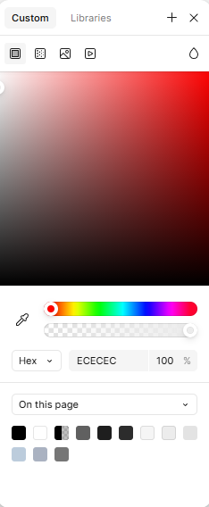
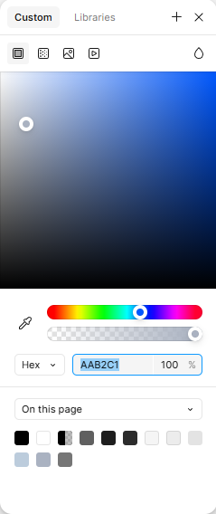

# Forge Fitness - Fitness Application

Forge Fitness is a comprehensive fitness companion designed to transform your wellness journey. This dynamic application empowers users to track workouts, set personalized goals, and achieve measurable results through an intuitive dashboard system. Whether you're a beginner starting your fitness journey or an experienced athlete looking to optimize your performance, Forge Fitness provides the tools and motivation needed to forge your path to better health.

---

## Table of Contents

There is no table of contents for this project yet as it in early developement stage and the focus is on the ux design and creating wireframes.

---

## Client Goals

The Forge Fitness application is designed with inspiration from leading fitness brands like PureGym, Garmin, and Strava. The primary goals of this project are to:

1. **Create a User-Friendly Experience**:
   - Develop a visually appealing and intuitive interface that allows users to seamlessly navigate through features.
   - Ensure accessibility for users of all fitness levels, from beginners to experienced athletes.

2. **Support Personalization**:
   - Enable users to set personalized fitness goals and create tailored workout plans to suit their needs and preferences.
   - Provide flexible tracking tools that adapt to individual progress and routines.

3. **Enhance Motivation and Engagement**:
   - Deliver meaningful insights through progress tracking and activity visualization to keep users motivated.
   - Incorporate features like achievements and milestones to celebrate fitness successes.

4. **Offer Comprehensive Fitness Management**:
   - Combine multiple fitness needs in one platform, including workout tracking, calorie logging, and goal-setting.
   - Provide tools that empower users to manage and monitor their wellness journey efficiently.

5. **Prioritize Modern Design Standards**:
   - Emphasize clean, minimalistic design principles inspired by modern fitness platforms.
   - Ensure a mobile-responsive layout for a seamless experience across devices.

The Forge Fitness app aims to bridge the gap between simplicity and functionality, empowering users to take control of their fitness journey with a professional-grade toolset tailored to their unique goals.

---

 ## User Stories

### Profile Management
- **Goal Alignment**: Supports "Create a User-Friendly Experience."
- As a **new user**, I want to create an account, so that I can save my fitness data and track my progress.
- As a **registered user**, I want to edit my profile details, so that my information remains up-to-date.
- As a **returning user**, I want to log in securely, so that I can access my personalized fitness data.

### Training Section
- **Goal Alignment**: Supports "Support Personalization."
- As a **user**, I want to explore different workout plans, so that I can find a routine that matches my fitness goals.
- As a **beginner**, I want access to instructional videos or guides, so that I can perform exercises safely and correctly.
- As an **advanced user**, I want to customize a training plan, so that I can focus on specific fitness objectives.

### Activity Tracking
- **Goal Alignment**: Supports "Enhance Motivation and Engagement."
- As a **user**, I want to log my daily workouts, so that I can keep a detailed history of my fitness activities.
- As a **health-conscious individual**, I want to track my calorie intake and steps, so that I can monitor my overall health.
- As a **busy professional**, I want to receive reminders to log my activities, so that I can stay consistent with my fitness journey.

### Progress and Insights
- **Goal Alignment**: Supports  "Comprehensive Fitness Management."
- As a **goal-oriented user**, I want to set fitness goals, so that I can work toward specific milestones.
- As a **data-driven user**, I want to view charts and graphs of my progress, so that I can analyze trends over time.
- As a **motivated user**, I want to receive notifications when I achieve a goal, so that I stay inspired to continue.

### Settings
- **Goal Alignment**: Supports "Prioritize Modern Design Standards."
- As a **user**, I want to customize the app's appearance, so that it matches my personal preferences (e.g., dark mode).
- As a **privacy-conscious user**, I want to change my password, so that my account remains secure.
- As a **user**, I want to manage my notification preferences, so that I receive only relevant updates.

---

##  Initial Design

 The color scheme I have gone for is a combination of light colours to create a clean and modern look. The colours I have gone for are:

Header: BCCCDC - Light Blue

Body: ECECEC - Light Grey

Footer: AAB2C1 - Dark Grey

The typography is yet to be decided. But I want the layout of the website to be designed easy to read and visually appealing, with a focus on using a font that is both readable and visually appealing. 

## User Experience (UX) and wireframes

To create a top class fitness app, this website is being desinged with a great amount of care and attention to detail. In the Dashboard page, I have included a variety of features to help users create their own workout regimes and track their progress tailored to their fitness goals. Here are the main features down below:

## Dashboard

* 🏃‍♂️ Profile section - For users to create their profile, set their goals to help them achieve their progress.

* 💪 Training section - For users to select a workout of any type, create traning plans to help achieve specific goals and instructor led digital classes.

* 📊 Activity section - For users to track their physical activity, workout time, log their steps and monitor calories burnt. 

* 📈 Progress section - For users to set goals and track their progress and achievements.

* ⚙️ Settings section - For users to set their account settings, such as password and email notifications. With also app appearance settings, feedback and support

---
