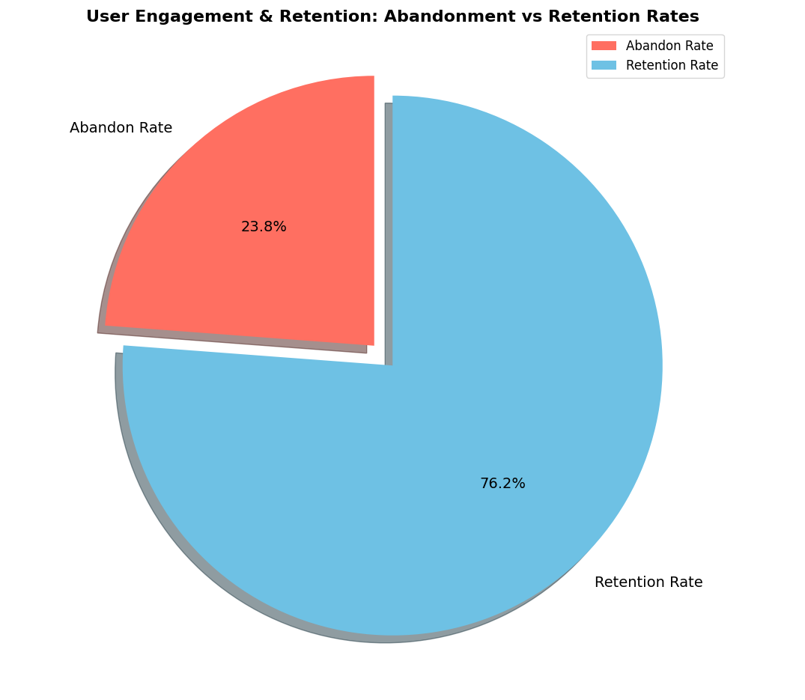
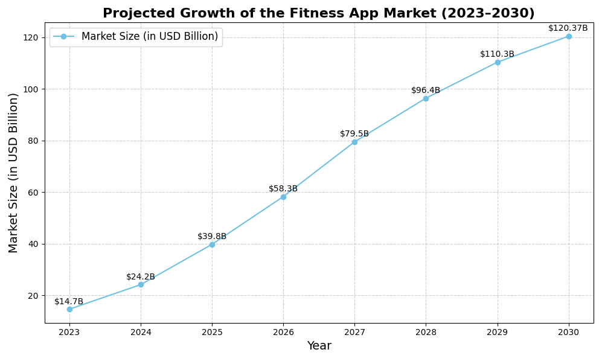
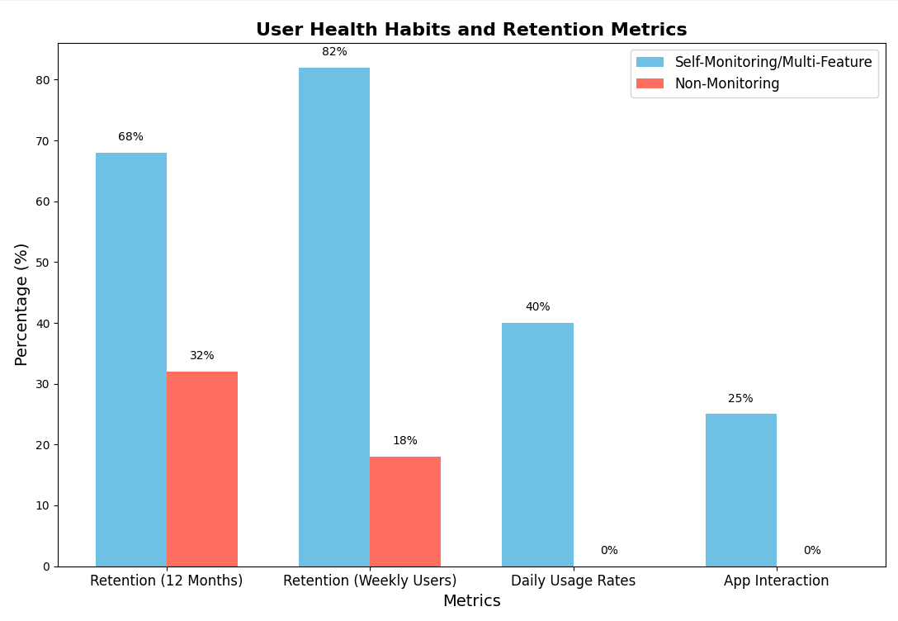
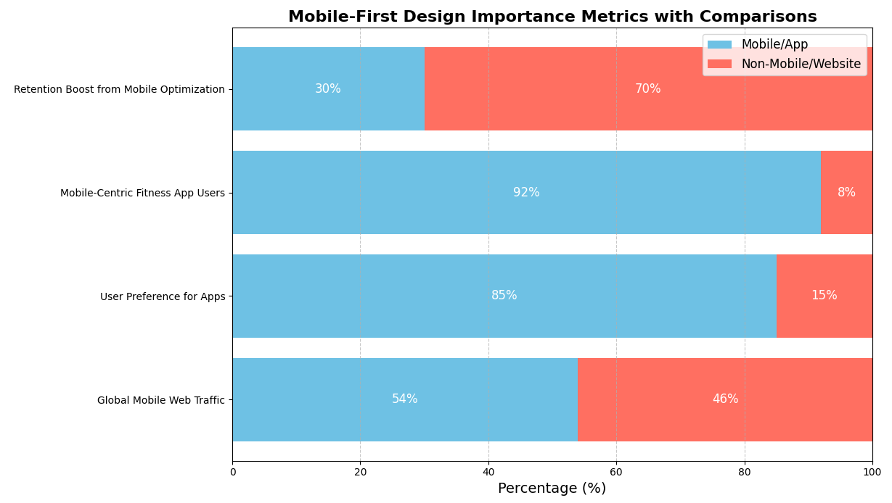
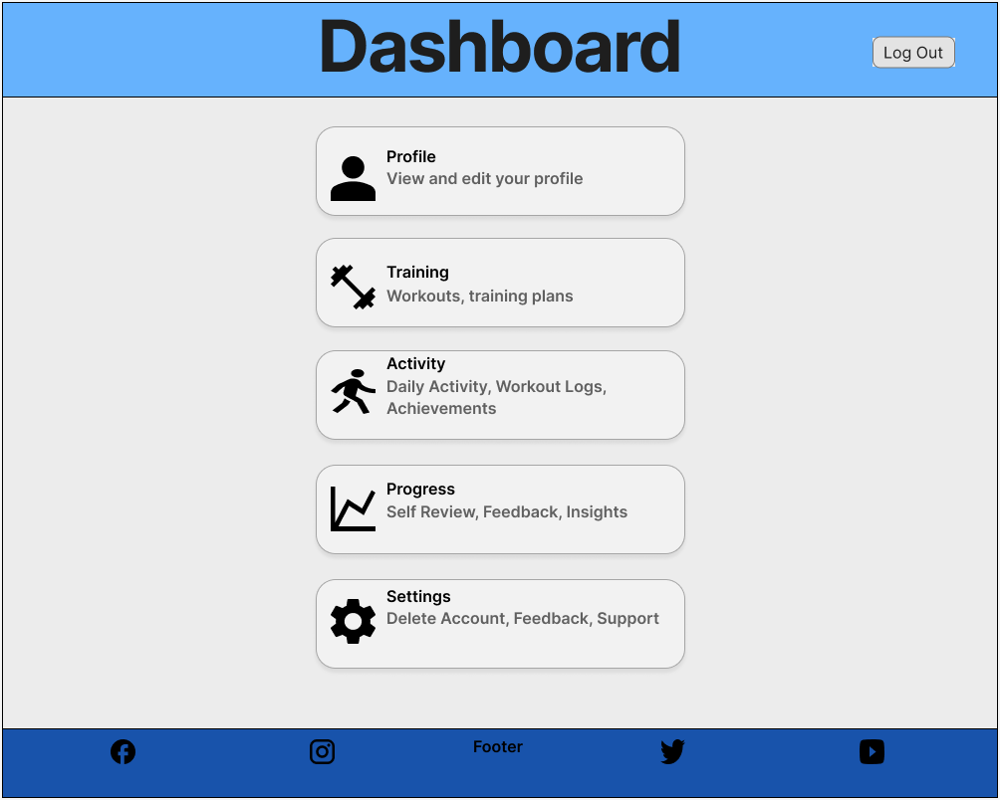
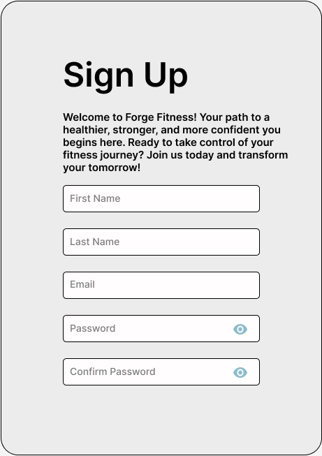
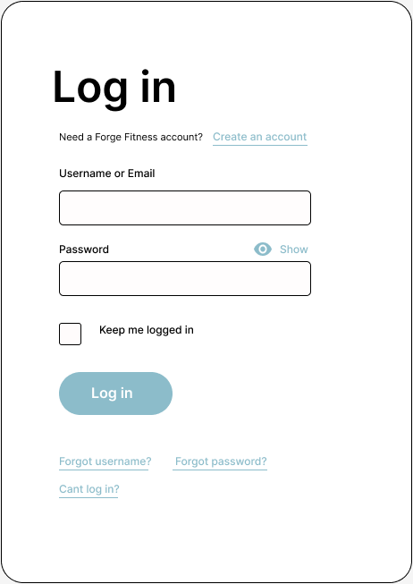
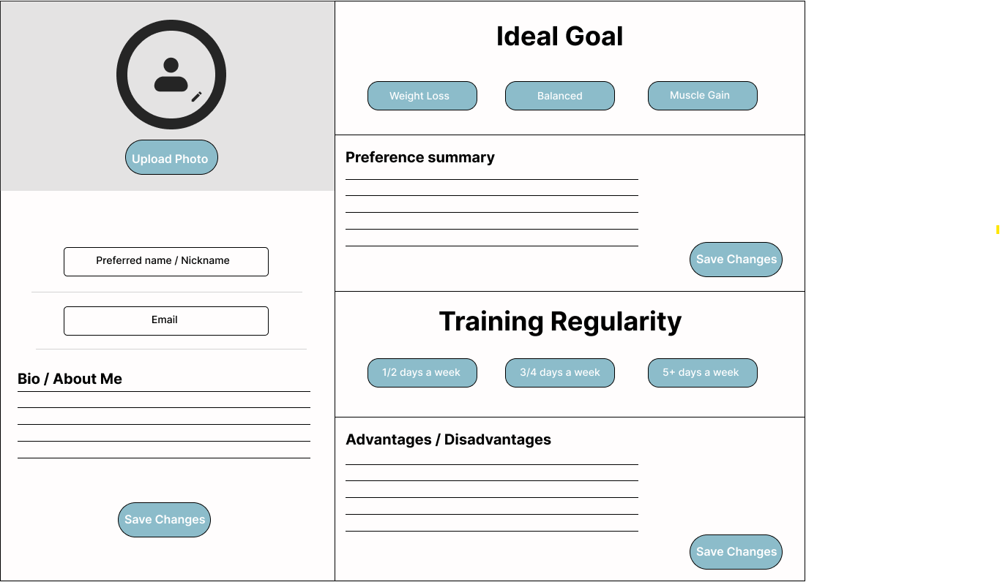
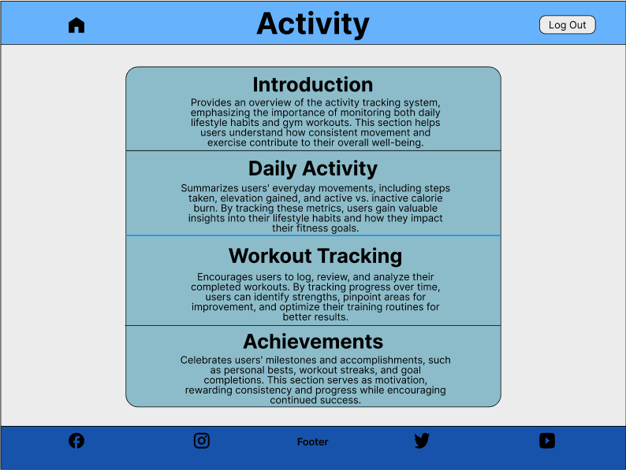
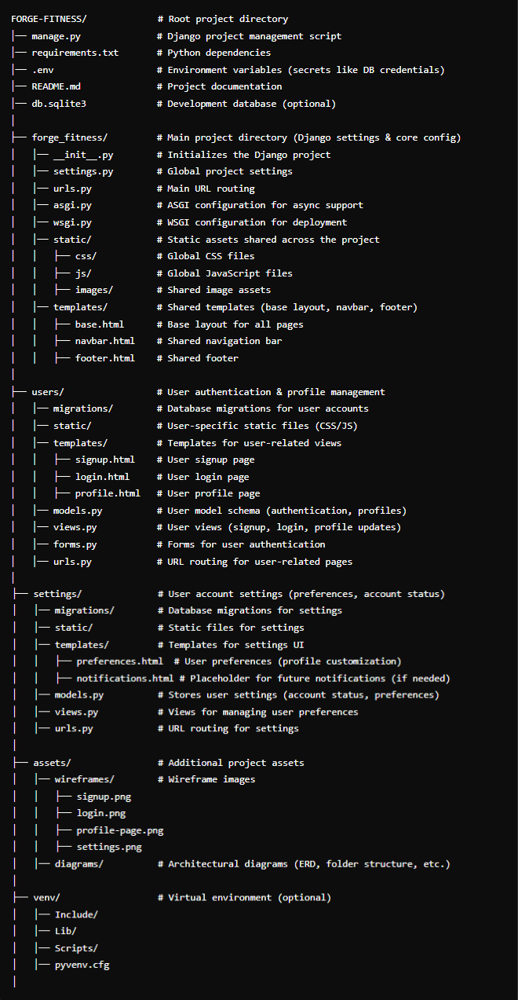

# Forge Fitness - Fitness Application

Forge Fitness is a **fitness guidance platform** designed to help users structure and manage their personal fitness journeys. Unlike traditional fitness tracking applications, Forge Fitness **does not track real-time workout data** but instead serves as an **educational and organizational tool** for users to **learn how to set goals, manage progress, and personalize their fitness experience**.

This application offers a **user-friendly dashboard** where individuals can:
- **Create and manage their profile** with a preferred name and bio.
- **Set fitness-related goals** and structure their personal fitness journey.
- **Access structured guidance on workouts and fitness routines**.
- **Monitor their progress through milestones and achievements**.
- **Manage their account settings**, including profile updates and account deletion.

Whether you’re a **beginner** looking for structured guidance or an **experienced fitness enthusiast** aiming to organize your training, **Forge Fitness provides a simplified and intuitive experience tailored to your fitness aspirations.**

---

## Table of Contents

There is no table of contents for this project yet as it in early developement stage and the focus is on the ux design and creating wireframes.

---

## Statistics  

The following **market research** and **user behavior data** have been carefully selected to inform the **development decisions** for Forge Fitness. These insights highlight **key trends** in **fitness app user engagement**, **activity tracking habits**, and **personalized goal-setting preferences**.  

Each metric provides **valuable insights** that guide the **app’s feature priorities** and **implementation approach**, ensuring the application meets **real user needs** while maintaining **modern UX/UI and development practices**. The data is categorized into **four core focus areas** that align with **Forge Fitness objectives**:  

### **1. User Engagement & Retention**   
- **Key Insight:** A significant percentage of **fitness app users** abandon apps after the **first use**. However, apps with **structured goal-setting, progress tracking, and intuitive navigation** see **higher retention rates**.  
- **Supporting Data:**  
  - 📉 **25% of fitness app users** stop using the app after a **single session**.  
  - 📈 **Retention-focused features**, such as **personalized goals, achievement tracking, and structured workouts**, help **retain over 75%** of users.  

**🔹 How Forge Fitness Addresses This:**  
✔ **Clear onboarding & navigation** – The **Dashboard** simplifies access to **all sections** for **seamless user flow**.  
✔ **Goal-based motivation** – The **Progression Page** keeps users engaged by offering **milestones, progress tracking, and feedback loops**.  
✔ **Consistent engagement tools** – The **Activity Page** tracks **daily movement**, making fitness tracking a **daily habit**.  

**📊 Visual Representation:**  
  

**🔗 Supporting Data:** [In-App Engagement Statistics & Tips for Health Apps](https://www.storyly.io/post/statistics-tips-for-health-apps-in-app-engagement)  

---

### **I. Activity Tracking & User Behavior**   

- **Key Insight:** Users who engage with **daily activity tracking** are more likely to **achieve fitness goals** and **retain long-term app usage**.  
- **Supporting Data:**  
  - **80% of engaged users** actively track **workouts, steps, and calories** within their fitness apps.  
  - **Daily tracking users** are **2x more likely** to stay engaged in their **fitness journey** compared to users who don’t track progress.  

**🔹 How Forge Fitness Addresses This:**  
✔ **Daily Activity Tracking** – The **Activity Page** allows users to **log steps, calories burned, and workouts** to maintain consistency.  
✔ **Workout Logging & Summaries** – The **Training Section** provides structured **workout logs and plans** for better tracking.  
✔ **Instant Feedback & Insights** – The **Progression Page** helps users **visualize trends** and **adjust their routines accordingly**.  

---

### **II. Personalization & Goal-Driven Features**  
- **Key Insight:** Apps that offer **personalized fitness plans** and **adaptive goal-setting** see a **higher completion rate** for user fitness programs.  
- **Supporting Data:**  
  - **72% of users** prefer apps that allow them to **customize training plans** and set **individualized milestones**.  
  - Users with **personalized progress tracking** are **50% more likely** to **consistently achieve fitness goals**.  

**🔹 How Forge Fitness Addresses This:**  
✔ **Goal Setting & Milestones** – The **Progression Page** allows users to **define and track short-term and long-term fitness goals**.  
✔ **Customizable Workouts** – The **Training Page** offers structured and **adaptable plans** for different fitness levels.  
✔ **User Feedback & Adjustments** – The **Settings Page** enables users to **modify their preferences**, keeping the experience tailored.  

---

By leveraging these **core insights**, Forge Fitness ensures its features align with **proven engagement models**, **data-driven personalization**, and **seamless user experiences**—making it an **effective and intuitive fitness application** for all users.  

---

### 2. **Fitness App Market Trends**  

- **Market Size & Growth:**  
  - The **global fitness app market** is projected to grow from **USD 14.7 billion (2023) to USD 120.37 billion by 2030**, reflecting a **CAGR of 17.6%**.  
  - The rapid adoption of **fitness technology** and **AI-driven personalization** is driving market expansion.  
  - **Hybrid fitness models** (combining in-app training with real-world activities) are becoming increasingly popular.  

**📊 Visual Representation:**  
  

- **Source**: [Grand View Research](https://www.grandviewresearch.com/industry-analysis/fitness-app-market)

---

#### **Key Market Trends & How Forge Fitness Aligns**  

✅ **Personalization & AI-Driven Insights**  
- **72% of fitness app users** prefer **personalized workout recommendations** and **goal-based tracking**.  
- 🔹 **Forge Fitness Solution:** The **Training & Progression Pages** provide structured **goal-setting, tracking, and adaptive insights**.  

✅ **User Engagement via Gamification & Achievements**  
- **60% of fitness app users** stay engaged **longer** when apps include **progress tracking & achievements**.  
- 🔹 **Forge Fitness Solution:** The **Achievements Section** in the **Activity Page** encourages **streaks, milestones, and personal records** to keep users motivated.  

✅ **Mobile-First Approach & Accessibility**  
- **92% of fitness app users** primarily use **smartphones**, making mobile-first design **a necessity**.  
- 🔹 **Forge Fitness Solution:** The app is designed with **a responsive layout**, **touch-friendly elements**, and **an intuitive dashboard** for seamless navigation.  

✅ **Demand for Quick & Efficient Workouts**  
- **Over 50% of users** prefer fitness apps that offer **time-efficient workouts**.  
- 🔹 **Forge Fitness Solution:** The **Training Section** offers **structured plans & quick workout logging** to fit busy lifestyles.  

---

### **Relevance to Forge Fitness**  

The **growth of the fitness app market** and **emerging user preferences** support the **development direction of Forge Fitness**:  
✔ **User-Centric Features:** Personalized fitness tracking & adaptive workouts.  
✔ **Engagement Strategies:** Gamification through achievements & progress tracking.  
✔ **Mobile Optimization:** Seamless experience across **devices & screen sizes**.  

By aligning with **key industry trends**, Forge Fitness ensures **long-term usability, engagement, and innovation** in the competitive fitness app space.  

---

### 3. **User Health Habits**:

- **Key Statistics:**  
  - 📈 **68% retention rate** at 12 months for users who actively **self-monitor** vs **32% for non-monitoring users**.  
  - 🔄 **Weekly active users** show **82% higher retention rates** compared to sporadic users.  
  - 📊 **Multi-feature users** demonstrate **40% higher daily usage rates**.  
  - ⏰ **Personalized reminders** increase app interaction by **25%**.  

**📊 Visual Representation:**  
  

**🔗 Source:** [Effect of Self-Monitoring on Fitness Adherence](https://journals.plos.org/plosone/article?id=10.1371%2Fjournal.pone.0201166)  

---

### **How Forge Fitness Addresses This:**  

✅ **Comprehensive Tracking Integration**  
- 🏃‍♂️ **Daily Activity Logging** – Users can learn how to **track workouts, steps, calories burned, and active time** through the **Activity Page**.    
- 🏅 **Achievement Milestones** – The **Achievements Section** motivates users with **streaks, personal bests, and completion badges**.  
- ⏰ **Personalized Goal Reminders** – Users receive **activity prompts & goal reminders** to stay engaged with their fitness journey.  

This structured **demonstration-based approach** ensures that users understand **how to track progress, set goals, and interpret fitness data**—without requiring real-time integrations.

---

### 4. **Mobile-First Design Importance**:

- **Key Statistics**:  

  - **Mobile Dominance**:  
    - Over **54% of global web traffic** comes from mobile devices as of **2024**.  
    - _Source_: [Statista: Share of Website Traffic from Mobile Devices](https://www.statista.com/statistics/277125/share-of-website-traffic-coming-from-mobile-devices/)  

  - **User Preferences for Mobile Apps**:  
    - **85% of users** prefer mobile apps over websites due to their **speed, convenience, and accessibility**.  
    - _Source_: [App Usage Statistics 2024](https://www.statista.com/topics/1002/mobile-app-usage/)  

  - **Fitness App Users are Mobile-Centric**:  
    - **92% of fitness app users** access these apps via their smartphones, making **mobile design crucial**.  
    - _Source_: [Mobile App Usage Statistics for Fitness Apps](https://www.businessofapps.com/data/fitness-app-market/)  

  - **Responsive Design Increases Retention**:  
    - Apps with **seamless mobile experiences** have **30% higher retention rates** compared to non-mobile-optimized platforms.  
    - _Source_: [UX Design and Retention Study](https://www.uxdesigninstitute.com/blog/app-usage-statistics/)  

📊 **Visual Representation:**  
  

---

### **🔹 How Forge Fitness Addresses This:**  

✅ **Mobile-Friendly UI & Navigation**  
- 📱 **Responsive Layout** – The **Dashboard** is structured for **easy navigation across all screen sizes**, ensuring a **smooth user experience on mobile devices**.  
- 🎯 **Touch-Friendly Interactions** – Buttons, forms, and key **action elements are designed for mobile usability** with intuitive tap-based interactions.  
- 📌 **Simplified Content Structure** – Each page provides **clear sections** that allow users to quickly understand **how fitness tracking works**.  

✅ **Optimized Feature Display for Mobile Users**  
- 🏋️‍♂️ **Training Section** – Structured **workout plans and demonstrations** are presented in a **mobile-friendly** format.  
- 📊 **Progression Page** – Displays **goal-setting concepts, performance tracking, and feedback** in a way that is **accessible and easy to follow**.  
- ⚙️ **Settings Page** – Users can learn how to **manage their account, feedback, and app settings** in a **streamlined** mobile layout.  

✅ **User Experience Benefits**  
- 🚀 **Efficient Navigation** – Users can move seamlessly between sections without confusion.  
- 🔍 **Clear Visual Cues** – Icons and **concise explanations** ensure users understand **how each feature works**.  
- 📖 **Educational Approach** – Instead of **real-time tracking**, the app **demonstrates best practices for fitness monitoring** through well-structured UI components.  

---

### **📌 Summary of Statistics & Design Choices**  

Market research strongly supports the **mobile-first approach** taken in Forge Fitness. With **fitness apps projected to reach $120.37 billion by 2030**, the importance of **accessible and intuitive mobile interfaces** continues to grow. The statistics confirm that **92% of fitness app users** prefer **smartphone-based platforms**, reinforcing the decision to **prioritize responsive UI/UX principles** in this project.  

By integrating these **data-driven design decisions**, Forge Fitness offers **a structured and user-friendly demonstration of fitness tracking methodologies**, ensuring users **learn how to manage their fitness journey effectively**—without requiring **real-time tracking capabilities**. 🚀  

---

## Client Goals

The Forge Fitness application combines modern development practices with proven design patterns from industry leaders like PureGym, Garmin, and Strava. This milestone project showcases full-stack development capabilities while delivering a comprehensive fitness platform. By implementing features found in successful fitness applications and adding innovative elements, Forge Fitness demonstrates both technical proficiency and user-centered design principles. The following core objectives guide the development process and feature implementation:

### **1. User-Friendly and Intuitive Navigation**
- The **Dashboard** serves as a central hub, allowing users to quickly access key sections such as **Profile, Training, Activity, Progress, and Settings**.
- Each section is designed with a minimalistic layout, making navigation effortless while ensuring all features remain accessible.
- Responsive UI elements ensure an optimal experience across different devices.

### **2. Personalization and User Control**
- The **Profile Page** allows users to personalize their experience by setting their **preferred name and bio**, as well as uploading a profile picture.
- The **Settings Page** includes essential options such as **Feedback, Support, and Account Deletion**, ensuring users can manage their preferences effectively.
- Users can track their fitness progress in the **Progression Page**, which focuses on **Goal Setting, Performance Tracking, and Personalized Feedback**.

### **3. Structured Training Guidance**
- The **Training Section** provides users with a well-organized framework for fitness improvement.
  - **Introduction:** Guides users on how to use the training section effectively.
  - **Workouts:** Covers different muscle groups and recommended exercises.
  - **Training Plans:** Helps users structure their fitness routine.
  - **Summary:** Highlights key takeaways to keep users engaged and informed.

### **4. Motivation through Progress Tracking**
- The **Activity Page** enables users to help monitor their daily activity, ensuring they stay consistent with their fitness goals.
  - **Daily Activity:** Summarizes movement trends.
  - **Workout Tracking:** Encourages users to log and analyze their workouts.
  - **Achievements:** Recognizes and celebrates fitness milestones.

### **5. Secure and Accessible Authentication**
- The **Login Page** provides a secure authentication system, allowing users to log in effortlessly.
- The **Sign-Up Page** ensures a smooth onboarding process, with clear input fields and guided registration to enhance user experience.

### **6. Feedback and Continuous Engagement**
- The **Settings Page** integrates feedback and support options, enabling users to report issues, request assistance, and suggest improvements.
- The platform encourages ongoing engagement through motivational elements like **progress tracking and achievements**.

The **Forge Fitness** application balances functionality and simplicity, ensuring that users can efficiently **track their workouts, manage their profile, stay motivated, and personalize their experience**.

---

## User Stories

The following user stories have been developed to guide the implementation of Forge Fitness features, ensuring each component delivers tangible value to users while meeting project requirements. Each story aligns with specific client goals and technical objectives, demonstrating both user-centered design and full-stack development capabilities. The stories are organized into core functional areas, with clear goal alignment statements showing how they support the project's primary objectives.

### Profile Management
**Goal Alignment: Supports "Create a User-Friendly Experience."**

- As a **new user**, I want to create an account so that I can save my fitness data and track my progress.
- As a **returning user**, I want to log in securely so that I can access my personalized fitness data.
- As a **registered user**, I want to edit my profile details, including my preferred name and bio, so that my information remains up to date.
- As a **visual user**, I want to upload a profile picture so that my account feels more personalized.
- As a **self-motivated user**, I want to add a short bio about myself so that I can document my fitness journey.

### Training Section
**Goal Alignment: Supports "Support Personalization."**

- As a **user**, I want to explore different workout plans so that I can find a routine that matches my fitness goals.
- As a **beginner**, I want a simple introduction to workouts so that I can learn the fundamentals before diving into specific plans.
- As an **advanced user**, I want to understand how different muscle groups work so that I can improve my training efficiency.
- As a **goal-oriented user**, I want structured training plans so that I can follow a guided fitness program based on my needs.
- As a **data-driven user**, I want to see an overview of my workout plans so that I can track my fitness routine at a glance.

### Activity Tracking
**Goal Alignment: Supports "Enhance Motivation and Engagement."**

- As a **user**, I want to track my daily activity, such as steps and movement, so that I can monitor my overall fitness levels.
- As a **motivated individual**, I want to log my completed workouts so that I can track my consistency over time.
- As a **progress-focused user**, I want to review my past activities so that I can see how I’m improving.
- As an **achievement-driven user**, I want to earn milestones and badges so that I stay motivated to reach new fitness goals.
- As a **self-reflecting user**, I want to compare my active and inactive days so that I can improve my consistency.

### Progress and Insights
**Goal Alignment: Supports "Offer Comprehensive Fitness Management."**

- As a **goal-oriented user**, I want to set short-term and long-term fitness goals so that I can stay motivated and measure my progress.
- As a **self-improving user**, I want to track my performance trends over time so that I can see my strengths and areas for improvement.
- As an **analytical user**, I want to review feedback and insights based on my fitness habits so that I can make better training decisions.
- As a **results-driven user**, I want to receive clear visual data about my progress so that I can recognize patterns and plan my next steps.
- As a **self-aware user**, I want to receive performance insights and recommendations so that I can make meaningful adjustments to my fitness routine.

### Settings
**Goal Alignment: Supports "Prioritize Modern Design Standards."**

- As a **privacy-conscious user**, I want to permanently delete my account so that I have control over my data.
- As a **user**, I want to manage my fitness preferences and settings so that the app feels tailored to my personal experience.

Each story maps directly to technical requirements while maintaining focus on user value, creating a balanced approach between development objectives and user needs. This structured foundation provides clear direction for feature implementation and testing phases of the project.

---

## Initial Design

The visual identity of Forge Fitness is built on a carefully selected **color palette** that emphasizes clarity, professionalism, and user engagement. The combination of light and complementary colors creates a **modern aesthetic** that enhances readability while maintaining a strong visual hierarchy.

### Color Scheme

| Color  | Name                  | Usage |
|--------|-----------------------|-------------------------------|
| `#66A3FD` | **Argentinian Blue** | Navigation bar |
| `#ECECEC` | **Anti-Flash White** | Body background |
| `#8CBCCA` | **Sky Blue**         | Buttons, Sections |
| `#1853AB` | **Sapphire Blue**    | Footer |

---

The typography is yet to be decided. But I want the layout of the website to be designed easy to read and visually appealing, with a focus on using a font that is both readable and visually appealing.

---

## User Experience (UX) and wireframes

To create a top class fitness app, this website is being desinged with a great amount of care and attention to detail. In the Dashboard page, I have included a variety of features to help users create their own workout regimes and track their progress tailored to their fitness goals. Here are the main features down below:

## Dashboard page

### 📌 Dashboard Overview

The **Dashboard Page** serves as the central hub for navigation, providing users with quick access to key sections of the Forge Fitness app. It ensures a **clean and intuitive layout**, making it easy for users to interact with various features.

---

### 🏠 **Navigation Bar**
- **Logout Button**: Securely sign out of the application at any time.

---

### 📂 **Main Sections**

- 👤 **Profile Section** - Allows users to **view and edit** their profile, update their **preferred name**, and add a **personalized bio** to tailor their fitness experience.

- 🏋️ **Training Section** - Provides access to **structured workouts and training plans**, helping users follow a fitness routine aligned with their **goals and fitness levels**.

- 🏃‍♂️ **Activity Section** - Enables users to **track daily activity**, including **workouts, logs, and achievements**, ensuring they can monitor their progress and stay motivated.

- 📈 **Progress Section** - Focuses on **self-review, feedback, and insights**, helping users analyze **performance trends, goal tracking, and long-term fitness improvements**.

- ⚙️ **Settings Section** - Grants access to **account management**, including **feedback submission, support options, and account deletion**, ensuring a user-controlled experience.

---

### 🔻 **Footer Features**
- 🌐 **Social Media Links**: Quick access to **Facebook, Instagram, Twitter, and YouTube** for fitness-related content and community engagement.
- 🔗 **Footer Navigation**: Provides persistent **access to key sections**, ensuring seamless user experience across the app.

---

## Sign Up page

The sign up interface provides a streamlined onboarding experience while capturing essential user information. Key features include:

### Design Elements

- Modern, clean layout with clear visual hierarchy
- Enticing opening message to encourage sign-up
- Responsive form design optimized for all devices
- Consistent brand colors using the established palette

### Core Functionality

- Required profile information fields (name, email, password)
- Password visibility toggle for password field

---

## Login Page

The **Login Page** provides users with a simple and secure authentication interface, ensuring quick and easy access to the Forge Fitness platform. The design prioritizes usability and accessibility while maintaining a clean, minimalist layout.  

---

### **Design Elements**  

- **Minimalist layout** focusing on essential login components.  
- **Responsive form design** that adapts to all screen sizes.  
- **Brand-consistent typography and colors**, ensuring visual coherence.  
- **Clear and accessible form fields** for easy user interaction.  

---

### **Core Functionality**  

- **Email or Username Authentication**  
  - Users can log in using their **registered email or username**.  

- **Password Input with Toggle Visibility**  
  - A **"Show Password"** option allows users to toggle password visibility for ease of entry.  

- **Persistent Login Option**  
  - The **"Keep me logged in"** checkbox enables users to stay signed in across sessions.  

- **Forgot Password Recovery**  
  - A **"Forgot password?"** link provides users with a direct way to reset their credentials.  

- **New Account Registration Link**  
  - A **"Create an account"** link encourages new users to sign up seamlessly.  

---

### **User Experience**  

- **Simple, intuitive input fields** for easy login.  
- **Streamlined navigation** with clear sign-up and password recovery options.  
- **Secure session handling** to protect user credentials.  
- **Mobile-friendly layout**, ensuring accessibility across all devices.  

---

### **Why This Page Matters**  

The **Login Page** serves as the gateway to the Forge Fitness platform, offering a **seamless and user-friendly authentication experience**. By maintaining **strong security measures and a clean, intuitive layout**, it ensures a **smooth onboarding process** for both new and returning users.  

---

## Profile Page

The **Profile Page** allows users to personalize their fitness experience by managing their profile details. With a clean and structured layout, users can easily update their information, add a profile photo, and provide a short bio.  

### Design Elements

- Clean, modern layout with clear section divisions for easy navigation
- Interactive elements like buttons and input fields for user customization
- Consistent color scheme and typography aligned with the Forge Fitness brand
- Large, user-friendly **"Upload Photo"** option for profile personalization
- Responsive design ensuring seamless access across devices

### **Design Elements**  

- **Minimalist and intuitive layout** for easy profile customization.  
- **User-friendly input fields** for quick data entry and updates.  
- **Consistent color scheme and typography** aligned with Forge Fitness branding.  
- **Large and accessible "Upload Photo" button** for seamless profile personalization.  
- **Fully responsive design**, ensuring accessibility across different devices.  

---

### **Core Functionality**  

- **Profile Customization**  
  - Users can enter a **preferred name** to personalize their profile.  
  - A **bio/about me section** lets users add a short description about themselves.  

- **Photo Management**  
  - Upload a **profile photo** to personalize the user profile.  
  - Supports common image formats such as **PNG and JPEG**.  
  - Option to **update or remove the profile picture** if needed.  

- **Save Changes**  
  - Users can **save profile updates** to ensure all modifications are stored.  
  - A simple **confirmation process** ensures that changes are reflected instantly.  

---

### **User Experience**  

- **Simple and intuitive input fields** for quick profile updates.  
- **Seamless user interactions**, ensuring effortless navigation.  
- **Visual feedback** when changes are successfully saved.  
- **Responsive layout**, allowing smooth access on different screen sizes.  

---

## Training Page

The **Training Page** serves as a central hub for users to explore structured workout guidance and how personalized fitness plans work. This section is designed to provide clear, actionable insights, making it easier for users to understand their training options and track progress efficiently.

### **Introduction**

The **Introduction** section provides users with a foundational understanding of the training program. It explains the core principles behind structured fitness routines and highlights the importance of consistency, form, and goal setting. Whether users are beginners or experienced athletes, this section offers essential guidance on how to approach their fitness journey effectively.

### **Workouts**

The **Workouts** section is dedicated to helping users understand the role of different muscle groups and the exercises that target them effectively. 

- **Muscle Group Breakdown:**
  - Users can explore all the workout categories based on different body areas, ensuring a balanced workout approach.
  - Includes guidance on exercises for major muscle groups such as:
    - Chest
    - Back
    - Legs
    - Shoulders
    - Arms
    - Core
    - Full Body Workouts

- **Exercise Demonstrations:**
  - Each workout category provides information on the most effective exercises for that muscle group.
  - Users can follow step-by-step instructions or access additional resources to ensure proper form and injury prevention.

- **Training Techniques:**
  - Guidance on how to integrate progressive overload, rest periods, and rep schemes into their routine for optimal results.

### **Training Plans**

The **Training Plans** section provides structured workout programs tailored to different fitness goals. Whether users are looking to **lose weight, build muscle, or enhance endurance**, this section offers a variety of programs to suit their needs.

- **Structured Programs:**
  - Users can follow pre-designed training plans or customize their own based on their fitness level and goals.
  - Each plan outlines:
    - Recommended workout frequency
    - Exercise selection
    - Progress tracking strategies

- **Goal-Based Training Plans:**
  - **Weight Loss:** Focused on high-intensity workouts, calorie burning, and metabolic conditioning.
  - **Muscle Gain:** Strength-building exercises, hypertrophy-focused routines, and recovery strategies.
  - **Endurance Training:** Plans designed to improve stamina, cardiovascular health, and athletic performance.

- **Progress Tracking:**
  - Encourages users to log their workouts and adjust their plans based on improvements and feedback.

### **Summary**

The **Summary** section ties together key takeaways from the **Introduction, Workouts, and Training Plans**. This section reinforces how users can apply the provided information to their fitness journey, ensuring they make informed decisions that align with their personal health goals.

- **Why This Matters:**
  - Highlights how structured training enhances results.
  - Emphasizes the importance of tracking progress and making adjustments.

- **Next Steps:**
  - Encourages users to explore different training plans, experiment with workout variations, and stay consistent in their routines.
  - Provides recommendations for further learning and improvement.

### **Training Page Conclusion**

The Training section of the platform is designed to offer a **comprehensive, structured, and user-friendly** approach to fitness. By combining key insights from **Introduction, Workouts, Training Plans, and Summary**, users are empowered with the knowledge and resources they need to take control of their fitness journey. Whether they are starting out or refining their routine, this section provides the **guidance, structure, and motivation** needed to achieve long-term success.

---

## Activity Page

The **Activity Page** provides users with a centralized space to learn about their **daily movement, workout progress, and fitness milestones**. Designed with a structured layout, it ensures that users can quickly access key fitness insights on a **single page** without navigating through multiple sections. This streamlined approach enhances usability, making it easier to stay engaged and track progress effectively.

---

## **Page Structure and Purpose**

The Activity Page is structured into four main sections, each focusing on a different aspect of fitness tracking. These sections work together to provide a **comprehensive snapshot** of the user’s understanding about daily and long-term activity.

### **Introduction**  
The **Introduction** section sets the foundation for understanding activity tracking. It highlights the significance of **monitoring both daily movement and structured workouts**, emphasizing how an active lifestyle contributes to overall fitness goals.  
- Encourages users to view movement beyond workouts, incorporating **everyday activity** as part of their progress.  
- Reinforces the importance of tracking **steps, calories burned, and overall consistency** to build long-term fitness habits.  

---

### **Daily Activity**  
The **Daily Activity** section provides users with a summary of their movement patterns throughout the day, giving them insight into how **active or inactive** they have been.  
- Displays **steps taken, active vs. inactive calorie burn, and general activity trends** in an easy-to-read format.  
- Helps users recognize patterns in their daily routine, allowing them to make **healthier lifestyle adjustments**.  
- Encourages consistency by showing users how **small daily movements contribute to their bigger fitness goals**.  

This section is designed for users who want to **stay mindful of their daily habits**, ensuring that they maintain steady progress even outside of structured workouts.

---

### **Workout Tracking**  
The **Workout Tracking** section focuses on users completed workouts, serving as a quick reference point for reviewing their fitness journey.  
- Summarizes the **type, frequency, and duration** of recent workouts.  
- Provides an **overview of workout patterns** to help users assess consistency and performance.  
- Encourages users to **reflect on their training routines** and stay committed to their goals.  

By having **workout data available at a glance**, users can **stay accountable** and ensure that they are following a balanced training plan.

---

### **Achievements**  
The **Achievements** section highlights key fitness milestones and accomplishments, reinforcing motivation and long-term engagement.  
- Recognizes **streaks, personal bests, and consistency milestones** to celebrate user progress.  
- Encourages a **sense of accomplishment** by visually showcasing fitness achievements.  
- Helps users **set new goals** based on past performance.  

By rewarding progress, this section provides users with **a continuous source of motivation** to push further and maintain their fitness routine.

---

### **Key Benefits of the Activity Page**

The **Activity Page** is designed to enhance user engagement by providing a **structured and accessible** way to monitor fitness progress.  

### **Why This Page Matters:**
✔ **Single-Page Overview:** Eliminates unnecessary navigation, making fitness tracking more intuitive.  
✔ **Data-Driven Insights:** Helps users make informed decisions about their activity levels and workout habits.  
✔ **Consistency & Motivation:** Encourages ongoing progress by reinforcing positive behavior and achievements.  
✔ **Improved Accountability:** Allows users to track their own patterns, adjust their routines, and stay committed to their fitness goals.  

---

### **Activity Page Summary**  

The **Activity Page** is a streamlined solution for users who want **clear, organized, and accessible fitness tracking** in one place. By integrating **Daily Activity, Workout Tracking, and Achievements**, this page empowers users to **stay consistent, celebrate their progress, and build sustainable fitness habits** over time.

---

## Progression page

The **Progression Page** provides users with a structured and intuitive platform to **track their fitness journey** over time. By focusing on **goal setting, performance tracking, and personalized feedback**, this page helps users learn how to stay motivated, recognize progress, and make informed adjustments to their fitness routines.  

---

## **Features and Sections**  

### **1. Goal Setting / Milestones**  
**Define your fitness goals and stay on track**  

This section helps users how to establish **short-term and long-term fitness goals** while tracking their progress toward meaningful milestones.  

- Set **personalized goals** based on your fitness objectives (e.g., weight loss, muscle gain, endurance improvement).  
- Monitor your **goal completion percentage**, giving you a clear sense of progress.  
- Celebrate **milestones and achievements**, such as reaching a strength PR, improving running speed, or completing a workout streak.  

📌 **How to Use This Section Effectively:**  
✔ Clearly define measurable goals (e.g., "Lose 5kg in 3 months" or "Run 10km without stopping").  
✔ Regularly check your milestone progress to stay motivated.  
✔ Adjust goals as needed to **continue pushing toward new challenges**.  

---

### **2. Performance Tracking**  
**Analyze your trends and measure real progress**  

Tracking **performance metrics** over time helps users understand their **strengths, weaknesses, and areas for improvement**.  

- View **progress summaries** that reflect workout consistency, strength development, endurance gains, and more.  
- Identify **patterns in fitness habits** through structured data representation.  
- Compare past and present performance to **track improvements** and optimize training.  

📌 **How to Use This Section Effectively:**  
✔ Regularly review your progress summaries to assess improvements.  
✔ Use historical performance data to adjust workout intensity and frequency.  
✔ Identify trends that may indicate the need for recovery or workout variations.  

---

### **3. Feedback and Insights**  
**Refine your training with meaningful insights**  

This section provides **personalized guidance** based on user activity and progression trends, helping users stay engaged and make strategic adjustments.  

- Gain **data-driven insights** into your progress and performance consistency.  
- Receive **motivational feedback**, such as reminders to stay consistent, recovery recommendations, or milestone celebrations.  
- Learn how to **optimize workouts** based on training data, ensuring **continuous improvement**.  

📌 **How to Use This Section Effectively:**  
✔ Reflect on feedback to make **targeted adjustments** to training plans.  
✔ Use progress insights to **fine-tune your workout intensity, recovery schedule, and goal-setting approach**.  
✔ Stay motivated by celebrating milestones and acknowledging improvements in strength, endurance, and consistency.  

---

## **Why the Progression Page is Essential**  

The **Progression Page** serves as a **central hub** for tracking progress, celebrating achievements, and making strategic adjustments to training plans. By combining **goal tracking, performance analysis, and feedback-driven improvements**, users can ensure **consistent growth and long-term success** in their fitness journey.  

✔ **Set clear goals and track milestone achievements.**  
✔ **Analyze performance trends to optimize training.**  
✔ **Use feedback to make data-driven adjustments for continuous progress.**  

By regularly engaging with this page, users will gain the knowledge to **stay accountable, make informed training decisions, and maintain long-term motivation** toward achieving their fitness goals. 🚀  

---

### Settings Page

The **Settings Page** provides users with a simple yet essential option to manage their account. This page ensures users have full control over their presence on the platform by offering a straightforward way to remove their account if needed.  

### **Delete Account**  
Users who wish to permanently remove their account can do so from this section.  
- **Irreversible Action:** Deleting an account will erase all associated data and cannot be undone.  
- **User Control:** Ensures users have complete authority over their data and app presence.  
- **Final Confirmation:** Before proceeding, users are encouraged to carefully consider their decision.  

By keeping the **Settings Page minimal**, the app maintains a **clean and straightforward experience**, allowing users to focus on their fitness journey without unnecessary complexity.  

---

## Database Structure
Forge Fitness employs a streamlined database structure focused on **user authentication** and **basic account settings**. The architecture ensures **data integrity, security, and efficiency**, supporting key functionalities such as **user profile management and account status tracking**.  

Unlike traditional fitness tracking apps, Forge Fitness does **not** store real-time workout data or structured fitness plans. Instead, it serves as an educational and demonstrative tool, showcasing **how users can manage their fitness journey** through a well-designed UI.  

---

## Database Tables  

### 1. **User Table**  
**Purpose:** Stores user account details required for **authentication and profile personalization**.  

#### **Key Fields:**  
- `user_id` **(Primary Key, Auto-increment)** – Unique identifier for each user.  
- `first_name` **(VARCHAR)** – Stores the user’s first name.  
- `last_name` **(VARCHAR)** – Stores the user’s last name.  
- `email` **(VARCHAR, Unique)** – Used for login authentication.  
- `password_hash` **(TEXT)** – Securely stored hashed password for authentication.  
- `profile_picture` **(VARCHAR, Nullable)** – Stores the file path of the user’s uploaded profile picture.  
- `bio` **(TEXT, Nullable)** – Stores the user’s bio from the profile page.  
- `created_at` **(TIMESTAMP)** – Tracks when the user account was created.  

#### **How It Works:**  
- This table is **central to the application**, storing **all necessary user details** for authentication and profile management.  
- Ensures **secure login and data retrieval**, linking to the **Settings Table** for additional account controls.  

---

### 2. **Settings Table**  
**Purpose:** Stores **basic user account settings** related to **account status management**.  

#### **Key Fields:**  
- `user_id` **(Foreign Key, References User Table)** – Links settings to the corresponding user.  
- `account_status` **(ENUM('active', 'deactivated'))** – Indicates whether an account is **active or has been deleted**.  

#### **How It Works:**  
- This table helps manage **account activation and deactivation**, ensuring a simple way to **handle user status** without unnecessary complexity.  
- Linked to the **User Table** through `user_id`, ensuring **every user has an associated settings entry**.  

---

## **How It All Works Together**  

### **User Authentication & Profile Management**  
✅ The **User Table** handles **login credentials, profile details, and user registration**.  
✅ Users can **upload a profile picture and add a bio** to personalize their profile page.  

### **Account Management**  
✅ The **Settings Table** allows users to **delete or deactivate their account**, ensuring a minimal but effective approach to **user preferences**.  

---

## **Scalability & Future Enhancements**  

While Forge Fitness currently maintains **a lightweight database structure**, it is **designed for easy expansion** if additional features (e.g., **theme preferences, notification settings**) are needed in the future.  

By keeping the database **minimal and efficient**, Forge Fitness remains **focused on UI demonstration** rather than **complex data storage**.

---

## Folder Structure

The Forge Fitness project follows a modular and structured approach to maintain scalability, clarity, and maintainability. This refactored structure ensures that user authentication, profile management, and settings are well-organized while keeping the core Django project structure intact.

### 🔹 How It’s Organized  

✔ **User authentication & profile management** are handled in the `users/` directory.  
✔ **User settings & account preferences** are managed in the `settings/` directory.  
✔ **Core Django settings, static assets, and templates** are stored in the `forge_fitness/` directory.  
✔ **Project-wide assets**, including wireframes and diagrams, are contained in the `assets/` directory.  

### How It Works

Each directory corresponds to a specific feature or functionality of the application:

1. **Root Directory (`forge-fitness/`)**  
   - Contains project-wide configurations such as:  
     - `manage.py` – Django project management script.  
     - `requirements.txt` – Dependencies and package requirements.  
     - `.env` – Environment variables for database credentials and secrets.  

2. **Main Application (`forge_fitness/`)**  
   - Manages the core Django project settings, including:  
     - `settings.py` – Configuration for installed apps, middleware, database settings.  
     - `urls.py` – Central URL routing for the project.  
     - `wsgi.py` & `asgi.py` – Deployment configurations.  
   - Contains **static files (`static/`)** used across the entire project.  
   - Stores **global templates (`templates/`)**, including:  
     - `base.html` – Layout foundation for all pages.  
     - `navbar.html` – Shared navigation bar.  
     - `footer.html` – Common footer section.  

3. **User Module (`users/`)**  
   - Handles **user authentication and profile management**.  
   - Contains:  
     - `models.py` – User database schema (storing login credentials, profile details).  
     - `views.py` – Handles authentication workflows (signup, login, profile updates).  
     - `forms.py` – Form handling for user authentication.  
   - Templates include:  
     - `signup.html` – User registration page.  
     - `login.html` – Login interface.  
     - `profile.html` – User profile settings.  

4. **Settings Module (`settings/`)**  
   - Manages **user account preferences and status settings**.  
   - Contains:  
     - `models.py` – Stores user preferences (e.g., account status).  
     - `views.py` – Manages user settings adjustments.  
     - `urls.py` – Routing for settings-related actions.  
   - Templates include:  
     - `preferences.html` – UI for modifying user settings.  
     - `notifications.html` – Page for adjusting notification preferences.  

5. **Assets & Wireframes (`assets/`)**  
   - Stores project documentation and design references, including:  
     - `wireframes/` – Screenshots of UI wireframes.  
     - `diagrams/` – Visual representations of the database and folder structure.  

---

### 🔹 How It Ties Into the Database  

The **folder structure** directly reflects the **database schema**, ensuring a **one-to-one mapping between functionalities and data storage**:

- The **`users/` app** aligns with the **User Table**, managing authentication and profile data.  
- The **`settings/` app** links to the **Settings Table**, handling user preferences.  

By **maintaining this structured relationship**, the project ensures a **seamless flow of data** between the backend and frontend, making it easier to **scale and manage future enhancements**.  

---