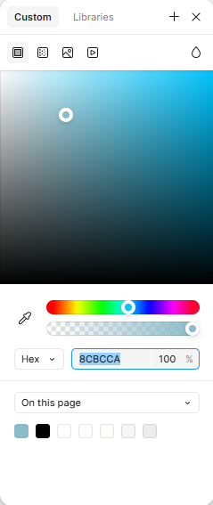
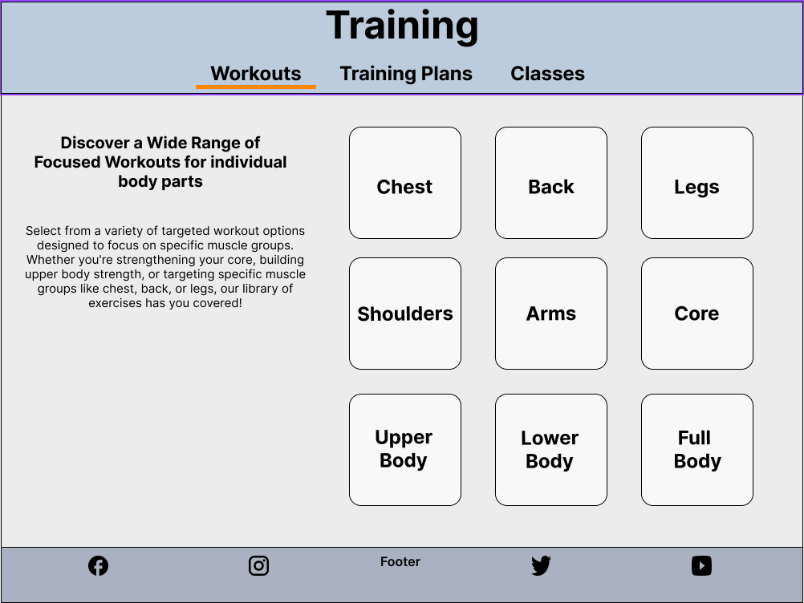
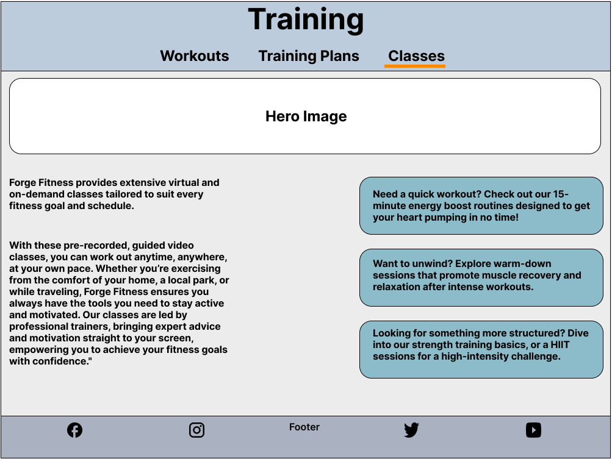
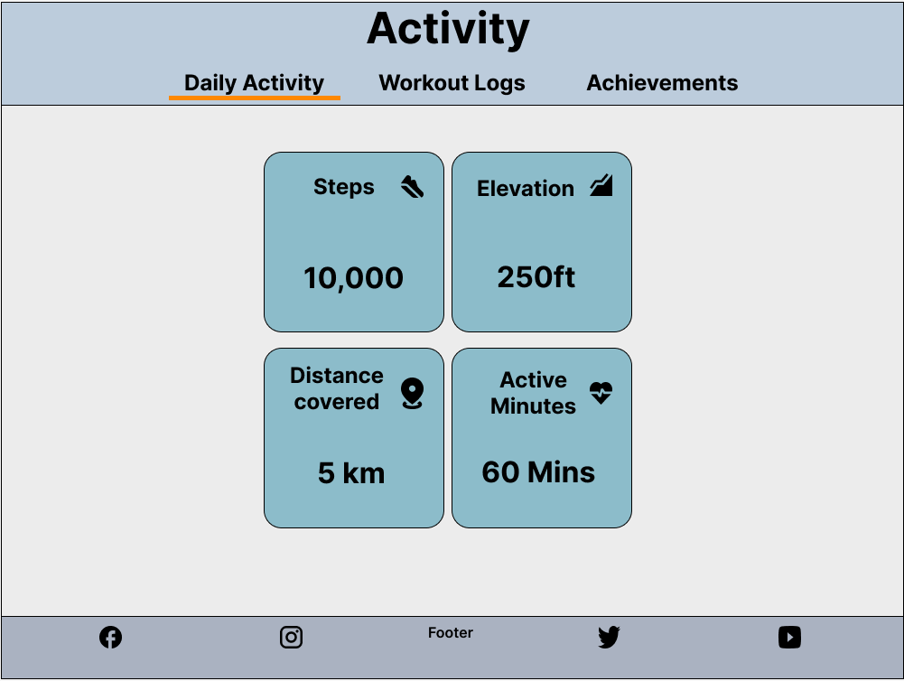

# Forge Fitness - Fitness Application

Forge Fitness is a comprehensive fitness companion designed to transform your wellness journey. This dynamic application empowers users to track workouts, set personalized goals, and achieve measurable results through an intuitive dashboard system. Whether you're a beginner starting your fitness journey or an experienced athlete looking to optimize your performance, Forge Fitness provides the tools and motivation needed to forge your path to better health.

---

## Table of Contents

There is no table of contents for this project yet as it in early developement stage and the focus is on the ux design and creating wireframes.

---

## Statistics

The following market research and user behavior data have been carefully selected to inform the development decisions for Forge Fitness. These statistics highlight key trends in the fitness app industry, user engagement patterns, health monitoring behaviors, and mobile design preferences. Each metric provides valuable insights that directly shape the project's features and implementation approach, ensuring the application meets real user needs while demonstrating effective full-stack development practices. The data is organized into four key areas that align with the project's core objectives and technical requirements.

### User Engagement and Retention

1. **High Abandonment Rates**:

- **Key Statistic**: 25% of mobile app users abandon fitness apps after first use, while successful apps retain 80% of users through effective onboarding

- **Visual Representation**:
  

- **Source**: [In-App Engagement Statistics & Tips for Health Apps](https://www.storyly.io/post/statistics-tips-for-health-apps-in-app-engagement)

- **Relevance to Forge Fitness**:
  - Intuitive dashboard design directly addresses user retention challenges
  - First-time user experience optimized through clear navigation and guided setup
  - Personalized goal-setting features engage users from day one
  - Achievement system provides immediate value and motivation
  - Regular progress updates keep users connected to their fitness journey

---

2. **Fitness App Market Trends**:

- **Market Size**: The global fitness app market is projected to grow from USD 14.7 billion (2023) to USD 120.37 billion by 2030, with a robust CAGR of 17.6%

- **Visual Representation**:
  

- **Source**: [Grand View Research](https://www.grandviewresearch.com/industry-analysis/fitness-app-market)

- **Relevance to Forge Fitness**:
  - The substantial market growth validates the focus on creating a comprehensive fitness platform
  - Rising demand for AI-driven personalization supports for smart workout planning features
  - Increasing user expectations for digital fitness solutions align with the progress tracking and achievement systems
  - Growing smartphone adoption rates reinforce mobile-first design approach

---

3. **User Health Habits**:

- **Key Statistics**:

  - 68% retention rate at 12 months for users who actively self-monitor vs 32% for non-monitoring users
  - Weekly active users show 82% higher retention rates compared to sporadic users
  - Multi-feature users demonstrate 40% higher daily usage rates
  - Personalized reminders increase app interaction by 25%

- **Visual Representation**:
  

- **Source**: [Effect of Self-Monitoring on Fitness Adherence](https://journals.plos.org/plosone/article?id=10.1371%2Fjournal.pone.0201166)

- **Relevance to Forge Fitness**:
  - **Comprehensive Tracking Integration**:
    - Daily workout logging system
    - Automated activity tracking
    - Multi-metric monitoring (steps, calories, weight)
    - Achievement milestones
    - Personalized goal reminders

---

4. **Mobile-First Design Importance**:

- **Key Statistics**:

  - **Mobile Dominance**:
    - Over 54% of global web traffic comes from mobile devices as of 2024.
    - _Source_: [Statista: Share of Website Traffic from Mobile Devices](https://www.statista.com/statistics/277125/share-of-website-traffic-coming-from-mobile-devices/)
  - **User Preferences for Mobile Apps**:
    - 85% of users prefer mobile apps over websites due to their speed, convenience, and offline capabilities.
    - _Source_: [App Usage Statistics 2024](https://www.statista.com/topics/1002/mobile-app-usage/)
  - **Fitness App Users are Mobile-Centric**:
    - 92% of fitness app users access these apps via their smartphones, making mobile design crucial.
    - _Source_: [Mobile App Usage Statistics for Fitness Apps](https://www.businessofapps.com/data/fitness-app-market/)
  - **Responsive Design Increases Retention**:
    - Apps with seamless mobile experiences have 30% higher retention rates compared to non-mobile-optimized platforms.
    - _Source_: [UX Design and Retention Study](https://www.uxdesigninstitute.com/blog/app-usage-statistics/)

- **Visual Representation**:
  

- **Relevance to Forge Fitness**:

  - **Design Priorities**:

    - Clean, minimalistic interface optimized for mobile screens
    - Touch-friendly dashboard elements for workout tracking
    - Responsive layout that adapts seamlessly across devices

  - **Feature Optimization**:

    - Quick-access workout logging for on-the-go users
    - Mobile-optimized progress charts and visualizations
    - Easy-to-navigate training sections on smaller screens

  - **User Experience Benefits**:
    - Instant access to fitness data during workouts
    - Simplified goal tracking through mobile dashboard
    - Seamless activity logging from any device

### Summary of Statistics

The market research and usage data strongly support the development direction for this project. With fitness apps projected to reach $120.37 billion by 2030, the timing is ideal for creating an innovative fitness application. The statistics show that 68% of users who track their progress maintain long-term engagement, while 92% primarily access fitness apps via smartphones. These insights have directly shaped Forge Fitness's development approach, focusing on intuitive mobile-first design, comprehensive tracking features, and personalized user experiences. By incorporating these data-driven decisions into the project architecture, Forge Fitness demonstrates practical application of modern web development principles while addressing real user needs in the digital fitness space. This research-backed foundation naturally flows into the established client goals, ensuring the project delivers both technical excellence and user value.

---

## Client Goals

The Forge Fitness application combines modern development practices with proven design patterns from industry leaders like PureGym, Garmin, and Strava. This milestone project showcases full-stack development capabilities while delivering a comprehensive fitness platform. By implementing features found in successful fitness applications and adding innovative elements, Forge Fitness demonstrates both technical proficiency and user-centered design principles. The following core objectives guide the development process and feature implementation:

1. **Create a User-Friendly Experience**:

   - Develop a visually appealing and intuitive interface that allows users to seamlessly navigate through features.
   - Ensure accessibility for users of all fitness levels, from beginners to experienced athletes.

2. **Support Personalization**:

   - Enable users to set personalized fitness goals and create tailored workout plans to suit their needs and preferences.
   - Provide flexible tracking tools that adapt to individual progress and routines.

3. **Enhance Motivation and Engagement**:

   - Deliver meaningful insights through progress tracking and activity visualization to keep users motivated.
   - Incorporate features like achievements and milestones to celebrate fitness successes.

4. **Offer Comprehensive Fitness Management**:

   - Combine multiple fitness needs in one platform, including workout tracking, calorie logging, and goal-setting.
   - Provide tools that empower users to manage and monitor their wellness journey efficiently.

5. **Prioritize Modern Design Standards**:
   - Emphasize clean, minimalistic design principles inspired by modern fitness platforms.
   - Ensure a mobile-responsive layout for a seamless experience across devices.

The Forge Fitness app aims to bridge the gap between simplicity and functionality, empowering users to take control of their fitness journey with a professional-grade toolset tailored to their unique goals.

---

## User Stories

The following user stories have been developed to guide the implementation of Forge Fitness features, ensuring each component delivers tangible value to users while meeting project requirements. Each story aligns with specific client goals and technical objectives, demonstrating both user-centered design and full-stack development capabilities. The stories are organized into core functional areas, with clear goal alignment statements showing how they support the project's primary objectives.

### Profile Management

- **Goal Alignment**: Supports "Create a User-Friendly Experience."
- As a **new user**, I want to create an account, so that I can save my fitness data and track my progress.
- As a **registered user**, I want to edit my profile details, so that my information remains up-to-date.
- As a **returning user**, I want to log in securely, so that I can access my personalized fitness data.

### Training Section

- **Goal Alignment**: Supports "Support Personalization."
- As a **user**, I want to explore different workout plans, so that I can find a routine that matches my fitness goals.
- As a **beginner**, I want access to instructional videos or guides, so that I can perform exercises safely and correctly.
- As an **advanced user**, I want to customize a training plan, so that I can focus on specific fitness objectives.

### Activity Tracking

- **Goal Alignment**: Supports "Enhance Motivation and Engagement."
- As a **user**, I want to log my daily workouts, so that I can keep a detailed history of my fitness activities.
- As a **health-conscious individual**, I want to track my calorie intake and steps, so that I can monitor my overall health.
- As a **busy professional**, I want to receive reminders to log my activities, so that I can stay consistent with my fitness journey.

### Progress and Insights

- **Goal Alignment**: Supports "Comprehensive Fitness Management."
- As a **goal-oriented user**, I want to set fitness goals, so that I can work toward specific milestones.
- As a **data-driven user**, I want to view charts and graphs of my progress, so that I can analyze trends over time.
- As a **motivated user**, I want to receive notifications when I achieve a goal, so that I stay inspired to continue.

### Settings

- **Goal Alignment**: Supports "Prioritize Modern Design Standards."
- As a **user**, I want to customize the app's appearance, so that it matches my personal preferences (e.g., dark mode).
- As a **privacy-conscious user**, I want to change my password, so that my account remains secure.
- As a **user**, I want to manage my notification preferences, so that I receive only relevant updates.

Each story maps directly to technical requirements while maintaining focus on user value, creating a balanced approach between development objectives and user needs. This structured foundation provides clear direction for feature implementation and testing phases of the project.

---

## Initial Design

The visual identity of Forge Fitness is built on a carefully selected color palette that emphasizes clarity, professionalism, and user engagement. The combination of light, complementary colors creates a modern aesthetic while ensuring optimal readability and visual hierarchy. The chosen color scheme reflects current design trends in fitness applications while maintaining distinctive brand identity:

Header: BCCCDC - Light Blue

Body: ECECEC - Light Grey

Footer: AAB2C1 - Dark Grey

Links & Buttons: ECECEC - Soft Cyan-Blue

The typography is yet to be decided. But I want the layout of the website to be designed easy to read and visually appealing, with a focus on using a font that is both readable and visually appealing.

## User Experience (UX) and wireframes

To create a top class fitness app, this website is being desinged with a great amount of care and attention to detail. In the Dashboard page, I have included a variety of features to help users create their own workout regimes and track their progress tailored to their fitness goals. Here are the main features down below:

## Dashboard page

- 🏃‍♂️ Profile section - For users to create their profile, set their goals to help them achieve their progress.

- 💪 Training section - For users to select a workout of any type, create traning plans to help achieve specific goals and instructor led digital classes.

- 📊 Activity section - For users to track their physical activity, workout time, log their steps and monitor calories burnt.

- 📈 Progress section - For users to set goals and track their progress and achievements.

- ⚙️ Settings section - For users to set their account settings, such as password and email notifications. With also app appearance settings, feedback and support

---

## Sign Up page

The sign up interface provides a streamlined onboarding experience while capturing essential user information. Key features include:

### Design Elements

- Modern, clean layout with clear visual hierarchy
- Enticing opening message to encourage sign-up
- Responsive form design optimized for all devices
- Consistent brand colors using the established palette

### Core Functionality

- Required profile information fields (name, email, password)
- Password visibility toggle for password field

---

## Login Page

The login interface implements secure authentication while maintaining an intuitive user experience. Key features include:

### Design Elements

- Clean, minimalist layout focusing on essential login components
- Responsive form design that adapts to all screen sizes
- Brand-consistent color scheme and typography

### Core Functionality

- Email and password authentication fields
- Password reset capability via "Forgot Password" link
- New user registration through prominent "Sign Up" option
- Form validation with clear error messaging
- Secure session management

### User Experience

- Single-click social media login options
- Remember me functionality
- Quick access to account recovery
- Streamlined navigation between authentication states

This login implementation follows modern security practices while delivering a frictionless entry point to the Forge Fitness platform.

---

## Profile Page

The profile page offers users a central hub to manage their personal information, goals, and preferences, ensuring a customized fitness experience. Key features include:

### Design Elements

- Clean, modern layout with clear section divisions for easy navigation
- Interactive elements like buttons and input fields for user customization
- Consistent color scheme and typography aligned with the Forge Fitness brand
- Large, user-friendly **"Upload Photo"** option for profile personalization
- Responsive design ensuring seamless access across devices

### Core Functionality

- **Personal Information Management**:
  - Editable fields for **Preferred Name/Nickname** and **Email**
  - Bio/About Me section for users to add a personalized description
- **Fitness Preferences**:
  - Goal selection options: **Weight Loss, Balanced, Muscle Gain**
  - Customizable **Training Regularity** preferences: 1/2, 3/4, or 5+ days per week
  - Dynamic preference summary reflecting selected goals and routines
- **Photo Management**:
  - Upload and preview profile photo with support for image file types (e.g., PNG, JPEG)
  - Option to replace or remove an existing photo
- **Save Preferences**:
  - Save changes functionality to persist updated information

### User Experience

- Simple and intuitive form fields with clear labels and helper text
- Real-time feedback when changes are made, e.g., _"Your preferences have been updated!"_
- Visual feedback for selected buttons (e.g., active highlight state for goals and training preferences)
- Seamless transitions between sections for a smooth navigation flow
- Consistent use of icons to enhance clarity and engagement (e.g., profile, goals, calendar)

### Future Enhancements

- Integration of fitness progress visualization directly on the profile page
- Option to connect wearable devices (e.g., Fitbit, Apple Watch) for real-time fitness data
- Advanced settings for privacy preferences and notification customization

The profile page is designed to empower users with control over their fitness journey, offering a user-friendly, customizable experience while maintaining visual consistency with the Forge Fitness platform.

---

## Training Page

The training page offers users an engaging and detailed platform to enhance their fitness routines. With a focus on user-friendly navigation and a variety of workout options, this section empowers users to target specific goals and track their progress effectively.

### Workout Section

- **Body-Part Focused Workouts**:

  - Users can select specific muscle groups such as Chest, Back, Legs, Shoulders, Arms, Core, Upper Body, Lower Body, and Full Body.
  - Tailored exercises for each category to meet diverse fitness needs.

- **Interactive Design**:

  - Clean and modern grid layout showcasing workout options.

- **Guided Sessions**:

  - Access detailed instructions, videos, or tips for selected workouts.

- **Customizable Plans**:

  - Users can create and save personalized workout routines based on their preferences.
  - Suggested plans for beginners, intermediates, and advanced users.

  ***

### Training Plans Section

The **Training Plans Page** provides users with tailored fitness programs designed to meet their unique goals, whether they aim for weight loss, muscle gain, or overall wellness. This section integrates user-friendly navigation and a structured layout to help users select and follow comprehensive training plans with ease.

### Key Features

- **Tailored Training Goals**:
  - Users can select from six distinct categories:
    1. **Weight Loss**: Focused on calorie-burning workouts and lifestyle adjustments.
    2. **Muscle Gain**: Designed for strength-building and hypertrophy-focused exercises.
    3. **Strength Training**: Routines to enhance endurance and muscular strength.
    4. **Overall Wellness**: Balanced plans incorporating mobility, relaxation, and general fitness.
    5. **Cardio Fitness**: High-energy exercises aimed at improving cardiovascular health.
    6. **Beginner Friendly**: Accessible programs for those new to fitness or returning after a break.

---

- **Visually Engaging Layout**:

  - Interactive buttons for each training category, ensuring clear and intuitive navigation.
  - Consistent branding and clean design for an uncluttered, professional appearance.

- **Expertly Crafted Plans**:
  - Each training plan includes structured workouts, guidance from fitness experts, and progress tracking to keep users motivated.

### Features

- **Adaptability**:
  - Plans are customizable to fit the user’s fitness level, time availability, and personal preferences.
- **Support and Guidance**:
  - Users are provided with step-by-step instructions, expert advice, and motivational tips for each plan.
- **Seamless Navigation**:
  - Tabs at the top of the page allow users to switch between **Workouts**, **Training Plans**, and **Classes** for a cohesive experience.

The Training Plans section serves as the engine of transformation, where users convert their fitness goals into measurable results through structured, expert-designed programs.

---

### Training Class Section

The Classes page is designed to provide users with access to a variety of virtual and on-demand fitness classes that cater to diverse fitness goals and schedules. With its user-centric layout and tailored class offerings, this section empowers users to stay consistent and motivated in their fitness journey.

### Core Features

Virtual and On-Demand Classes:
A library of pre-recorded guided video sessions accessible at any time.

**Categories include:**

- Quick 15-minute energy boosts
- Warm-down recovery sessions
- Strength training basics
- Beginner-friendly HIIT workouts
- Mindfulness and meditation sessions

**Flexible Access:**

- Classes can be accessed from anywhere, at any time, allowing users to adapt their fitness routines to their schedules.

**Professional Instruction:**

- Classes are led and shown by experienced trainers, ensuring users receive expert guidance and motivation.

**User Benefits**

- Convenience:
  - Users can work out at their own pace and on their own terms, whether at home, in the park, or while traveling.
- Customization:
  - Options to choose classes based on fitness goals, such as weight loss, muscle gain, or relaxation.
- Inclusivity:
  - Classes are designed for all fitness levels, from beginners to advanced users.

**Visual Representation**

- The Classes page includes:
  - A Hero Image section to introduce the concept of virtual classes.
  - Highlighted callout boxes to guide users to their preferred class types.
  - A footer with quick navigation links to other sections of the app.

### Training Page Summary

The Training section of Forge Fitness offers a well-rounded fitness experience, seamlessly integrating **Workouts**, **Training Plans**, and **Classes** to cater to every user’s unique fitness journey.
Whether it’s targeting specific muscle groups, following a structured plan, or exploring diverse virtual classes,
Forge Fitness ensures users have all the tools they need to achieve their goals and stay motivated every step of the way.

---

## Activity Page

The Activity Page provides users with an intuitive and comprehensive platform to monitor their daily movement, workout routines, and fitness achievements.
It emphasizes tracking key metrics that support users in achieving their fitness goals and maintaining an active lifestyle.

### Daily Activity

### Core Metrics

**Movement Analytics**

- Step Counter

  - Real-time step tracking
  - Daily goal progress
  - Weekly trend analysis

- Elevation Tracking

  - Vertical gain monitoring
  - Stair-climbing metrics
  - Terrain difficulty scoring

- Distance Measurement

  - Daily mileage tracking
  - Route mapping
  - Achievement milestones

- Active Time
  - Intensity zone tracking
  - Movement quality scoring
  - Rest/activity balance

**Importance**

Maintaining daily physical activity is crucial for achieving fitness goals and overall health. 
Regular movement, such as walking, climbing stairs, or engaging in light exercises, complements 
structured workouts by enhancing cardiovascular health, 
improving endurance, and aiding in weight management. 
According to the World Health Organization (WHO), regular physical activity contributes to the prevention 
and management of noncommunicable diseases like cardiovascular diseases, cancer, and diabetes, 
and also reduces symptoms of depression and anxiety.

While specific percentages on accelerated goal achievement due to daily activity vary 
among individuals and depend on factors like baseline fitness levels and overall lifestyle, 
the consensus is clear: integrating consistent daily activity with your fitness regimen 
significantly enhances the likelihood of reaching and maintaining your health objectives. 
Therefore, focusing on daily movement is a practical and effective strategy to support your fitness journey.
