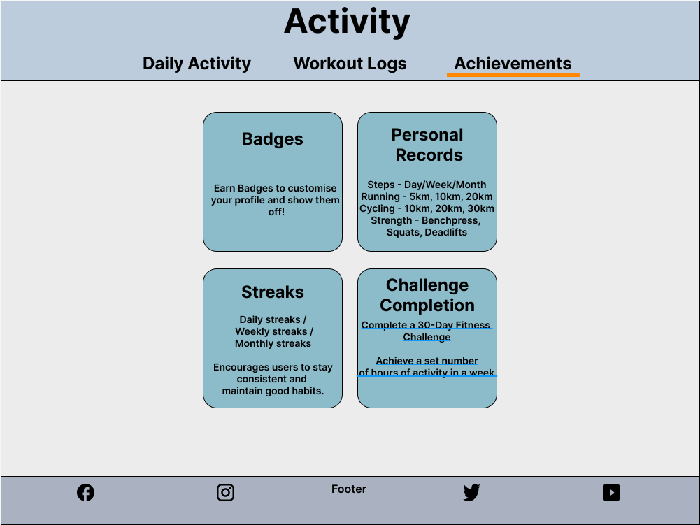

# Forge Fitness - Fitness Application

Forge Fitness is a comprehensive fitness companion designed to transform your wellness journey. This dynamic application empowers users to track workouts, set personalized goals, and achieve measurable results through an intuitive dashboard system. Whether you're a beginner starting your fitness journey or an experienced athlete looking to optimize your performance, Forge Fitness provides the tools and motivation needed to forge your path to better health.

---

## Table of Contents

There is no table of contents for this project yet as it in early developement stage and the focus is on the ux design and creating wireframes.

---

## Statistics

The following market research and user behavior data have been carefully selected to inform the development decisions for Forge Fitness. These statistics highlight key trends in the fitness app industry, user engagement patterns, health monitoring behaviors, and mobile design preferences. Each metric provides valuable insights that directly shape the project's features and implementation approach, ensuring the application meets real user needs while demonstrating effective full-stack development practices. The data is organized into four key areas that align with the project's core objectives and technical requirements.

### User Engagement and Retention

1. **High Abandonment Rates**:

- **Key Statistic**: 25% of mobile app users abandon fitness apps after first use, while successful apps retain 80% of users through effective onboarding

- **Visual Representation**:
  

- **Source**: [In-App Engagement Statistics & Tips for Health Apps](https://www.storyly.io/post/statistics-tips-for-health-apps-in-app-engagement)

- **Relevance to Forge Fitness**:
  - Intuitive dashboard design directly addresses user retention challenges
  - First-time user experience optimized through clear navigation and guided setup
  - Personalized goal-setting features engage users from day one
  - Achievement system provides immediate value and motivation
  - Regular progress updates keep users connected to their fitness journey

---

2. **Fitness App Market Trends**:

- **Market Size**: The global fitness app market is projected to grow from USD 14.7 billion (2023) to USD 120.37 billion by 2030, with a robust CAGR of 17.6%

- **Visual Representation**:
  

- **Source**: [Grand View Research](https://www.grandviewresearch.com/industry-analysis/fitness-app-market)

- **Relevance to Forge Fitness**:
  - The substantial market growth validates the focus on creating a comprehensive fitness platform
  - Rising demand for AI-driven personalization supports for smart workout planning features
  - Increasing user expectations for digital fitness solutions align with the progress tracking and achievement systems
  - Growing smartphone adoption rates reinforce mobile-first design approach

---

3. **User Health Habits**:

- **Key Statistics**:

  - 68% retention rate at 12 months for users who actively self-monitor vs 32% for non-monitoring users
  - Weekly active users show 82% higher retention rates compared to sporadic users
  - Multi-feature users demonstrate 40% higher daily usage rates
  - Personalized reminders increase app interaction by 25%

- **Visual Representation**:
  

- **Source**: [Effect of Self-Monitoring on Fitness Adherence](https://journals.plos.org/plosone/article?id=10.1371%2Fjournal.pone.0201166)

- **Relevance to Forge Fitness**:
  - **Comprehensive Tracking Integration**:
    - Daily workout logging system
    - Automated activity tracking
    - Multi-metric monitoring (steps, calories, weight)
    - Achievement milestones
    - Personalized goal reminders

---

4. **Mobile-First Design Importance**:

- **Key Statistics**:

  - **Mobile Dominance**:
    - Over 54% of global web traffic comes from mobile devices as of 2024.
    - _Source_: [Statista: Share of Website Traffic from Mobile Devices](https://www.statista.com/statistics/277125/share-of-website-traffic-coming-from-mobile-devices/)
  - **User Preferences for Mobile Apps**:
    - 85% of users prefer mobile apps over websites due to their speed, convenience, and offline capabilities.
    - _Source_: [App Usage Statistics 2024](https://www.statista.com/topics/1002/mobile-app-usage/)
  - **Fitness App Users are Mobile-Centric**:
    - 92% of fitness app users access these apps via their smartphones, making mobile design crucial.
    - _Source_: [Mobile App Usage Statistics for Fitness Apps](https://www.businessofapps.com/data/fitness-app-market/)
  - **Responsive Design Increases Retention**:
    - Apps with seamless mobile experiences have 30% higher retention rates compared to non-mobile-optimized platforms.
    - _Source_: [UX Design and Retention Study](https://www.uxdesigninstitute.com/blog/app-usage-statistics/)

- **Visual Representation**:
  

- **Relevance to Forge Fitness**:

  - **Design Priorities**:

    - Clean, minimalistic interface optimized for mobile screens
    - Touch-friendly dashboard elements for workout tracking
    - Responsive layout that adapts seamlessly across devices

  - **Feature Optimization**:

    - Quick-access workout logging for on-the-go users
    - Mobile-optimized progress charts and visualizations
    - Easy-to-navigate training sections on smaller screens

  - **User Experience Benefits**:
    - Instant access to fitness data during workouts
    - Simplified goal tracking through mobile dashboard
    - Seamless activity logging from any device

### Summary of Statistics

The market research and usage data strongly support the development direction for this project. With fitness apps projected to reach $120.37 billion by 2030, the timing is ideal for creating an innovative fitness application. The statistics show that 68% of users who track their progress maintain long-term engagement, while 92% primarily access fitness apps via smartphones. These insights have directly shaped Forge Fitness's development approach, focusing on intuitive mobile-first design, comprehensive tracking features, and personalized user experiences. By incorporating these data-driven decisions into the project architecture, Forge Fitness demonstrates practical application of modern web development principles while addressing real user needs in the digital fitness space. This research-backed foundation naturally flows into the established client goals, ensuring the project delivers both technical excellence and user value.

---

## Client Goals

The Forge Fitness application combines modern development practices with proven design patterns from industry leaders like PureGym, Garmin, and Strava. This milestone project showcases full-stack development capabilities while delivering a comprehensive fitness platform. By implementing features found in successful fitness applications and adding innovative elements, Forge Fitness demonstrates both technical proficiency and user-centered design principles. The following core objectives guide the development process and feature implementation:

1. **Create a User-Friendly Experience**:

   - Develop a visually appealing and intuitive interface that allows users to seamlessly navigate through features.
   - Ensure accessibility for users of all fitness levels, from beginners to experienced athletes.

2. **Support Personalization**:

   - Enable users to set personalized fitness goals and create tailored workout plans to suit their needs and preferences.
   - Provide flexible tracking tools that adapt to individual progress and routines.

3. **Enhance Motivation and Engagement**:

   - Deliver meaningful insights through progress tracking and activity visualization to keep users motivated.
   - Incorporate features like achievements and milestones to celebrate fitness successes.

4. **Offer Comprehensive Fitness Management**:

   - Combine multiple fitness needs in one platform, including workout tracking, calorie logging, and goal-setting.
   - Provide tools that empower users to manage and monitor their wellness journey efficiently.

5. **Prioritize Modern Design Standards**:
   - Emphasize clean, minimalistic design principles inspired by modern fitness platforms.
   - Ensure a mobile-responsive layout for a seamless experience across devices.

The Forge Fitness app aims to bridge the gap between simplicity and functionality, empowering users to take control of their fitness journey with a professional-grade toolset tailored to their unique goals.

---

## User Stories

The following user stories have been developed to guide the implementation of Forge Fitness features, ensuring each component delivers tangible value to users while meeting project requirements. Each story aligns with specific client goals and technical objectives, demonstrating both user-centered design and full-stack development capabilities. The stories are organized into core functional areas, with clear goal alignment statements showing how they support the project's primary objectives.

### Profile Management

- **Goal Alignment**: Supports "Create a User-Friendly Experience."
- As a **new user**, I want to create an account, so that I can save my fitness data and track my progress.
- As a **registered user**, I want to edit my profile details, so that my information remains up-to-date.
- As a **returning user**, I want to log in securely, so that I can access my personalized fitness data.

### Training Section

- **Goal Alignment**: Supports "Support Personalization."
- As a **user**, I want to explore different workout plans, so that I can find a routine that matches my fitness goals.
- As a **beginner**, I want access to instructional videos or guides, so that I can perform exercises safely and correctly.
- As an **advanced user**, I want to customize a training plan, so that I can focus on specific fitness objectives.

### Activity Tracking

- **Goal Alignment**: Supports "Enhance Motivation and Engagement."
- As a **user**, I want to log my daily workouts, so that I can keep a detailed history of my fitness activities.
- As a **health-conscious individual**, I want to track my calorie intake and steps, so that I can monitor my overall health.
- As a **busy professional**, I want to receive reminders to log my activities, so that I can stay consistent with my fitness journey.

### Progress and Insights

- **Goal Alignment**: Supports "Comprehensive Fitness Management."
- As a **goal-oriented user**, I want to set fitness goals, so that I can work toward specific milestones.
- As a **data-driven user**, I want to view charts and graphs of my progress, so that I can analyze trends over time.
- As a **motivated user**, I want to receive notifications when I achieve a goal, so that I stay inspired to continue.

### Settings

- **Goal Alignment**: Supports "Prioritize Modern Design Standards."
- As a **user**, I want to customize the app's appearance, so that it matches my personal preferences (e.g., dark mode).
- As a **privacy-conscious user**, I want to change my password, so that my account remains secure.
- As a **user**, I want to manage my notification preferences, so that I receive only relevant updates.

Each story maps directly to technical requirements while maintaining focus on user value, creating a balanced approach between development objectives and user needs. This structured foundation provides clear direction for feature implementation and testing phases of the project.

---

## Initial Design

The visual identity of Forge Fitness is built on a carefully selected color palette that emphasizes clarity, professionalism, and user engagement. The combination of light, complementary colors creates a modern aesthetic while ensuring optimal readability and visual hierarchy. The chosen color scheme reflects current design trends in fitness applications while maintaining distinctive brand identity:

#66B2FD - Argentinian Blue - Navigation bar

#ECECEC - Anti-flash White - Body 

#8CBCCA - Sky blue - Button/Page/Section 

#1853AB -  Sapphire Blue - Footer 

The typography is yet to be decided. But I want the layout of the website to be designed easy to read and visually appealing, with a focus on using a font that is both readable and visually appealing.

## User Experience (UX) and wireframes

To create a top class fitness app, this website is being desinged with a great amount of care and attention to detail. In the Dashboard page, I have included a variety of features to help users create their own workout regimes and track their progress tailored to their fitness goals. Here are the main features down below:

## Dashboard page

- 🏃‍♂️ Profile section - For users to create their profile, set their goals to help them achieve their progress.

- 💪 Training section - For users to select a workout of any type, create traning plans to help achieve specific goals and instructor led digital classes.

- 📊 Activity section - For users to track their physical activity, workout time, log their steps and monitor calories burnt.

- 📈 Progress section - For users to set goals and track their progress and achievements.

- ⚙️ Settings section - For users to set their account settings, such as password and email notifications. With also app appearance settings, feedback and support

---

## Sign Up page

The sign up interface provides a streamlined onboarding experience while capturing essential user information. Key features include:

### Design Elements

- Modern, clean layout with clear visual hierarchy
- Enticing opening message to encourage sign-up
- Responsive form design optimized for all devices
- Consistent brand colors using the established palette

### Core Functionality

- Required profile information fields (name, email, password)
- Password visibility toggle for password field

---

## Login Page

The login interface implements secure authentication while maintaining an intuitive user experience. Key features include:

### Design Elements

- Clean, minimalist layout focusing on essential login components
- Responsive form design that adapts to all screen sizes
- Brand-consistent color scheme and typography

### Core Functionality

- Email and password authentication fields
- Password reset capability via "Forgot Password" link
- New user registration through prominent "Sign Up" option
- Form validation with clear error messaging
- Secure session management

### User Experience

- Single-click social media login options
- Remember me functionality
- Quick access to account recovery
- Streamlined navigation between authentication states

This login implementation follows modern security practices while delivering a frictionless entry point to the Forge Fitness platform.

---

## Profile Page

The profile page offers users a central hub to manage their personal information, goals, and preferences, ensuring a customized fitness experience. Key features include:

### Design Elements

- Clean, modern layout with clear section divisions for easy navigation
- Interactive elements like buttons and input fields for user customization
- Consistent color scheme and typography aligned with the Forge Fitness brand
- Large, user-friendly **"Upload Photo"** option for profile personalization
- Responsive design ensuring seamless access across devices

### Core Functionality

- **Personal Information Management**:
  - Editable fields for **Preferred Name/Nickname** and **Email**
  - Bio/About Me section for users to add a personalized description
- **Fitness Preferences**:
  - Goal selection options: **Weight Loss, Balanced, Muscle Gain**
  - Customizable **Training Regularity** preferences: 1/2, 3/4, or 5+ days per week
  - Dynamic preference summary reflecting selected goals and routines
- **Photo Management**:
  - Upload and preview profile photo with support for image file types (e.g., PNG, JPEG)
  - Option to replace or remove an existing photo
- **Save Preferences**:
  - Save changes functionality to persist updated information

### User Experience

- Simple and intuitive form fields with clear labels and helper text
- Real-time feedback when changes are made, e.g., _"Your preferences have been updated!"_
- Visual feedback for selected buttons (e.g., active highlight state for goals and training preferences)
- Seamless transitions between sections for a smooth navigation flow
- Consistent use of icons to enhance clarity and engagement (e.g., profile, goals, calendar)

### Future Enhancements

- Integration of fitness progress visualization directly on the profile page
- Option to connect wearable devices (e.g., Fitbit, Apple Watch) for real-time fitness data
- Advanced settings for privacy preferences and notification customization

The profile page is designed to empower users with control over their fitness journey, offering a user-friendly, customizable experience while maintaining visual consistency with the Forge Fitness platform.

---

## Training Page

The **Training Page** serves as a central hub for users to explore structured workout guidance and how personalized fitness plans work. This section is designed to provide clear, actionable insights, making it easier for users to understand their training options and track progress efficiently.

### **Introduction**

The **Introduction** section provides users with a foundational understanding of the training program. It explains the core principles behind structured fitness routines and highlights the importance of consistency, form, and goal setting. Whether users are beginners or experienced athletes, this section offers essential guidance on how to approach their fitness journey effectively.

### **Workouts**

The **Workouts** section is dedicated to helping users understand the role of different muscle groups and the exercises that target them effectively. 

- **Muscle Group Breakdown:**
  - Users can explore all the workout categories based on different body areas, ensuring a balanced workout approach.
  - Includes guidance on exercises for major muscle groups such as:
    - Chest
    - Back
    - Legs
    - Shoulders
    - Arms
    - Core
    - Full Body Workouts

- **Exercise Demonstrations:**
  - Each workout category provides information on the most effective exercises for that muscle group.
  - Users can follow step-by-step instructions or access additional resources to ensure proper form and injury prevention.

- **Training Techniques:**
  - Guidance on how to integrate progressive overload, rest periods, and rep schemes into their routine for optimal results.

### **Training Plans**

The **Training Plans** section provides structured workout programs tailored to different fitness goals. Whether users are looking to **lose weight, build muscle, or enhance endurance**, this section offers a variety of programs to suit their needs.

- **Structured Programs:**
  - Users can follow pre-designed training plans or customize their own based on their fitness level and goals.
  - Each plan outlines:
    - Recommended workout frequency
    - Exercise selection
    - Progress tracking strategies

- **Goal-Based Training Plans:**
  - **Weight Loss:** Focused on high-intensity workouts, calorie burning, and metabolic conditioning.
  - **Muscle Gain:** Strength-building exercises, hypertrophy-focused routines, and recovery strategies.
  - **Endurance Training:** Plans designed to improve stamina, cardiovascular health, and athletic performance.

- **Progress Tracking:**
  - Encourages users to log their workouts and adjust their plans based on improvements and feedback.

### **Summary**

The **Summary** section ties together key takeaways from the **Introduction, Workouts, and Training Plans**. This section reinforces how users can apply the provided information to their fitness journey, ensuring they make informed decisions that align with their personal health goals.

- **Why This Matters:**
  - Highlights how structured training enhances results.
  - Emphasizes the importance of tracking progress and making adjustments.

- **Next Steps:**
  - Encourages users to explore different training plans, experiment with workout variations, and stay consistent in their routines.
  - Provides recommendations for further learning and improvement.

### **Training Page Conclusion**

The Training section of the platform is designed to offer a **comprehensive, structured, and user-friendly** approach to fitness. By combining key insights from **Introduction, Workouts, Training Plans, and Summary**, users are empowered with the knowledge and resources they need to take control of their fitness journey. Whether they are starting out or refining their routine, this section provides the **guidance, structure, and motivation** needed to achieve long-term success.

---

## Activity Page

The Activity Page provides users with an intuitive and comprehensive platform to monitor their daily movement, workout routines, and fitness achievements.
It emphasizes tracking key metrics that support users in achieving their fitness goals and maintaining an active lifestyle.

### Daily Activity

### Core Metrics

**Movement Analytics**

- Step Counter

  - Daily step tracking
  - Daily goal progress
  - Weekly trend analysis

- Elevation Tracking

  - Vertical gain monitoring
  - Stair-climbing metrics
  - Terrain difficulty scoring

- Distance Measurement

  - Daily mileage tracking
  - Route mapping
  - Achievement milestones

- Active Time
  - Intensity zone tracking
  - Movement quality scoring
  - Rest/activity balance

**Importance**

Maintaining daily physical activity is crucial for achieving fitness goals and overall health. 
Regular movement, such as walking, climbing stairs, or engaging in light exercises, complements 
structured workouts by enhancing cardiovascular health, 
improving endurance, and aiding in weight management. 
According to the World Health Organization (WHO), regular physical activity contributes to the prevention 
and management of noncommunicable diseases like cardiovascular diseases, cancer, and diabetes, 
and also reduces symptoms of depression and anxiety.

While specific percentages on accelerated goal achievement due to daily activity vary 
among individuals and depend on factors like baseline fitness levels and overall lifestyle, 
the consensus is clear: integrating consistent daily activity with your fitness regimen 
significantly enhances the likelihood of reaching and maintaining your health objectives. 
Therefore, focusing on daily movement is a practical and effective strategy to support your fitness journey.

--- 

### Workout Logs

The Workout Logs section is designed to provide users with an intuitive way to track, review, and manage their workout routines.
It encourages consistency, provides insights into progress, and helps users tailor their fitness journey to achieve their goals effectively.

#### Key Features

1. **Custom Workouts**:
   - Allows users to manually log their own workout routines.
   - Includes details such as:
     - Workout name or activity type.
     - Duration of the workout.
     - Intensity level for better tracking and categorization.

2. **Performance Metrics**:
   - Displays key performance indicators for users to monitor their workouts, such as:
     - Distance covered for cardio exercises.
     - Sets, reps, and weights for strength training.
     - Heart rate zones and intensity levels.

3. **Workout History**:
   - Keeps a detailed log of past workout sessions.
   - Includes:
     - Date and time of each workout.
     - Duration of the session.
     - Type of workout completed.
     - Calories burned during the workout.

4. **Notes/Comments**:
   - Provides a space for users to add personal notes or reflections for each workout.
   - Enables users to:
     - Record observations, challenges, or improvements.
     - Look back at past entries to see progress and learn from their experiences.
     - Maintain motivation through personal reflections.

#### Benefits

- **Flexibility**: Users can log workouts that are outside of predefined plans, ensuring comprehensive tracking.
- **Insight**: Performance metrics help users identify strengths and areas for improvement.
- **Motivation**: Personal notes foster accountability and allow users to reflect on their progress over time.

#### Importance
The Workout Logs section is an essential part of Forge Fitness, enabling users to stay organized and 
focused on their fitness goals, no matter their level or preferred workout style.

---

### Achievements 

The Achievements section in the Activity Page offers users a motivational and rewarding 
system to track and celebrate their fitness milestones. By incorporating a mix of visual rewards, 
performance tracking, and consistency challenges, this section aims to keep users engaged and 
inspired throughout their fitness journey.

### Key Features

- **Badges**:
  - Earn badges to customize your profile and showcase your accomplishments.
  - Examples include “10,000 Steps in a Day” or “First Workout Logged.”
  - Encourages users to strive for specific goals and provides a sense of achievement.

- **Personal Records**:
  - Track your best performance across various activities:
    - **Steps**: Day/Week/Month tracking.
    - **Running**: 5km, 10km, 20km milestones.
    - **Cycling**: 10km, 20km, 30km challenges.
    - **Strength**: Bench press, squats, deadlifts records.
  - Keeps users motivated to improve and surpass their previous records.

- **Streaks**:
  - Track daily, weekly, and monthly streaks to encourage consistency.
  - Builds good habits by rewarding users for staying active over time.
  - Examples include “7-Day Active Streak” or “30 Days of 10,000 Steps.”

- **Challenge Completion**:
  - Complete predefined challenges such as:
    - A 30-Day Fitness Challenge.
    - Achieve a set number of hours of activity in a week.
  - Adds excitement and short-term goals to keep users engaged.

### Visual Representation

Each achievement type is visually represented with distinct cards, designed for clarity and simplicity:
- **Interactive Cards**: Highlight achievements with intuitive designs.
- **Icons**: Easily recognizable visuals to enhance user understanding and engagement.
- **Future Expandability**: This section is flexible for future additions, like new challenges or badges.

### User Benefits
- Encourages long-term commitment and consistency.
- Motivates users to surpass personal records and push their limits.
- Builds a sense of community and competition by showcasing achievements.

#### Importance

The Activity section brings together key tools to help users monitor their 
daily efforts, reflect on past workouts, and celebrate meaningful milestones. 
By offering clear insights and actionable data, it supports users in staying on track and 
building sustainable habits over time. Whether tracking steps, reviewing workout performance, 
or reaching personal goals, the Activity section ensures that users have the 
information they need to stay focused and make steady progress.

---

### Progression page

The Progression Page provides users with a detailed and interactive platform to track their fitness journey over time.
This page focuses on providing meaningful insights and visual representations to help users stay motivated and achieve their fitness goals.

### Features and Sections

#### **1. Overview**
The Overview section offers a high-level snapshot of the user's current progress, making it easy to stay on track and see the bigger picture.
- **Goals Snapshot**: Displays progress towards active goals, such as:
  - *Weight Loss Goal*: "70% Complete (7kg out of 10kg lost)."
  - *Steps Goal*: "90% Complete (45,000 out of 50,000 weekly steps)."
- **Activity Breakdown**:
  - Cardio: 40%.
  - Strength Training: 35%.
  - Stretching: 25%.
- Highlights recent trends and achievements to keep users motivated.

#### **2. Data Visualization**
This section uses visual tools to display trends and comparisons, helping users analyze their progress effectively.
- **Progress Graphs**: Line or bar charts illustrating metrics such as:
  - Weight progression.
  - Distance covered.
  - Calories burned.
  - Strength improvement over time.
- **Comparison Metrics**: Allows users to compare their performance across different timeframes, such as weekly or monthly trends.
- **Distribution Insights**: Provides a breakdown of activity types, like cardio versus strength training, to help users adjust their routines for balanced fitness.

#### **3. Feedback**
The Feedback section gives users personalized insights and actionable tips based on their performance data.
- **Progress Milestones**:
  - Celebrate achievements like "Halfway to goal!" or "50 workouts completed."
- **Insights and Tips**:
  - "You've increased your weekly activity by 15% compared to last month."
  - "Based on your trends, consider adding more rest days for better recovery."
- Encourages users to reflect on their progress and make informed adjustments to their fitness routines.

The Progression Page is designed to empower users with a comprehensive view of their fitness journey, 
combining actionable feedback, visual data, and a clear snapshot of their achievements. 
By integrating meaningful insights with easy-to-understand visuals, 
the page keeps users engaged, motivated, and on track to meet their fitness goals.

---

### Settings Page

The Settings Page provides users with the flexibility to personalize their Forge Fitness experience, ensuring the app aligns with their preferences, lifestyle, and security needs.

### **App Preferences**
- **Theme Selection**: Users can toggle between light mode and dark mode to suit their visual preferences.
- **Unit Preferences**: Choose between metric or imperial units for all fitness-related data.

### **Notifications and Settings**
- **Toggle Notifications**: Enable or disable reminders for workouts, daily goals, and progress updates.
- **Quiet Hours**: Set specific times during which notifications are silenced.
- **Frequency Customization**: Adjust how often notifications are sent for different activities.

### **Privacy and Security**
- **Two-Factor Authentication**: Enhance account security by enabling an extra layer of protection.
- **Data Export**: Download all fitness-related data for personal use or analysis.
- **Account Management**: Options to delete or deactivate the account if needed.

### **Support and Feedback**
- **Quick Solutions**: Access a knowledge base or FAQ section to solve common issues.
- **Live Support Options**: Connect with support staff via live chat, email, or ticket submission.
- **Improvement Suggestions**: Users can submit feedback or suggestions to enhance the app.

--- 

## Database Structure

Forge Fitness leverages a sophisticated database architecture meticulously designed to manage user data, fitness tracking, and workout programming with efficiency and precision. The scheme establishes well-defined relationships between tables, ensuring seamless data integration, integrity, and optimized query performance. This structure underpins the application’s core functionalities, including personalized user profiles, detailed workout tracking, activity monitoring, and achievement systems. By prioritizing scalability and reliability, the database provides a robust foundation for delivering a seamless and engaging fitness management experience.

---

### 1. User Table
**Purpose**: Stores user account details required for authentication and profile personalization.

#### Key Fields:
- **id**: Unique identifier for each user.
- **first_name** and **last_name**: Personal information for identification.
- **email**: Unique and used for login.
- **password**: Stores the securely hashed password for authentication.
- **profile_photo**: Allows users to upload a profile picture for a more personalized experience.
- **is_active**: Indicates whether the account is active or deactivated.
- **created_at**: Tracks when the user registered.

### How It Works:
- This table is central to the application, as all other tables are linked to it through `user_id`.
- It ensures secure and efficient user management.

---

### 2. Settings Table
**Purpose**: Stores user-specific preferences for app customization and notifications.

#### Key Fields:
- **theme_preference**: Allows users to toggle between light and dark modes.
- **unit_preference**: Supports metric or imperial units for tracking fitness data.
- **notification_frequency**: Configures how often users receive notifications.
- **quiet_hours_start** and **quiet_hours_end**: Defines times to mute notifications.
- **two_factor_enabled**: Adds an extra layer of account security.

#### How It Works:
- Linked to the **User Table** through `user_id`.
- Provides a personalized user experience by storing their preferences.

---

### 3. Training Plans Table
**Purpose**: Manages predefined and user-created training plans for different fitness goals.

#### Key Fields:
- **title** and **description**: Provide details about the training plan.
- **created_by**: Tracks who created the plan (an admin or the user).
- **created_at**: Tracks when the plan was created.

#### How It Works:
- Training plans are accessible by users and linked to their goals.
- Users can choose or customize plans based on their fitness objectives.

---

### 4. Activity Table
**Purpose**: Logs user activities (e.g., walking, running, strength training) for tracking progress.

#### Key Fields:
- **activity_type**: Specifies the type of activity performed.
- **steps**, **distance**, **calories_burned**, and **duration**: Capture detailed metrics of the activity.
- **date**: Logs when the activity took place.

#### How It Works:
- Linked to the **User Table** through `user_id`.
- Provides insights into daily activities and supports progress tracking.

---

### 5. Progress Table
**Purpose**: Tracks user goals and their progress toward achieving them.

#### Key Fields:
- **goal**: Defines the user's fitness objective (e.g., weight loss, muscle gain).
- **progress_percentage**: Measures how much of the goal is complete.
- **milestones**: Stores text descriptions of milestones achieved.
- **last_updated**: Tracks the most recent update to the progress.

### How It Works:
- Linked to the **User Table** through `user_id`.
- Enables users to monitor progress visually and adjust goals as needed.

---

### 6. Workout Logs Table
**Purpose**: Records detailed information about individual workouts.

#### Key Fields:
- **workout_name**: Names the workout (e.g., "Push Day").
- **sets**, **reps**, and **weight**: Track workout specifics.
- **date**: Captures when the workout was performed.

#### How It Works:
- Linked to the **User Table** through `user_id`.
- Allows users to maintain a log of their workouts for analysis and improvement.

---

### 7. Achievements Table
**Purpose**: Rewards users with badges and milestones for motivation and consistency.

#### Key Fields:
- **badge**: Describes the earned achievement (e.g., "Steps Champion").
- **date_earned**: Records when the achievement was unlocked.

#### How It Works:
- Linked to the **User Table** through `user_id`.
- Gamifies the fitness experience to keep users motivated and engaged.

---

### How It All Works Together

#### User-Centric Design:
- All tables are linked via the `user_id` field, ensuring that data is scoped to individual users.

#### Personalization:
- The **Settings Table** ensures that each user has a tailored experience.
- The **Training Plans**, **Workout Logs**, and **Achievements Tables** support customized fitness journeys.

#### Progress Tracking:
- Data from the **Activity Table** and **Progress Table** work together to give users insights into their fitness progress.

#### Motivation:
- The **Achievements Table** keeps users engaged through rewards and gamification.

#### Scalability:
- The structure is modular, allowing future features (e.g., social features, additional activity types) to be easily added.

---

## Folder Structure

The Forge Fitness project follows a modular and well-structured architecture to maintain scalability, maintainability, and ease of collaboration. This structure ensures that different components such as user authentication, workout tracking, activity monitoring, and progress tracking are organized effectively. Each major functionality is contained within its own Django app, following best practices for separation of concerns.

The organization of the files and directories ensures that:
- User-related functionalities are managed in the `users/` directory.
- Activities tracking and progress monitoring are housed in the `activities/` and `progress/` directories, respectively.
- Training plans and workouts are structured under the `training/` directory.
- User settings and preferences are handled within the `settings/` directory.
- Static files, templates, and assets are kept separate to maintain clarity.

### How It Works

Each directory corresponds to a specific feature or functionality of the application:

1. **Root Directory (`forge-fitness/`)**:
   - Contains project-wide configuration files such as `manage.py` for running the Django server, `requirements.txt` for dependencies, and `.env` for environment variables.

2. **Main Application (`forge_fitness/`)**:
   - Houses core Django settings, URL configurations, and global templates like `base.html`, `navbar.html`, and `footer.html`.
   - Includes static files (`static/`) used throughout the project, such as CSS, JavaScript, and images.

3. **Users Module (`users/`)**:
   - Manages user authentication and profile data.
   - Contains models, views, forms, and templates for login, signup, and profile management.
   - Stores user-specific static files and database migrations.

4. **Activities Module (`activities/`)**:
   - Handles logging of user activities such as step tracking, distance covered, and calories burned.
   - Includes templates for viewing daily activity logs and achievements.
   - Provides models that store activity-related data.

5. **Training Plans (`training/`)**:
   - Manages workout programs and training plans.
   - Contains models for workout types, training sessions, and user-selected plans.
   - Includes templates for viewing available training plans and scheduling workouts.

6. **Progress Tracking (`progress/`)**:
   - Tracks user goals and milestones.
   - Includes views and templates for visualizing progress through charts and statistics.
   - Stores database models that track progress percentages and milestones.

7. **Settings (`settings/`)**:
   - Manages user preferences such as theme selection, notification settings, and privacy controls.
   - Contains models to store user-specific configurations.
   - Templates allow users to adjust their preferences.

8. **Assets and Wireframes (`assets/`)**:
   - Stores UI wireframes and diagrams that help document and guide development.
   - Includes the `database-structure.png` and `folder-structure.png` diagrams for reference.

---

### How It Ties Into the Database Structure

Each directory within the folder structure corresponds directly to a **table in the database**, ensuring a **one-to-one mapping between the frontend logic and backend storage**. Here's how they align:

- The **`users/` app** aligns with the **User Table**, managing authentication and profile data.
- The **`activities/` app** connects with the **Activity Table**, recording workout times, steps, and calories burned.
- The **`training/` app** is linked to the **Training Plans Table**, ensuring users can access structured workouts.
- The **`progress/` app** stores user milestones and goal achievements, directly mapping to the **Progress Table**.
- The **`settings/` app** works with the **Settings Table**, allowing users to customize their app experience.

By maintaining this structured relationship, this project follows a smooth flow of data between the backend database and the frontend interface. The database structure is fully integrated with the project’s folder organization, making it easy to manage, scale, and extend in future development.

---