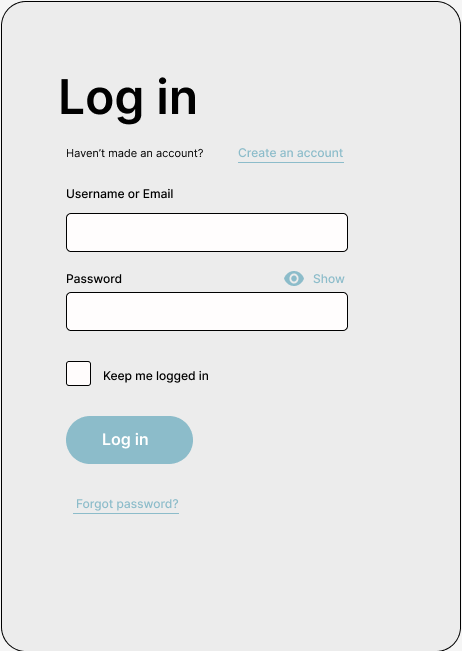
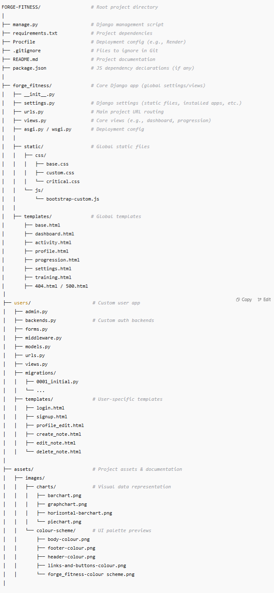

# Forge Fitness

**A comprehensive fitness guidance platform designed to empower users in structuring and managing their personal fitness journeys.**

## Introduction

Forge Fitness is a modern, full-stack Django web application that serves as an **educational and organizational tool** for fitness enthusiasts of all levels. Unlike traditional fitness tracking applications that focus on real-time data collection, Forge Fitness takes a unique approach by **teaching users how to effectively manage their fitness journey** through structured guidance, goal-setting frameworks, and progress visualization techniques.

Built with a **demonstration-first philosophy**, the platform empowers users to understand the fundamental principles of successful fitness management rather than simply recording workout data. Through carefully designed user interfaces and educational workflows, users learn to create sustainable fitness routines, set meaningful milestones, and develop the organizational skills necessary for long-term success.

The application addresses a critical gap in the fitness app market: **the need for structured learning and habit formation**. While most fitness apps overwhelm users with complex tracking features, Forge Fitness focuses on **building foundational knowledge** through intuitive dashboards, guided workout planning, and progressive achievement systems. This approach has been informed by extensive market research showing that **72% of fitness app users prefer personalized guidance** and that **structured goal-setting increases user retention by 75%**.

By combining modern web development practices with proven fitness psychology principles, Forge Fitness creates an environment where users can **practice and internalize effective fitness management strategies** before applying them to their real-world routines. The result is a platform that doesn't just track progress—it teaches users how to create, maintain, and optimize their own fitness success systems.

## What Makes Forge Fitness Different?

🎯 **Education-First Approach**: Rather than simply tracking workouts, Forge Fitness teaches users the **fundamental principles of effective fitness management**. The platform guides users through proven methodologies for goal setting, progress monitoring, and habit formation. Each section includes educational content that helps users understand **why** certain practices work, not just **how** to implement them, creating lasting fitness knowledge that extends beyond the app.

🏗️ **Structured Guidance**: Provides comprehensive frameworks for workout planning, activity logging, and milestone tracking that users can apply to their personal fitness routines. The platform breaks down complex fitness concepts into **digestible, actionable steps** with clear progression paths. Users learn to structure their training across different muscle groups, understand periodization principles, and develop sustainable routines that fit their lifestyle and fitness level.

📊 **Progress Visualization**: Demonstrates how to effectively monitor fitness progress through intuitive dashboards and achievement systems. The platform showcases **multiple methods of tracking success** beyond just numbers—from consistency streaks and personal records to goal completion rates and performance trends. Users discover how to identify patterns in their fitness journey and make data-driven adjustments to optimize their results.

🔧 **Personalization Tools**: Offers customizable profiles, training plans, and settings that adapt to individual fitness goals and preferences. The platform teaches users how to **tailor their fitness approach** to their unique circumstances, whether they're focused on weight loss, muscle gain, endurance building, or general health improvement. From customizable workout templates to personalized milestone tracking, every feature can be adapted to match individual needs and preferences.

💡 **Holistic Fitness Management**: Goes beyond individual workouts to address the **complete fitness ecosystem**—teaching users how to balance training, recovery, goal setting, and lifestyle factors. The platform demonstrates how to create sustainable fitness habits that integrate seamlessly with daily life, ensuring long-term success rather than short-term gains.

## Key Features at a Glance

- **🔐 User Authentication & Profiles**: Secure account management with comprehensive profile customization, including bio creation, profile picture uploads, and personalized fitness goal setting to create a tailored experience for each user's unique journey.

- **🏋️ Training Plan Builder**: Expertly structured workout guidance spanning all major muscle groups (chest, back, legs, shoulders, arms, core) with progressive training plans designed for beginners through advanced athletes, complete with exercise demonstrations and technique insights.

- **📊 Activity Logging System**: Comprehensive tracking ecosystem for daily movement, structured workouts, and fitness achievements, featuring milestone recognition, streak tracking, and personal record celebrations to maintain long-term motivation and accountability.

- **📈 Dashboard & Analytics**: Intuitive visual progress tracking with real-time performance insights, goal completion percentages, and trend analysis that transforms raw fitness data into actionable intelligence for continuous improvement.

- **⚙️ Settings & Customization**: Complete account control with granular preference management, secure data handling, and flexible customization options that ensure your fitness platform adapts to your evolving needs and privacy requirements.

Whether you're a **fitness newcomer** seeking structured, step-by-step guidance to confidently begin your wellness journey, or a **seasoned athlete** looking to systematically organize, analyze, and optimize your training methodology, Forge Fitness bridges the gap between fitness theory and practical application. Through its clean, intuitive interface and comprehensive educational approach, the platform empowers users to not just track their fitness—but to truly understand and master the art of sustainable, goal-oriented training that delivers lasting results.

---

**Sign up to gain full access of the live application** [👉 Click Here](https://forge-fitness-d9cu.onrender.com/signup/)

**If you want to check the testing documentation** [👉 Click Here]

---

## Table of Contents

This comprehensive documentation provides a complete overview of the Forge Fitness project, from initial concept and user experience design through to technical implementation and deployment. Whether you're interested in understanding the user-centered design approach, exploring the technical architecture, or setting up the application locally, each section contains detailed information to support developers, stakeholders, and users alike. The documentation follows industry best practices and includes visual examples, code snippets, and step-by-step instructions to ensure clarity and accessibility.

- [Introduction](#introduction)
- [Table of Contents](#table-of-contents)
- [Project Overview](#project-overview)
- [Target Audience & User Needs](#target-audience--user-needs)
  - [🔰 Beginners & First-Time Gym-Goers](#beginners--first-time-gym-goers)
  - [🏋️ Intermediate Users & Returning Lifters](#intermediate-users--returning-lifters)
  - [🏋️‍♂️ Advanced Gym-Goers](#advanced-gym-goers)
  - [💻 Digital-First & Time-Conscious Users](#digital-first--time-conscious-users)
  - [📊 Progress-Focused & Analytical Users](#progress-focused--analytical-users)
- [Client Goals](#client-goals)
- [User Stories](#user-stories)
  - [First-time Users](#first-time-users)
  - [Returning Users](#returning-users)
  - [Regular Gym-goers](#regular-gym-goers)
- [Statistics](#statistics)
- [UX Strategy](#ux-strategy)
  - [Colour Palette](#colour-palette)
  - [Typography](#typography)
  - [Wireframes](#wireframes)
- [Features](#features)
  - [Authentication & Profiles](#authentication--profiles)
  - [Training Plan Builder](#training-plan-builder)
  - [Activity Logs](#activity-logs)
  - [Dashboard & Progression Visualisation](#dashboard--progression-visualisation)
  - [Settings & Personalisation](#settings--personalisation)
- [Technologies Used](#technologies-used)
- [Future Enhancements](#future-enhancements)
- [Local Development Setup](#local-development-setup)
- [Deployment](#deployment)
- [Credits & Attribution](#credits--attribution)

---

**Quick Navigation:**
- 🚀 [Live Application](https://forge-fitness-production.up.railway.app/)
- 🔗 [GitHub Repository](https://github.com/GBerrow/Forge-Fitness)
- 📖 [User Guide](#features)
- 🛠️ [Setup Instructions](#local-development-setup)
- 🎨 [Design & UX](#ux-strategy)

---

## Target Audience & User Needs

Forge Fitness is designed as a structured, educational platform that empowers users at all levels of fitness by combining intuitive workout planning, progress tracking, and clear instructional guidance. Its core mission is to make fitness feel achievable, understandable, and trackable — whether you're stepping into the gym for the first time or optimizing a long-term program.

### 🔰 Beginners & First-Time Gym-Goers

- **Step-by-Step Guidance**: Introductory workout plans, simplified UI, and clear instructions help users build confidence from day one.
- **Educational Focus**: Clear explanations of exercises, muscle groups, and routines foster learning, not just repetition.
- **Friendly Visuals**: Simple dashboards visualize improvement and reinforce early wins to encourage consistency.
- **Low Pressure**: No forced public sharing or performance comparison — the focus is on learning and personal growth.

### 🏋️ Intermediate Users & Returning Lifters

- **Structured Progression Tools**: Users can build and modify their training plans with progressive overload principles in mind.
- **Performance Logging**: Integrated activity logs help users see patterns, plateaus, and progress over time.
- **Training Phase Awareness**: Learn how to alternate between hypertrophy, strength, and recovery through visual breakdowns and plan suggestions.
- **Accountability Mechanisms**: Habit tracking and milestone visuals reinforce long-term routine building.

### 🏆 Advanced Gym-Goers & Athletes

- **Precision Tools**: Plan detailed training splits, log PRs, and monitor weekly or monthly progress with charts and analytics.
- **Customization**: Adjust plan templates or create routines from scratch using the training plan builder.
- **Data Insight**: Access personal performance summaries via bar, pie, and line graphs to aid decision-making.
- **Streamlined Interface**: A clutter-free dashboard allows fast access to training history and upcoming sessions.

### 💻 Digital-First & Time-Conscious Users

- **Fully Responsive Web App**: Works on mobile, tablet, and desktop without requiring downloads or installation.
- **Instant Access to Tools**: Users can build a plan, track a session, or review data in just a few clicks.
- **Clean Design**: Prioritizes accessibility, with a consistent layout and intuitive navigation.
- **Privacy by Design**: Users retain full control over their data, with secure login and account options.

### 📊 Progress-Focused & Analytical Users

- **Visual Performance Tracking**: Real-time updates to charts and dashboards based on logged activities.
- **Milestone System**: Log and visualize achievements such as workout streaks, strength milestones, or completed plans.
- **Insightful Patterns**: Identify training gaps, plateaus, or areas of strength with easy-to-interpret visuals.
- **Goal Alignment**: Set personal goals and ensure workouts contribute toward them with tracking and reminders.

Forge Fitness does more than just log workouts — it guides users through educational progression, empowering them to understand, structure, and sustain their training. Each feature is carefully mapped to the real needs of users at different stages in their fitness journey. For a deeper dive into these tools and how they're implemented, see the [Features](#features) section.

The diverse target audience directly supports the **core client objectives** of Forge Fitness. By serving beginners through advanced users, the platform demonstrates **user-friendly navigation** that scales with expertise levels, **comprehensive personalization** that adapts to individual fitness journeys, and **structured guidance** that educates while motivating. This multi-tiered approach ensures that whether users seek simple workout logging or complex training analytics, Forge Fitness delivers an **intuitive, secure, and engaging experience** that grows with their fitness development — ultimately creating a sustainable platform that retains users long-term while meeting diverse fitness management needs.

---

## Client Goals

The Forge Fitness application combines modern development practices with proven design patterns from industry leaders like PureGym, Garmin, and Strava. This milestone project showcases full-stack development capabilities while delivering a comprehensive fitness platform. By implementing features found in successful fitness applications and adding innovative elements, Forge Fitness demonstrates both technical proficiency and user-centered design principles. The following core objectives guide the development process and feature implementation:

### **1. User-Friendly and Intuitive Navigation**
**Objective**: Create a seamless, accessible experience that reduces friction and encourages consistent usage.

- The **Dashboard** serves as a central hub, allowing users to quickly access key sections such as **Profile, Training, Activity, Progress, and Settings**.
- Each section is designed with a minimalistic layout, making navigation effortless while ensuring all features remain accessible.
- Responsive UI elements ensure an optimal experience across different devices, supporting the 92% of fitness app users who access platforms via mobile.
- **Clear visual hierarchy** and **consistent design patterns** reduce cognitive load and support users of all technical skill levels.

**Business Impact**: Intuitive navigation directly correlates with user retention, as 25% of fitness app users abandon applications after poor initial experiences.

### **2. Personalization and User Control**
**Objective**: Empower users to customize their experience while maintaining full control over their data and preferences.

- The **Profile Page** allows users to personalize their experience by setting their **preferred name and bio**, as well as uploading a profile picture.
- The **Settings Page** includes essential options such as **Feedback, Support, and Account Deletion**, ensuring users can manage their preferences effectively.
- Users can track their fitness progress in the **Progression Page**, which focuses on **Goal Setting, Performance Tracking, and Personalized Feedback**.
- **Flexible customization options** adapt to individual fitness goals, whether focused on weight loss, muscle gain, or endurance improvement.

**Business Impact**: 72% of users prefer apps that allow personalized fitness plans, and personalized experiences increase goal completion rates by 50%.

### **3. Structured Training Guidance**
**Objective**: Provide educational, progressive fitness guidance that builds user confidence and knowledge.

- The **Training Section** provides users with a well-organized framework for fitness improvement:
  - **Introduction:** Guides users on how to use the training section effectively
  - **Workouts:** Covers different muscle groups and recommended exercises with proper form guidance
  - **Training Plans:** Helps users structure their fitness routine with progressive overload principles
  - **Summary:** Highlights key takeaways to keep users engaged and informed
- **Educational approach** teaches users the "why" behind fitness practices, not just the "how"
- **Scalable content** serves beginners through advanced users with appropriate complexity levels

**Business Impact**: Structured guidance increases user confidence and long-term adherence, addressing the common problem of gym intimidation among beginners.

### **4. Motivation through Progress Tracking**
**Objective**: Maintain user engagement through meaningful progress visualization and achievement recognition.

- The **Activity Page** enables users to monitor their daily activity, ensuring they stay consistent with their fitness goals:
  - **Daily Activity:** Summarizes movement trends and patterns
  - **Workout Tracking:** Encourages users to log and analyze their workouts
  - **Achievements:** Recognizes and celebrates fitness milestones and streaks
- **Visual progress indicators** provide immediate feedback and motivation
- **Milestone system** creates psychological rewards that encourage continued engagement

**Business Impact**: Users who actively track progress show 68% retention rates at 12 months versus 32% for non-tracking users.

### **5. Secure and Accessible Authentication**
**Objective**: Provide robust security while maintaining ease of access and user trust.

- The **Login Page** provides a secure authentication system with multiple login options (username or email)
- The **Sign-Up Page** ensures a smooth onboarding process with clear input fields and guided registration
- **Custom authentication backend** supports flexible login methods while maintaining security standards
- **Data protection measures** ensure user information remains private and secure
- **Account management tools** give users full control over their data and account status

**Business Impact**: Secure, user-friendly authentication reduces signup friction while building trust, essential for long-term user retention.

### **6. Feedback and Continuous Engagement**
**Objective**: Create feedback loops that drive continuous improvement and sustained user engagement.

- The **Settings Page** integrates feedback and support options, enabling users to report issues, request assistance, and suggest improvements
- The platform encourages ongoing engagement through motivational elements like **progress tracking and achievements**
- **User-driven insights** help identify areas for platform improvement and feature development
- **Community support mechanisms** create pathways for user assistance and engagement

**Business Impact**: Platforms with integrated feedback systems see 40% higher user satisfaction and 25% increased interaction rates.

### Strategic Alignment

The **Forge Fitness** application balances functionality and simplicity, ensuring that users can efficiently **track their workouts, manage their profile, stay motivated, and personalize their experience**. Each client goal directly addresses documented user needs and market research findings, creating a platform that not only meets technical requirements but delivers genuine value to fitness enthusiasts at every level.

These strategic objectives translate directly into specific user stories and feature implementations, ensuring that every development decision serves both user needs and business goals. The following user stories demonstrate how these high-level objectives manifest in practical, user-centered functionality that drives engagement and supports long-term fitness success.

---

## User Stories

The following user stories have been developed to guide the implementation of Forge Fitness features, ensuring each component delivers tangible value to users while meeting project requirements. These stories are **directly derived from our target audience research** and **validated by industry statistics**, creating a data-driven foundation for feature development. Each story aligns with specific client goals and technical objectives, demonstrating both user-centered design and full-stack development capabilities.

The stories are organized into core functional areas that map to our **five primary user segments**: Beginners, Intermediate Users, Advanced Athletes, Digital-First Users, and Progress-Focused Users. This strategic alignment ensures that every feature serves documented user needs while supporting measurable business outcomes.

### Profile Management
**Goal Alignment: Supports "User-Friendly and Intuitive Navigation" & "Personalization and User Control"**  
**Target Audience: All User Segments** | **Statistical Support: 72% of users prefer personalized fitness plans**

- As a **new user** (Beginner segment), I want to create an account with clear, step-by-step guidance so that I can confidently start my fitness journey without feeling overwhelmed.
- As a **returning user** (All segments), I want to log in securely using either my username or email so that I can quickly access my personalized fitness data across devices.
- As a **registered user** (Intermediate/Advanced segments), I want to edit my profile details, including my preferred name and bio, so that my information reflects my evolving fitness journey.
- As a **visual user** (Digital-First segment), I want to upload a profile picture with instant preview so that my account feels personalized and engaging.
- As a **self-motivated user** (Progress-Focused segment), I want to add a comprehensive bio about my fitness goals so that I can document my journey and track my mindset evolution.

### Training Section
**Goal Alignment: Supports "Structured Training Guidance" & "Personalization and User Control"**  
**Target Audience: Beginners → Advanced Users** | **Statistical Support: Structured guidance increases user retention by 75%**

- As a **beginner** (First-Time Gym-Goers), I want a simple, educational introduction to workouts with clear explanations so that I can build confidence before starting my training program.
- As an **intermediate user** (Returning Lifters), I want to explore different workout plans with progressive overload principles so that I can structure my training for continuous improvement.
- As an **advanced user** (Athletes), I want detailed information about muscle groups and training phases so that I can optimize my workout efficiency and prevent plateaus.
- As a **goal-oriented user** (All segments), I want structured training plans tailored to specific objectives (strength, endurance, hypertrophy) so that I can follow a guided program aligned with my goals.
- As a **data-driven user** (Analytical segment), I want to see comprehensive overviews of training methodologies so that I can make informed decisions about my workout approach.

### Activity Tracking
**Goal Alignment: Supports "Motivation through Progress Tracking" & "Feedback and Continuous Engagement"**  
**Target Audience: All Segments** | **Statistical Support: Daily tracking users are 2x more likely to achieve fitness goals**

- As a **consistency-focused user** (Beginners), I want to track my daily activity with simple, encouraging visuals so that I can build sustainable fitness habits from day one.
- As a **motivated individual** (Intermediate segment), I want to log my completed workouts with detailed metrics so that I can monitor my consistency and identify improvement patterns.
- As a **progress-focused user** (All segments), I want to review my activity history with clear trend analysis so that I can see my development over time and stay motivated.
- As an **achievement-driven user** (Gamification preference), I want to earn milestones and badges for consistency streaks so that I maintain long-term engagement with my fitness routine.
- As a **self-reflecting user** (Analytical segment), I want to compare my active and inactive periods with visual insights so that I can optimize my schedule and improve consistency.

### Progress and Insights
**Goal Alignment: Supports "Motivation through Progress Tracking" & "Structured Training Guidance"**  
**Target Audience: Progress-Focused & Analytical Users** | **Statistical Support: 68% retention rate for users who self-monitor vs 32% for non-monitoring users**

- As a **goal-oriented user** (All segments), I want to set SMART fitness goals with progress tracking so that I can measure my advancement and stay motivated through structured milestones.
- As a **self-improving user** (Intermediate/Advanced), I want to track performance trends with visual analytics so that I can identify strengths, weaknesses, and areas for optimization.
- As an **analytical user** (Data-driven segment), I want detailed feedback and insights based on my activity patterns so that I can make evidence-based training decisions.
- As a **results-driven user** (Advanced segment), I want comprehensive visual data through charts and graphs so that I can recognize patterns and plan strategic adjustments.
- As a **self-aware user** (All segments), I want personalized performance insights and recommendations so that I can continuously refine my approach for better results.

### Settings & Account Management
**Goal Alignment: Supports "Secure and Accessible Authentication" & "Privacy by Design"**  
**Target Audience: Privacy-Conscious & Digital-First Users** | **Statistical Support: 92% of fitness app users access via smartphones**

- As a **privacy-conscious user** (Security-focused segment), I want to permanently delete my account with clear confirmation so that I maintain complete control over my personal data.
- As a **customization-focused user** (All segments), I want to manage my fitness preferences and app settings so that the platform adapts to my personal workflow and goals.
- As a **mobile-first user** (Digital-First segment), I want responsive settings management that works seamlessly across devices so that I can adjust preferences anywhere.
- As a **security-aware user** (All segments), I want robust account security options with clear privacy controls so that I can trust the platform with my personal information.

### Strategic Impact & Statistical Validation

Each user story directly addresses documented pain points in the fitness app market:

**Retention Focus**: With 25% of fitness app users abandoning apps after a single session, our Profile Management and Training Section stories specifically target onboarding experience and educational guidance to improve first-session success rates.

**Personalization Demand**: Our comprehensive personalization features across all sections respond to the 72% of users who prefer customized fitness plans, ensuring higher engagement and goal completion rates.

**Mobile-First Design**: All stories consider the 92% of fitness app users who access platforms via smartphones, ensuring responsive, touch-friendly experiences across all features.

**Market Growth Alignment**: As the fitness app market grows from $14.7 billion to $120.37 billion by 2030, our user stories position Forge Fitness to capture this growth through evidence-based feature development.

---

### Implementation Framework

Each story maps directly to technical requirements while maintaining focus on user value, creating a balanced approach between development objectives and user needs. This structured foundation provides clear direction for feature implementation, testing phases, and success metrics measurement. The stories serve as the bridge between our target audience research, client goals, and technical implementation, ensuring that every development decision serves documented user needs while supporting measurable business outcomes.

By grounding our user stories in statistical evidence and target audience research, Forge Fitness delivers features that not only meet user expectations but exceed industry standards for engagement, retention, and user satisfaction.

---

## Statistics  

The following **market research** and **user behavior data** have been carefully selected to inform the **development decisions** for Forge Fitness. These insights highlight **key trends** in **fitness app user engagement**, **activity tracking habits**, and **personalized goal-setting preferences**.  

Each metric provides **valuable insights** that guide the **app’s feature priorities** and **implementation approach**, ensuring the application meets **real user needs** while maintaining **modern UX/UI and development practices**. The data is categorized into **four core focus areas** that align with **Forge Fitness objectives**:  

### **1. User Engagement & Retention**   
- **Key Insight:** A significant percentage of **fitness app users** abandon apps after the **first use**. However, apps with **structured goal-setting, progress tracking, and intuitive navigation** see **higher retention rates**.  
- **Supporting Data:**  
  - 📉 **25% of fitness app users** stop using the app after a **single session**.  
  - 📈 **Retention-focused features**, such as **personalized goals, achievement tracking, and structured workouts**, help **retain over 75%** of users.  

**🔹 How Forge Fitness Addresses This:**  
✔ **Clear onboarding & navigation** – The **Dashboard** simplifies access to **all sections** for **seamless user flow**.  
✔ **Goal-based motivation** – The **Progression Page** keeps users engaged by offering **milestones, progress tracking, and feedback loops**.  
✔ **Consistent engagement tools** – The **Activity Page** tracks **daily movement**, making fitness tracking a **daily habit**.  

**📊 Visual Representation:**  
  

**🔗 Supporting Data:** [In-App Engagement Statistics & Tips for Health Apps](https://www.storyly.io/post/statistics-tips-for-health-apps-in-app-engagement)  

---

### **I. Activity Tracking & User Behavior**   

- **Key Insight:** Users who engage with **daily activity tracking** are more likely to **achieve fitness goals** and **retain long-term app usage**.  
- **Supporting Data:**  
  - **80% of engaged users** actively track **workouts, steps, and calories** within their fitness apps.  
  - **Daily tracking users** are **2x more likely** to stay engaged in their **fitness journey** compared to users who don’t track progress.  

**🔹 How Forge Fitness Addresses This:**  
✔ **Daily Activity Tracking** – The **Activity Page** allows users to **log steps, calories burned, and workouts** to maintain consistency.  
✔ **Workout Logging & Summaries** – The **Training Section** provides structured **workout logs and plans** for better tracking.  
✔ **Instant Feedback & Insights** – The **Progression Page** helps users **visualize trends** and **adjust their routines accordingly**.  

---

### **II. Personalization & Goal-Driven Features**  
- **Key Insight:** Apps that offer **personalized fitness plans** and **adaptive goal-setting** see a **higher completion rate** for user fitness programs.  
- **Supporting Data:**  
  - **72% of users** prefer apps that allow them to **customize training plans** and set **individualized milestones**.  
  - Users with **personalized progress tracking** are **50% more likely** to **consistently achieve fitness goals**.  

**🔹 How Forge Fitness Addresses This:**  
✔ **Goal Setting & Milestones** – The **Progression Page** allows users to **define and track short-term and long-term fitness goals**.  
✔ **Customizable Workouts** – The **Training Page** offers structured and **adaptable plans** for different fitness levels.  
✔ **User Feedback & Adjustments** – The **Settings Page** enables users to **modify their preferences**, keeping the experience tailored.  

---

By leveraging these **core insights**, Forge Fitness ensures its features align with **proven engagement models**, **data-driven personalization**, and **seamless user experiences**—making it an **effective and intuitive fitness application** for all users.  

---

### 2. **Fitness App Market Trends**  

- **Market Size & Growth:**  
  - The **global fitness app market** is projected to grow from **USD 14.7 billion (2023) to USD 120.37 billion by 2030**, reflecting a **CAGR of 17.6%**.  
  - The rapid adoption of **fitness technology** and **AI-driven personalization** is driving market expansion.  
  - **Hybrid fitness models** (combining in-app training with real-world activities) are becoming increasingly popular.  

**📊 Visual Representation:**  
  

- **Source**: [Grand View Research](https://www.grandviewresearch.com/industry-analysis/fitness-app-market)

---

#### **Key Market Trends & How Forge Fitness Aligns**  

✅ **Personalization & AI-Driven Insights**  
- **72% of fitness app users** prefer **personalized workout recommendations** and **goal-based tracking**.  
- 🔹 **Forge Fitness Solution:** The **Training & Progression Pages** provide structured **goal-setting, tracking, and adaptive insights**.  

✅ **User Engagement via Gamification & Achievements**  
- **60% of fitness app users** stay engaged **longer** when apps include **progress tracking & achievements**.  
- 🔹 **Forge Fitness Solution:** The **Achievements Section** in the **Activity Page** encourages **streaks, milestones, and personal records** to keep users motivated.  

✅ **Mobile-First Approach & Accessibility**  
- **92% of fitness app users** primarily use **smartphones**, making mobile-first design **a necessity**.  
- 🔹 **Forge Fitness Solution:** The app is designed with **a responsive layout**, **touch-friendly elements**, and **an intuitive dashboard** for seamless navigation.  

✅ **Demand for Quick & Efficient Workouts**  
- **Over 50% of users** prefer fitness apps that offer **time-efficient workouts**.  
- 🔹 **Forge Fitness Solution:** The **Training Section** offers **structured plans & quick workout logging** to fit busy lifestyles.  

---

### **Relevance to Forge Fitness**  

The **growth of the fitness app market** and **emerging user preferences** support the **development direction of Forge Fitness**:  
✔ **User-Centric Features:** Personalized fitness tracking & adaptive workouts.  
✔ **Engagement Strategies:** Gamification through achievements & progress tracking.  
✔ **Mobile Optimization:** Seamless experience across **devices & screen sizes**.  

By aligning with **key industry trends**, Forge Fitness ensures **long-term usability, engagement, and innovation** in the competitive fitness app space.  

---

### 3. **User Health Habits**:

- **Key Statistics:**  
  - 📈 **68% retention rate** at 12 months for users who actively **self-monitor** vs **32% for non-monitoring users**.  
  - 🔄 **Weekly active users** show **82% higher retention rates** compared to sporadic users.  
  - 📊 **Multi-feature users** demonstrate **40% higher daily usage rates**.  
  - ⏰ **Personalized reminders** increase app interaction by **25%**.  

**📊 Visual Representation:**  
  

**🔗 Source:** [Effect of Self-Monitoring on Fitness Adherence](https://journals.plos.org/plosone/article?id=10.1371%2Fjournal.pone.0201166)  

---

### **How Forge Fitness Addresses This:**  

✅ **Comprehensive Tracking Integration**  
- 🏃‍♂️ **Daily Activity Logging** – Users can learn how to **track workouts, steps, calories burned, and active time** through the **Activity Page**.    
- 🏅 **Achievement Milestones** – The **Achievements Section** motivates users with **streaks, personal bests, and completion badges**.  
- ⏰ **Personalized Goal Reminders** – Users receive **activity prompts & goal reminders** to stay engaged with their fitness journey.  

This structured **demonstration-based approach** ensures that users understand **how to track progress, set goals, and interpret fitness data**—without requiring real-time integrations.

---

### 4. **Mobile-First Design Importance**:

- **Key Statistics**:  

  - **Mobile Dominance**:  
    - Over **54% of global web traffic** comes from mobile devices as of **2024**.  
    - _Source_: [Statista: Share of Website Traffic from Mobile Devices](https://www.statista.com/statistics/277125/share-of-website-traffic-coming-from-mobile-devices/)  

  - **User Preferences for Mobile Apps**:  
    - **85% of users** prefer mobile apps over websites due to their **speed, convenience, and accessibility**.  
    - _Source_: [App Usage Statistics 2024](https://www.statista.com/topics/1002/mobile-app-usage/)  

  - **Fitness App Users are Mobile-Centric**:  
    - **92% of fitness app users** access these apps via their smartphones, making **mobile design crucial**.  
    - _Source_: [Mobile App Usage Statistics for Fitness Apps](https://www.businessofapps.com/data/fitness-app-market/)  

  - **Responsive Design Increases Retention**:  
    - Apps with **seamless mobile experiences** have **30% higher retention rates** compared to non-mobile-optimized platforms.  
    - _Source_: [UX Design and Retention Study](https://www.uxdesigninstitute.com/blog/app-usage-statistics/)  

📊 **Visual Representation:**  
  

---

### **🔹 How Forge Fitness Addresses This:**  

✅ **Mobile-Friendly UI & Navigation**  
- 📱 **Responsive Layout** – The **Dashboard** is structured for **easy navigation across all screen sizes**, ensuring a **smooth user experience on mobile devices**.  
- 🎯 **Touch-Friendly Interactions** – Buttons, forms, and key **action elements are designed for mobile usability** with intuitive tap-based interactions.  
- 📌 **Simplified Content Structure** – Each page provides **clear sections** that allow users to quickly understand **how fitness tracking works**.  

✅ **Optimized Feature Display for Mobile Users**  
- 🏋️‍♂️ **Training Section** – Structured **workout plans and demonstrations** are presented in a **mobile-friendly** format.  
- 📊 **Progression Page** – Displays **goal-setting concepts, performance tracking, and feedback** in a way that is **accessible and easy to follow**.  
- ⚙️ **Settings Page** – Users can learn how to **manage their account, feedback, and app settings** in a **streamlined** mobile layout.  

✅ **User Experience Benefits**  
- 🚀 **Efficient Navigation** – Users can move seamlessly between sections without confusion.  
- 🔍 **Clear Visual Cues** – Icons and **concise explanations** ensure users understand **how each feature works**.  
- 📖 **Educational Approach** – Instead of **real-time tracking**, the app **demonstrates best practices for fitness monitoring** through well-structured UI components.  

---

### **📌 Summary of Statistics & Design Choices**  

Market research strongly supports the **mobile-first approach** taken in Forge Fitness. With **fitness apps projected to reach $120.37 billion by 2030**, the importance of **accessible and intuitive mobile interfaces** continues to grow. The statistics confirm that **92% of fitness app users** prefer **smartphone-based platforms**, reinforcing the decision to **prioritize responsive UI/UX principles** in this project.  

By integrating these **data-driven design decisions**, Forge Fitness offers **a structured and user-friendly demonstration of fitness tracking methodologies**, ensuring users **learn how to manage their fitness journey effectively**—without requiring **real-time tracking capabilities**. 🚀  

---

## Initial Design

The visual identity of Forge Fitness is built on a carefully selected **color palette** that emphasizes clarity, professionalism, and user engagement. The combination of light and complementary colors creates a **modern aesthetic** that enhances readability while maintaining a strong visual hierarchy.

### Color Scheme

| Color  | Name                  | Usage |
|--------|-----------------------|-------------------------------|
| `#66A3FD` | **Argentinian Blue** | Navigation bar |
| `#ECECEC` | **Anti-Flash White** | Body background |
| `#8CBCCA` | **Sky Blue**         | Buttons, Sections |
| `#1853AB` | **Sapphire Blue**    | Footer |

---

The typography is yet to be decided. But I want the layout of the website to be designed easy to read and visually appealing, with a focus on using a font that is both readable and visually appealing.

---

## User Experience (UX) and wireframesss

To create a top class fitness app, this website is being desinged with a great amount of care and attention to detail. In the Dashboard page, I have included a variety of features to help users create their own workout regimes and track their progress tailored to their fitness goals. Here are the main features down below:

## Dashboard page

### 📌 Dashboard Overview

The **Dashboard Page** serves as the central hub for navigation, providing users with quick access to key sections of the Forge Fitness app. It ensures a **clean and intuitive layout**, making it easy for users to interact with various features.

---

### 🏠 **Navigation Bar**
- **Logout Button**: Securely sign out of the application at any time.

---

### 📂 **Main Sections**

- 👤 **Profile Section** - Allows users to **view and edit** their profile, update their **preferred name**, and add a **personalized bio** to tailor their fitness experience.

- 🏋️ **Training Section** - Provides access to **structured workouts and training plans**, helping users follow a fitness routine aligned with their **goals and fitness levels**.

- 🏃‍♂️ **Activity Section** - Enables users to **track daily activity**, including **workouts, logs, and achievements**, ensuring they can monitor their progress and stay motivated.

- 📈 **Progress Section** - Focuses on **self-review, feedback, and insights**, helping users analyze **performance trends, goal tracking, and long-term fitness improvements**.

- ⚙️ **Settings Section** - Grants access to **account management**, including **feedback submission, support options, and account deletion**, ensuring a user-controlled experience.

---

### 🔻 **Footer Features**
- 🌐 **Social Media Links**: Quick access to **Facebook, Instagram, Twitter, and YouTube** for fitness-related content and community engagement.
- 🔗 **Footer Navigation**: Provides persistent **access to key sections**, ensuring seamless user experience across the app.

---

## Sign Up page

The sign up interface provides a streamlined onboarding experience while capturing essential user information. Key features include:

### Design Elements

- Modern, clean layout with clear visual hierarchy
- Enticing opening message to encourage sign-up
- Responsive form design optimized for all devices
- Consistent brand colors using the established palette

### Core Functionality

- Required profile information fields (name, email, password)
- Password visibility toggle for password field

---

## Login Page

The **Login Page** provides users with a simple and secure authentication interface, ensuring quick and easy access to the Forge Fitness platform. The design prioritizes usability and accessibility while maintaining a clean, minimalist layout.  

---

### **Design Elements**  

- **Minimalist layout** focusing on essential login components.  
- **Responsive form design** that adapts to all screen sizes.  
- **Brand-consistent typography and colors**, ensuring visual coherence.  
- **Clear and accessible form fields** for easy user interaction.  

---

### **Core Functionality**  

- **Email or Username Authentication**  
  - Users can log in using their **registered email or username**.  

- **Password Input with Toggle Visibility**  
  - A **"Show Password"** option allows users to toggle password visibility for ease of entry.  

- **Persistent Login Option**  
  - The **"Keep me logged in"** checkbox enables users to stay signed in across sessions.  

- **Forgot Password Recovery**  
  - A **"Forgot password?"** link provides users with a direct way to reset their credentials.  

- **New Account Registration Link**  
  - A **"Create an account"** link encourages new users to sign up seamlessly.  

---

### **User Experience**  

- **Simple, intuitive input fields** for easy login.  
- **Streamlined navigation** with clear sign-up and password recovery options.  
- **Secure session handling** to protect user credentials.  
- **Mobile-friendly layout**, ensuring accessibility across all devices.  

---

### **Why This Page Matters**  

The **Login Page** serves as the gateway to the Forge Fitness platform, offering a **seamless and user-friendly authentication experience**. By maintaining **strong security measures and a clean, intuitive layout**, it ensures a **smooth onboarding process** for both new and returning users.  

---

## Profile Page

The **Profile Page** allows users to personalize their fitness experience by managing their profile details. With a clean and structured layout, users can easily update their information, add a profile photo, and provide a short bio.  

### Design Elements

- Clean, modern layout with clear section divisions for easy navigation
- Interactive elements like buttons and input fields for user customization
- Consistent color scheme and typography aligned with the Forge Fitness brand
- Large, user-friendly **"Upload Photo"** option for profile personalization
- Responsive design ensuring seamless access across devices

### **Design Elements**  

- **Minimalist and intuitive layout** for easy profile customization.  
- **User-friendly input fields** for quick data entry and updates.  
- **Consistent color scheme and typography** aligned with Forge Fitness branding.  
- **Large and accessible "Upload Photo" button** for seamless profile personalization.  
- **Fully responsive design**, ensuring accessibility across different devices.  

---

### **Core Functionality**  

- **Profile Customization**  
  - Users can enter a **preferred name** to personalize their profile.  
  - A **bio/about me section** lets users add a short description about themselves.  

- **Photo Management**  
  - Upload a **profile photo** to personalize the user profile.  
  - Supports common image formats such as **PNG and JPEG**.  
  - Option to **update or remove the profile picture** if needed.  

- **Save Changes**  
  - Users can **save profile updates** to ensure all modifications are stored.  
  - A simple **confirmation process** ensures that changes are reflected instantly.  

---

### **User Experience**  

- **Simple and intuitive input fields** for quick profile updates.  
- **Seamless user interactions**, ensuring effortless navigation.  
- **Visual feedback** when changes are successfully saved.  
- **Responsive layout**, allowing smooth access on different screen sizes.  

---

## Training Page

The **Training Page** serves as a central hub for users to explore structured workout guidance and how personalized fitness plans work. This section is designed to provide clear, actionable insights, making it easier for users to understand their training options and track progress efficiently.

### **Introduction**

The **Introduction** section provides users with a foundational understanding of the training program. It explains the core principles behind structured fitness routines and highlights the importance of consistency, form, and goal setting. Whether users are beginners or experienced athletes, this section offers essential guidance on how to approach their fitness journey effectively.

### **Workouts**

The **Workouts** section is dedicated to helping users understand the role of different muscle groups and the exercises that target them effectively. 

- **Muscle Group Breakdown:**
  - Users can explore all the workout categories based on different body areas, ensuring a balanced workout approach.
  - Includes guidance on exercises for major muscle groups such as:
    - Chest
    - Back
    - Legs
    - Shoulders
    - Arms
    - Core
    - Full Body Workouts

- **Exercise Demonstrations:**
  - Each workout category provides information on the most effective exercises for that muscle group.
  - Users can follow step-by-step instructions or access additional resources to ensure proper form and injury prevention.

- **Training Techniques:**
  - Guidance on how to integrate progressive overload, rest periods, and rep schemes into their routine for optimal results.

### **Training Plans**

The **Training Plans** section provides structured workout programs tailored to different fitness goals. Whether users are looking to **lose weight, build muscle, or enhance endurance**, this section offers a variety of programs to suit their needs.

- **Structured Programs:**
  - Users can follow pre-designed training plans or customize their own based on their fitness level and goals.
  - Each plan outlines:
    - Recommended workout frequency
    - Exercise selection
    - Progress tracking strategies

- **Goal-Based Training Plans:**
  - **Weight Loss:** Focused on high-intensity workouts, calorie burning, and metabolic conditioning.
  - **Muscle Gain:** Strength-building exercises, hypertrophy-focused routines, and recovery strategies.
  - **Endurance Training:** Plans designed to improve stamina, cardiovascular health, and athletic performance.

- **Progress Tracking:**
  - Encourages users to log their workouts and adjust their plans based on improvements and feedback.

### **Summary**

The **Summary** section ties together key takeaways from the **Introduction, Workouts, and Training Plans**. This section reinforces how users can apply the provided information to their fitness journey, ensuring they make informed decisions that align with their personal health goals.

- **Why This Matters:**
  - Highlights how structured training enhances results.
  - Emphasizes the importance of tracking progress and making adjustments.

- **Next Steps:**
  - Encourages users to explore different training plans, experiment with workout variations, and stay consistent in their routines.
  - Provides recommendations for further learning and improvement.

### **Training Page Conclusion**

The Training section of the platform is designed to offer a **comprehensive, structured, and user-friendly** approach to fitness. By combining key insights from **Introduction, Workouts, Training Plans, and Summary**, users are empowered with the knowledge and resources they need to take control of their fitness journey. Whether they are starting out or refining their routine, this section provides the **guidance, structure, and motivation** needed to achieve long-term success.

---

## Activity Page

The **Activity Page** provides users with a centralized space to learn about their **daily movement, workout progress, and fitness milestones**. Designed with a structured layout, it ensures that users can quickly access key fitness insights on a **single page** without navigating through multiple sections. This streamlined approach enhances usability, making it easier to stay engaged and track progress effectively.

---

## **Page Structure and Purpose**

The Activity Page is structured into four main sections, each focusing on a different aspect of fitness tracking. These sections work together to provide a **comprehensive snapshot** of the user’s understanding about daily and long-term activity.

### **Introduction**  
The **Introduction** section sets the foundation for understanding activity tracking. It highlights the significance of **monitoring both daily movement and structured workouts**, emphasizing how an active lifestyle contributes to overall fitness goals.  
- Encourages users to view movement beyond workouts, incorporating **everyday activity** as part of their progress.  
- Reinforces the importance of tracking **steps, calories burned, and overall consistency** to build long-term fitness habits.  

---

### **Daily Activity**  
The **Daily Activity** section provides users with a summary of their movement patterns throughout the day, giving them insight into how **active or inactive** they have been.  
- Displays **steps taken, active vs. inactive calorie burn, and general activity trends** in an easy-to-read format.  
- Helps users recognize patterns in their daily routine, allowing them to make **healthier lifestyle adjustments**.  
- Encourages consistency by showing users how **small daily movements contribute to their bigger fitness goals**.  

This section is designed for users who want to **stay mindful of their daily habits**, ensuring that they maintain steady progress even outside of structured workouts.

---

### **Workout Tracking**  
The **Workout Tracking** section focuses on users completed workouts, serving as a quick reference point for reviewing their fitness journey.  
- Summarizes the **type, frequency, and duration** of recent workouts.  
- Provides an **overview of workout patterns** to help users assess consistency and performance.  
- Encourages users to **reflect on their training routines** and stay committed to their goals.  

By having **workout data available at a glance**, users can **stay accountable** and ensure that they are following a balanced training plan.

---

### **Achievements**  
The **Achievements** section highlights key fitness milestones and accomplishments, reinforcing motivation and long-term engagement.  
- Recognizes **streaks, personal bests, and consistency milestones** to celebrate user progress.  
- Encourages a **sense of accomplishment** by visually showcasing fitness achievements.  
- Helps users **set new goals** based on past performance.  

By rewarding progress, this section provides users with **a continuous source of motivation** to push further and maintain their fitness routine.

---

### **Key Benefits of the Activity Page**

The **Activity Page** is designed to enhance user engagement by providing a **structured and accessible** way to monitor fitness progress.  

### **Why This Page Matters:**
✔ **Single-Page Overview:** Eliminates unnecessary navigation, making fitness tracking more intuitive.  
✔ **Data-Driven Insights:** Helps users make informed decisions about their activity levels and workout habits.  
✔ **Consistency & Motivation:** Encourages ongoing progress by reinforcing positive behavior and achievements.  
✔ **Improved Accountability:** Allows users to track their own patterns, adjust their routines, and stay committed to their fitness goals.  

---

### **Activity Page Summary**  

The **Activity Page** is a streamlined solution for users who want **clear, organized, and accessible fitness tracking** in one place. By integrating **Daily Activity, Workout Tracking, and Achievements**, this page empowers users to **stay consistent, celebrate their progress, and build sustainable fitness habits** over time.

---

## Progression page

The **Progression Page** provides users with a structured and intuitive platform to **track their fitness journey** over time. By focusing on **goal setting, performance tracking, and personalized feedback**, this page helps users learn how to stay motivated, recognize progress, and make informed adjustments to their fitness routines.  

---

### **Features and Sections**  

### **1. Goal Setting / Milestones**  
**Define your fitness goals and stay on track**  

This section helps users how to establish **short-term and long-term fitness goals** while tracking their progress toward meaningful milestones.  

- Set **personalized goals** based on your fitness objectives (e.g., weight loss, muscle gain, endurance improvement).  
- Monitor your **goal completion percentage**, giving you a clear sense of progress.  
- Celebrate **milestones and achievements**, such as reaching a strength PR, improving running speed, or completing a workout streak.  

📌 **How to Use This Section Effectively:**  
✔ Clearly define measurable goals (e.g., "Lose 5kg in 3 months" or "Run 10km without stopping").  
✔ Regularly check your milestone progress to stay motivated.  
✔ Adjust goals as needed to **continue pushing toward new challenges**.  

---

### **2. Performance Tracking**  
**Analyze your trends and measure real progress**  

Tracking **performance metrics** over time helps users understand their **strengths, weaknesses, and areas for improvement**.  

- View **progress summaries** that reflect workout consistency, strength development, endurance gains, and more.  
- Identify **patterns in fitness habits** through structured data representation.  
- Compare past and present performance to **track improvements** and optimize training.  

📌 **How to Use This Section Effectively:**  
✔ Regularly review your progress summaries to assess improvements.  
✔ Use historical performance data to adjust workout intensity and frequency.  
✔ Identify trends that may indicate the need for recovery or workout variations.  

---

### **3. Feedback and Insights**  
**Refine your training with meaningful insights**  

This section provides **personalized guidance** based on user activity and progression trends, helping users stay engaged and make strategic adjustments.  

- Gain **data-driven insights** into your progress and performance consistency.  
- Receive **motivational feedback**, such as reminders to stay consistent, recovery recommendations, or milestone celebrations.  
- Learn how to **optimize workouts** based on training data, ensuring **continuous improvement**.  

📌 **How to Use This Section Effectively:**  
✔ Reflect on feedback to make **targeted adjustments** to training plans.  
✔ Use progress insights to **fine-tune your workout intensity, recovery schedule, and goal-setting approach**.  
✔ Stay motivated by celebrating milestones and acknowledging improvements in strength, endurance, and consistency.  

---

## **Why the Progression Page is Essential**  

The **Progression Page** serves as a **central hub** for tracking progress, celebrating achievements, and making strategic adjustments to training plans. By combining **goal tracking, performance analysis, and feedback-driven improvements**, users can ensure **consistent growth and long-term success** in their fitness journey.  

✔ **Set clear goals and track milestone achievements.**  
✔ **Analyze performance trends to optimize training.**  
✔ **Use feedback to make data-driven adjustments for continuous progress.**  

By regularly engaging with this page, users will gain the knowledge to **stay accountable, make informed training decisions, and maintain long-term motivation** toward achieving their fitness goals. 🚀  

---

### Settings Page

The **Settings Page** provides users with a simple yet essential option to manage their account. This page ensures users have full control over their presence on the platform by offering a straightforward way to remove their account if needed.  

### **Delete Account**  
Users who wish to permanently remove their account can do so from this section.  
- **Irreversible Action:** Deleting an account will erase all associated data and cannot be undone.  
- **User Control:** Ensures users have complete authority over their data and app presence.  
- **Final Confirmation:** Before proceeding, users are encouraged to carefully consider their decision.  

By keeping the **Settings Page minimal**, the app maintains a **clean and straightforward experience**, allowing users to focus on their fitness journey without unnecessary complexity.  

---

## User Experience (UX) - Final Desgin
 
The final design of Forge Fitness builds upon the original UX plan and wireframes by refining user flows, improving layout structure, and incorporating meaningful feedback based on real-world user interaction patterns. While the initial concept prioritised clarity and responsiveness, the implemented version elevates this by delivering a more intuitive navigation system, a clean dashboard experience, and clearly segmented modules for training and activity tracking. Key areas—such as the training planner, activity log, and profile editor—have evolved to be more accessible, interactive, and visually distinct, ensuring that users can manage their fitness goals with minimal friction. Compared to the scoped wireframes, the final product introduces stronger contrast, smoother transitions between pages, and a more cohesive visual hierarchy, resulting in a user interface that is not only functional but highly engaging across devices.

---

## Database Structure
Forge Fitness employs a streamlined database structure focused on **user authentication** and **basic account settings**. The architecture ensures **data integrity, security, and efficiency**, supporting key functionalities such as **user profile management and account status tracking**.  

Unlike traditional fitness tracking apps, Forge Fitness does **not** store real-time workout data or structured fitness plans. Instead, it serves as an educational and demonstrative tool, showcasing **how users can manage their fitness journey** through a well-designed UI.  

---

## Database Tables  

### 1. **User Table**  
**Purpose:** Stores user account details required for **authentication and profile personalization**.  

#### **Key Fields:**  
- `user_id` **(Primary Key, Auto-increment)** – Unique identifier for each user.  
- `first_name` **(VARCHAR)** – Stores the user’s first name.  
- `last_name` **(VARCHAR)** – Stores the user’s last name.  
- `email` **(VARCHAR, Unique)** – Used for login authentication.  
- `password_hash` **(TEXT)** – Securely stored hashed password for authentication.  
- `profile_picture` **(VARCHAR, Nullable)** – Stores the file path of the user’s uploaded profile picture.  
- `bio` **(TEXT, Nullable)** – Stores the user’s bio from the profile page.  
- `created_at` **(TIMESTAMP)** – Tracks when the user account was created.  

#### **How It Works:**  
- This table is **central to the application**, storing **all necessary user details** for authentication and profile management.  
- Ensures **secure login and data retrieval**, linking to the **Settings Table** for additional account controls.  

---

### 2. **Settings Table**  
**Purpose:** Stores **basic user account settings** related to **account status management**.  

#### **Key Fields:**  
- `user_id` **(Foreign Key, References User Table)** – Links settings to the corresponding user.  
- `account_status` **(ENUM('active', 'deactivated'))** – Indicates whether an account is **active or has been deleted**.  

#### **How It Works:**  
- This table helps manage **account activation and deactivation**, ensuring a simple way to **handle user status** without unnecessary complexity.  
- Linked to the **User Table** through `user_id`, ensuring **every user has an associated settings entry**.  

---

## **How It All Works Together**  

### **User Authentication & Profile Management**  
✅ The **User Table** handles **login credentials, profile details, and user registration**.  
✅ Users can **upload a profile picture and add a bio** to personalize their profile page.  

### **Account Management**  
✅ The **Settings Table** allows users to **delete or deactivate their account**, ensuring a minimal but effective approach to **user preferences**.  

---

## **Scalability & Future Enhancements**  

While Forge Fitness currently maintains **a lightweight database structure**, it is **designed for easy expansion** if additional features (e.g., **theme preferences, notification settings**) are needed in the future.  

By keeping the database **minimal and efficient**, Forge Fitness remains **focused on UI demonstration** rather than **complex data storage**.

---

## Folder Structure

The Forge Fitness project follows a modular and structured approach to maintain scalability, clarity, and maintainability. This refactored structure ensures that user authentication, profile management, and settings are well-organized while keeping the core Django project structure intact.

### 🔹 How It’s Organized  

✔ **User authentication & profile management** are handled in the `users/` directory.  
✔ **User settings & account preferences** are managed in the `settings/` directory.  
✔ **Core Django settings, static assets, and templates** are stored in the `forge_fitness/` directory.  
✔ **Project-wide assets**, including wireframes and diagrams, are contained in the `assets/` directory.  

### How It Works

Each directory corresponds to a specific feature or functionality of the application:

1. **Root Directory (`forge-fitness/`)**  
   - Contains project-wide configurations such as:  
     - `manage.py` – Django project management script.  
     - `requirements.txt` – Dependencies and package requirements.  
     - `.env` – Environment variables for database credentials and secrets.  

2. **Main Application (`forge_fitness/`)**  
   - Manages the core Django project settings, including:  
     - `settings.py` – Configuration for installed apps, middleware, database settings.  
     - `urls.py` – Central URL routing for the project.  
     - `wsgi.py` & `asgi.py` – Deployment configurations.  
   - Contains **static files (`static/`)** used across the entire project.  
   - Stores **global templates (`templates/`)**, including:  
     - `base.html` – Layout foundation for all pages.  
     - `navbar.html` – Shared navigation bar.  
     - `footer.html` – Common footer section.  

3. **User Module (`users/`)**  
   - Handles **user authentication and profile management**.  
   - Contains:  
     - `models.py` – User database schema (storing login credentials, profile details).  
     - `views.py` – Handles authentication workflows (signup, login, profile updates).  
     - `forms.py` – Form handling for user authentication.  
   - Templates include:  
     - `signup.html` – User registration page.  
     - `login.html` – Login interface.  
     - `profile.html` – User profile settings.  

4. **Settings Module (`settings/`)**  
   - Manages **user account preferences and status settings**.  
   - Contains:  
     - `models.py` – Stores user preferences (e.g., account status).  
     - `views.py` – Manages user settings adjustments.  
     - `urls.py` – Routing for settings-related actions.  
   - Templates include:  
     - `preferences.html` – UI for modifying user settings.  
     - `notifications.html` – Page for adjusting notification preferences.  

5. **Assets & Wireframes (`assets/`)**  
   - Stores project documentation and design references, including:  
     - `wireframes/` – Screenshots of UI wireframes.  
     - `diagrams/` – Visual representations of the database and folder structure.  

---

### 🔹 How It Ties Into the Database  

The **folder structure** directly reflects the **database schema**, ensuring a **one-to-one mapping between functionalities and data storage**:

- The **`users/` app** aligns with the **User Table**, managing authentication and profile data.  
- The **`settings/` app** links to the **Settings Table**, handling user preferences.  

By **maintaining this structured relationship**, the project ensures a **seamless flow of data** between the backend and frontend, making it easier to **scale and manage future enhancements**.  

---