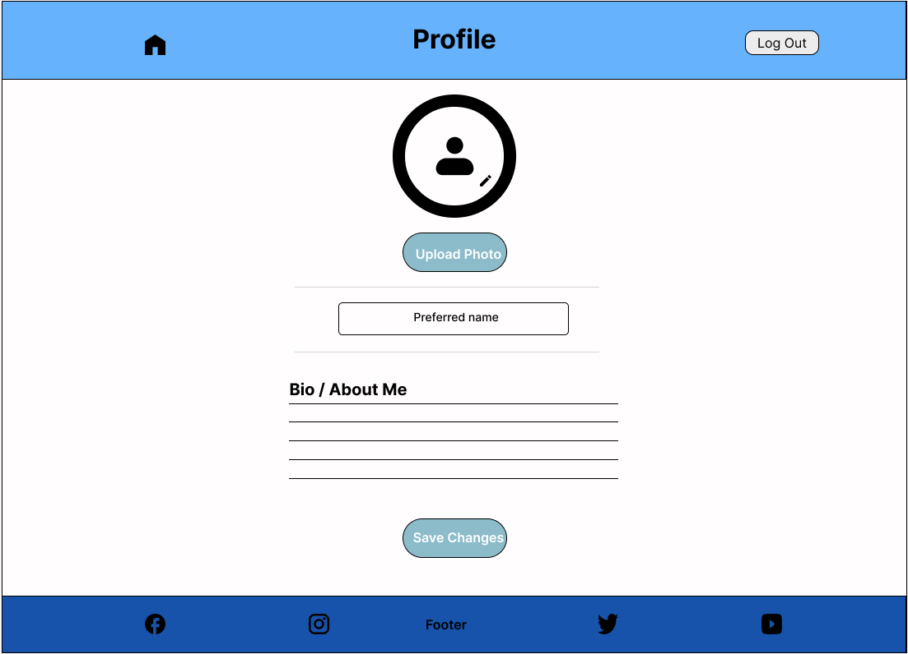
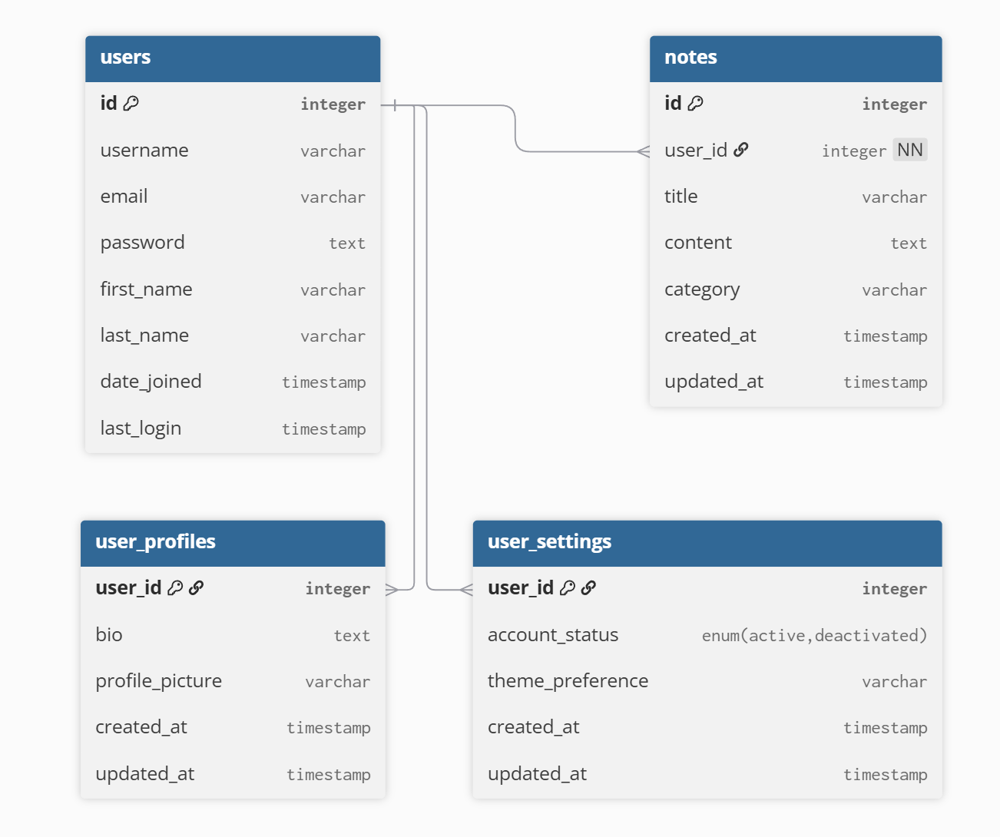

# Forge Fitness - Fitness Application

Forge Fitness is a comprehensive fitness companion designed to transform your wellness journey. This dynamic application empowers users to track workouts, set personalized goals, and achieve measurable results through an intuitive dashboard system. Whether you're a beginner starting your fitness journey or an experienced athlete looking to optimize your performance, Forge Fitness provides the tools and motivation needed to forge your path to better health.

---

## Table of Contents

There is no table of contents for this project yet as it in early developement stage and the focus is on the ux design and creating wireframes.

---

## Statistics

The following market research and user behavior data have been carefully selected to inform the development decisions for Forge Fitness. These statistics highlight key trends in the fitness app industry, user engagement patterns, health monitoring behaviors, and mobile design preferences. Each metric provides valuable insights that directly shape the project's features and implementation approach, ensuring the application meets real user needs while demonstrating effective full-stack development practices. The data is organized into four key areas that align with the project's core objectives and technical requirements.

### User Engagement and Retention

1. **High Abandonment Rates**:

- **Key Statistic**: 25% of mobile app users abandon fitness apps after first use, while successful apps retain 80% of users through effective onboarding

- **Visual Representation**:
  

- **Source**: [In-App Engagement Statistics & Tips for Health Apps](https://www.storyly.io/post/statistics-tips-for-health-apps-in-app-engagement)

- **Relevance to Forge Fitness**:
  - Intuitive dashboard design directly addresses user retention challenges
  - First-time user experience optimized through clear navigation and guided setup
  - Personalized goal-setting features engage users from day one
  - Achievement system provides immediate value and motivation
  - Regular progress updates keep users connected to their fitness journey

---

2. **Fitness App Market Trends**:

- **Market Size**: The global fitness app market is projected to grow from USD 14.7 billion (2023) to USD 120.37 billion by 2030, with a robust CAGR of 17.6%

- **Visual Representation**:
  

- **Source**: [Grand View Research](https://www.grandviewresearch.com/industry-analysis/fitness-app-market)

- **Relevance to Forge Fitness**:
  - The substantial market growth validates the focus on creating a comprehensive fitness platform
  - Rising demand for AI-driven personalization supports for smart workout planning features
  - Increasing user expectations for digital fitness solutions align with the progress tracking and achievement systems
  - Growing smartphone adoption rates reinforce mobile-first design approach

---

3. **User Health Habits**:

- **Key Statistics**:

  - 68% retention rate at 12 months for users who actively self-monitor vs 32% for non-monitoring users
  - Weekly active users show 82% higher retention rates compared to sporadic users
  - Multi-feature users demonstrate 40% higher daily usage rates
  - Personalized reminders increase app interaction by 25%

- **Visual Representation**:
  

- **Source**: [Effect of Self-Monitoring on Fitness Adherence](https://journals.plos.org/plosone/article?id=10.1371%2Fjournal.pone.0201166)

- **Relevance to Forge Fitness**:
  - **Comprehensive Tracking Integration**:
    - Daily workout logging system
    - Automated activity tracking
    - Multi-metric monitoring (steps, calories, weight)
    - Achievement milestones
    - Personalized goal reminders

---

4. **Mobile-First Design Importance**:

- **Key Statistics**:

  - **Mobile Dominance**:
    - Over 54% of global web traffic comes from mobile devices as of 2024.
    - _Source_: [Statista: Share of Website Traffic from Mobile Devices](https://www.statista.com/statistics/277125/share-of-website-traffic-coming-from-mobile-devices/)
  - **User Preferences for Mobile Apps**:
    - 85% of users prefer mobile apps over websites due to their speed, convenience, and offline capabilities.
    - _Source_: [App Usage Statistics 2024](https://www.statista.com/topics/1002/mobile-app-usage/)
  - **Fitness App Users are Mobile-Centric**:
    - 92% of fitness app users access these apps via their smartphones, making mobile design crucial.
    - _Source_: [Mobile App Usage Statistics for Fitness Apps](https://www.businessofapps.com/data/fitness-app-market/)
  - **Responsive Design Increases Retention**:
    - Apps with seamless mobile experiences have 30% higher retention rates compared to non-mobile-optimized platforms.
    - _Source_: [UX Design and Retention Study](https://www.uxdesigninstitute.com/blog/app-usage-statistics/)

- **Visual Representation**:
  

- **Relevance to Forge Fitness**:

  - **Design Priorities**:

    - Clean, minimalistic interface optimized for mobile screens
    - Touch-friendly dashboard elements for workout tracking
    - Responsive layout that adapts seamlessly across devices

  - **Feature Optimization**:

    - Quick-access workout logging for on-the-go users
    - Mobile-optimized progress charts and visualizations
    - Easy-to-navigate training sections on smaller screens

  - **User Experience Benefits**:
    - Instant access to fitness data during workouts
    - Simplified goal tracking through mobile dashboard
    - Seamless activity logging from any device

### Summary of Statistics

The market research and usage data strongly support the development direction for this project. With fitness apps projected to reach $120.37 billion by 2030, the timing is ideal for creating an innovative fitness application. The statistics show that 68% of users who track their progress maintain long-term engagement, while 92% primarily access fitness apps via smartphones. These insights have directly shaped Forge Fitness's development approach, focusing on intuitive mobile-first design, comprehensive tracking features, and personalized user experiences. By incorporating these data-driven decisions into the project architecture, Forge Fitness demonstrates practical application of modern web development principles while addressing real user needs in the digital fitness space. This research-backed foundation naturally flows into the established client goals, ensuring the project delivers both technical excellence and user value.

---

## Client Goals

The Forge Fitness application combines modern development practices with proven design patterns from industry leaders like PureGym, Garmin, and Strava. This milestone project showcases full-stack development capabilities while delivering a comprehensive fitness platform. By implementing features found in successful fitness applications and adding innovative elements, Forge Fitness demonstrates both technical proficiency and user-centered design principles. The following core objectives guide the development process and feature implementation:

### **1. User-Friendly and Intuitive Navigation**
- The **Dashboard** serves as a central hub, allowing users to quickly access key sections such as **Profile, Training, Activity, Progress, and Settings**.
- Each section is designed with a minimalistic layout, making navigation effortless while ensuring all features remain accessible.
- Responsive UI elements ensure an optimal experience across different devices.

### **2. Personalization and User Control**
- The **Profile Page** allows users to personalize their experience by setting their **preferred name and bio**, as well as uploading a profile picture.
- The **Settings Page** includes essential options such as **Feedback, Support, and Account Deletion**, ensuring users can manage their preferences effectively.
- Users can track their fitness progress in the **Progression Page**, which focuses on **Goal Setting, Performance Tracking, and Personalized Feedback**.

### **3. Structured Training Guidance**
- The **Training Section** provides users with a well-organized framework for fitness improvement.
  - **Introduction:** Guides users on how to use the training section effectively.
  - **Workouts:** Covers different muscle groups and recommended exercises.
  - **Training Plans:** Helps users structure their fitness routine.
  - **Summary:** Highlights key takeaways to keep users engaged and informed.

### **4. Motivation through Progress Tracking**
- The **Activity Page** enables users to help monitor their daily activity, ensuring they stay consistent with their fitness goals.
  - **Daily Activity:** Summarizes movement trends.
  - **Workout Tracking:** Encourages users to log and analyze their workouts.
  - **Achievements:** Recognizes and celebrates fitness milestones.

### **5. Secure and Accessible Authentication**
- The **Login Page** provides a secure authentication system, allowing users to log in effortlessly.
- The **Sign-Up Page** ensures a smooth onboarding process, with clear input fields and guided registration to enhance user experience.

### **6. Feedback and Continuous Engagement**
- The **Settings Page** integrates feedback and support options, enabling users to report issues, request assistance, and suggest improvements.
- The platform encourages ongoing engagement through motivational elements like **progress tracking and achievements**.

The **Forge Fitness** application balances functionality and simplicity, ensuring that users can efficiently **track their workouts, manage their profile, stay motivated, and personalize their experience**.

---

## User Stories

The following user stories have been developed to guide the implementation of Forge Fitness features, ensuring each component delivers tangible value to users while meeting project requirements. Each story aligns with specific client goals and technical objectives, demonstrating both user-centered design and full-stack development capabilities. The stories are organized into core functional areas, with clear goal alignment statements showing how they support the project's primary objectives.

### Profile Management
**Goal Alignment: Supports "Create a User-Friendly Experience."**

- As a **new user**, I want to create an account so that I can save my fitness data and track my progress.
- As a **returning user**, I want to log in securely so that I can access my personalized fitness data.
- As a **registered user**, I want to edit my profile details, including my preferred name and bio, so that my information remains up to date.
- As a **visual user**, I want to upload a profile picture so that my account feels more personalized.
- As a **self-motivated user**, I want to add a short bio about myself so that I can document my fitness journey.

### Training Section
**Goal Alignment: Supports "Support Personalization."**

- As a **user**, I want to explore different workout plans so that I can find a routine that matches my fitness goals.
- As a **beginner**, I want a simple introduction to workouts so that I can learn the fundamentals before diving into specific plans.
- As an **advanced user**, I want to understand how different muscle groups work so that I can improve my training efficiency.
- As a **goal-oriented user**, I want structured training plans so that I can follow a guided fitness program based on my needs.
- As a **data-driven user**, I want to see an overview of my workout plans so that I can track my fitness routine at a glance.

### Activity Tracking
**Goal Alignment: Supports "Enhance Motivation and Engagement."**

- As a **user**, I want to track my daily activity, such as steps and movement, so that I can monitor my overall fitness levels.
- As a **motivated individual**, I want to log my completed workouts so that I can track my consistency over time.
- As a **progress-focused user**, I want to review my past activities so that I can see how I’m improving.
- As an **achievement-driven user**, I want to earn milestones and badges so that I stay motivated to reach new fitness goals.
- As a **self-reflecting user**, I want to compare my active and inactive days so that I can improve my consistency.

### Progress and Insights
**Goal Alignment: Supports "Offer Comprehensive Fitness Management."**

- As a **goal-oriented user**, I want to set short-term and long-term fitness goals so that I can stay motivated and measure my progress.
- As a **self-improving user**, I want to track my performance trends over time so that I can see my strengths and areas for improvement.
- As an **analytical user**, I want to review feedback and insights based on my fitness habits so that I can make better training decisions.
- As a **results-driven user**, I want to receive clear visual data about my progress so that I can recognize patterns and plan my next steps.
- As a **self-aware user**, I want to receive performance insights and recommendations so that I can make meaningful adjustments to my fitness routine.

### Settings
**Goal Alignment: Supports "Prioritize Modern Design Standards."**

- As a **privacy-conscious user**, I want to permanently delete my account so that I have control over my data.
- As a **user**, I want to manage my fitness preferences and settings so that the app feels tailored to my personal experience.

Each story maps directly to technical requirements while maintaining focus on user value, creating a balanced approach between development objectives and user needs. This structured foundation provides clear direction for feature implementation and testing phases of the project.

---

## Initial Design

The visual identity of Forge Fitness is built on a carefully selected color palette that emphasizes clarity, professionalism, and user engagement. The combination of light, complementary colors creates a modern aesthetic while ensuring optimal readability and visual hierarchy. The chosen color scheme reflects current design trends in fitness applications while maintaining distinctive brand identity:

#66B2FD - Argentinian Blue - Navigation bar

#ECECEC - Anti-flash White - Body 

#8CBCCA - Sky blue - Button/Page/Section 

#1853AB -  Sapphire Blue - Footer 

The typography is yet to be decided. But I want the layout of the website to be designed easy to read and visually appealing, with a focus on using a font that is both readable and visually appealing.

## User Experience (UX) and wireframes

To create a top class fitness app, this website is being desinged with a great amount of care and attention to detail. In the Dashboard page, I have included a variety of features to help users create their own workout regimes and track their progress tailored to their fitness goals. Here are the main features down below:

## Dashboard page

- 🏃‍♂️ Profile section - For users to create their profile, set their goals to help them achieve their progress.

- 💪 Training section - For users to select a workout of any type, create traning plans to help achieve specific goals and instructor led digital classes.

- 📊 Activity section - For users to track their physical activity, workout time, log their steps and monitor calories burnt.

- 📈 Progress section - For users to set goals and track their progress and achievements.

- ⚙️ Settings section - For users to set their account settings, such as password and email notifications. With also app appearance settings, feedback and support

---

## Sign Up page

The sign up interface provides a streamlined onboarding experience while capturing essential user information. Key features include:

### Design Elements

- Modern, clean layout with clear visual hierarchy
- Enticing opening message to encourage sign-up
- Responsive form design optimized for all devices
- Consistent brand colors using the established palette

### Core Functionality

- Required profile information fields (name, email, password)
- Password visibility toggle for password field

---

## Login Page

The **Login Page** provides users with a simple and secure authentication interface, ensuring quick and easy access to the Forge Fitness platform. The design prioritizes usability and accessibility while maintaining a clean, minimalist layout.  

---

### **Design Elements**  

- **Minimalist layout** focusing on essential login components.  
- **Responsive form design** that adapts to all screen sizes.  
- **Brand-consistent typography and colors**, ensuring visual coherence.  
- **Clear and accessible form fields** for easy user interaction.  

---

### **Core Functionality**  

- **Email or Username Authentication**  
  - Users can log in using their **registered email or username**.  

- **Password Input with Toggle Visibility**  
  - A **"Show Password"** option allows users to toggle password visibility for ease of entry.  

- **Persistent Login Option**  
  - The **"Keep me logged in"** checkbox enables users to stay signed in across sessions.  

- **Forgot Password Recovery**  
  - A **"Forgot password?"** link provides users with a direct way to reset their credentials.  

- **New Account Registration Link**  
  - A **"Create an account"** link encourages new users to sign up seamlessly.  

---

### **User Experience**  

- **Simple, intuitive input fields** for easy login.  
- **Streamlined navigation** with clear sign-up and password recovery options.  
- **Secure session handling** to protect user credentials.  
- **Mobile-friendly layout**, ensuring accessibility across all devices.  

---

### **Why This Page Matters**  

The **Login Page** serves as the gateway to the Forge Fitness platform, offering a **seamless and user-friendly authentication experience**. By maintaining **strong security measures and a clean, intuitive layout**, it ensures a **smooth onboarding process** for both new and returning users.  

---

## Profile Page

The **Profile Page** allows users to personalize their fitness experience by managing their profile details. With a clean and structured layout, users can easily update their information, add a profile photo, and provide a short bio.  

### Design Elements

- Clean, modern layout with clear section divisions for easy navigation
- Interactive elements like buttons and input fields for user customization
- Consistent color scheme and typography aligned with the Forge Fitness brand
- Large, user-friendly **"Upload Photo"** option for profile personalization
- Responsive design ensuring seamless access across devices

### **Design Elements**  

- **Minimalist and intuitive layout** for easy profile customization.  
- **User-friendly input fields** for quick data entry and updates.  
- **Consistent color scheme and typography** aligned with Forge Fitness branding.  
- **Large and accessible "Upload Photo" button** for seamless profile personalization.  
- **Fully responsive design**, ensuring accessibility across different devices.  

---

### **Core Functionality**  

- **Profile Customization**  
  - Users can enter a **preferred name** to personalize their profile.  
  - A **bio/about me section** lets users add a short description about themselves.  

- **Photo Management**  
  - Upload a **profile photo** to personalize the user profile.  
  - Supports common image formats such as **PNG and JPEG**.  
  - Option to **update or remove the profile picture** if needed.  

- **Save Changes**  
  - Users can **save profile updates** to ensure all modifications are stored.  
  - A simple **confirmation process** ensures that changes are reflected instantly.  

---

### **User Experience**  

- **Simple and intuitive input fields** for quick profile updates.  
- **Seamless user interactions**, ensuring effortless navigation.  
- **Visual feedback** when changes are successfully saved.  
- **Responsive layout**, allowing smooth access on different screen sizes.  

---

## Training Page

The **Training Page** serves as a central hub for users to explore structured workout guidance and how personalized fitness plans work. This section is designed to provide clear, actionable insights, making it easier for users to understand their training options and track progress efficiently.

### **Introduction**

The **Introduction** section provides users with a foundational understanding of the training program. It explains the core principles behind structured fitness routines and highlights the importance of consistency, form, and goal setting. Whether users are beginners or experienced athletes, this section offers essential guidance on how to approach their fitness journey effectively.

### **Workouts**

The **Workouts** section is dedicated to helping users understand the role of different muscle groups and the exercises that target them effectively. 

- **Muscle Group Breakdown:**
  - Users can explore all the workout categories based on different body areas, ensuring a balanced workout approach.
  - Includes guidance on exercises for major muscle groups such as:
    - Chest
    - Back
    - Legs
    - Shoulders
    - Arms
    - Core
    - Full Body Workouts

- **Exercise Demonstrations:**
  - Each workout category provides information on the most effective exercises for that muscle group.
  - Users can follow step-by-step instructions or access additional resources to ensure proper form and injury prevention.

- **Training Techniques:**
  - Guidance on how to integrate progressive overload, rest periods, and rep schemes into their routine for optimal results.

### **Training Plans**

The **Training Plans** section provides structured workout programs tailored to different fitness goals. Whether users are looking to **lose weight, build muscle, or enhance endurance**, this section offers a variety of programs to suit their needs.

- **Structured Programs:**
  - Users can follow pre-designed training plans or customize their own based on their fitness level and goals.
  - Each plan outlines:
    - Recommended workout frequency
    - Exercise selection
    - Progress tracking strategies

- **Goal-Based Training Plans:**
  - **Weight Loss:** Focused on high-intensity workouts, calorie burning, and metabolic conditioning.
  - **Muscle Gain:** Strength-building exercises, hypertrophy-focused routines, and recovery strategies.
  - **Endurance Training:** Plans designed to improve stamina, cardiovascular health, and athletic performance.

- **Progress Tracking:**
  - Encourages users to log their workouts and adjust their plans based on improvements and feedback.

### **Summary**

The **Summary** section ties together key takeaways from the **Introduction, Workouts, and Training Plans**. This section reinforces how users can apply the provided information to their fitness journey, ensuring they make informed decisions that align with their personal health goals.

- **Why This Matters:**
  - Highlights how structured training enhances results.
  - Emphasizes the importance of tracking progress and making adjustments.

- **Next Steps:**
  - Encourages users to explore different training plans, experiment with workout variations, and stay consistent in their routines.
  - Provides recommendations for further learning and improvement.

### **Training Page Conclusion**

The Training section of the platform is designed to offer a **comprehensive, structured, and user-friendly** approach to fitness. By combining key insights from **Introduction, Workouts, Training Plans, and Summary**, users are empowered with the knowledge and resources they need to take control of their fitness journey. Whether they are starting out or refining their routine, this section provides the **guidance, structure, and motivation** needed to achieve long-term success.

---

## Activity Page

The **Activity Page** provides users with a centralized space to learn about their **daily movement, workout progress, and fitness milestones**. Designed with a structured layout, it ensures that users can quickly access key fitness insights on a **single page** without navigating through multiple sections. This streamlined approach enhances usability, making it easier to stay engaged and track progress effectively.

---

## **Page Structure and Purpose**

The Activity Page is structured into four main sections, each focusing on a different aspect of fitness tracking. These sections work together to provide a **comprehensive snapshot** of the user’s understanding about daily and long-term activity.

### **Introduction**  
The **Introduction** section sets the foundation for understanding activity tracking. It highlights the significance of **monitoring both daily movement and structured workouts**, emphasizing how an active lifestyle contributes to overall fitness goals.  
- Encourages users to view movement beyond workouts, incorporating **everyday activity** as part of their progress.  
- Reinforces the importance of tracking **steps, calories burned, and overall consistency** to build long-term fitness habits.  

---

### **Daily Activity**  
The **Daily Activity** section provides users with a summary of their movement patterns throughout the day, giving them insight into how **active or inactive** they have been.  
- Displays **steps taken, active vs. inactive calorie burn, and general activity trends** in an easy-to-read format.  
- Helps users recognize patterns in their daily routine, allowing them to make **healthier lifestyle adjustments**.  
- Encourages consistency by showing users how **small daily movements contribute to their bigger fitness goals**.  

This section is designed for users who want to **stay mindful of their daily habits**, ensuring that they maintain steady progress even outside of structured workouts.

---

### **Workout Tracking**  
The **Workout Tracking** section focuses on users completed workouts, serving as a quick reference point for reviewing their fitness journey.  
- Summarizes the **type, frequency, and duration** of recent workouts.  
- Provides an **overview of workout patterns** to help users assess consistency and performance.  
- Encourages users to **reflect on their training routines** and stay committed to their goals.  

By having **workout data available at a glance**, users can **stay accountable** and ensure that they are following a balanced training plan.

---

### **Achievements**  
The **Achievements** section highlights key fitness milestones and accomplishments, reinforcing motivation and long-term engagement.  
- Recognizes **streaks, personal bests, and consistency milestones** to celebrate user progress.  
- Encourages a **sense of accomplishment** by visually showcasing fitness achievements.  
- Helps users **set new goals** based on past performance.  

By rewarding progress, this section provides users with **a continuous source of motivation** to push further and maintain their fitness routine.

---

### **Key Benefits of the Activity Page**

The **Activity Page** is designed to enhance user engagement by providing a **structured and accessible** way to monitor fitness progress.  

### **Why This Page Matters:**
✔ **Single-Page Overview:** Eliminates unnecessary navigation, making fitness tracking more intuitive.  
✔ **Data-Driven Insights:** Helps users make informed decisions about their activity levels and workout habits.  
✔ **Consistency & Motivation:** Encourages ongoing progress by reinforcing positive behavior and achievements.  
✔ **Improved Accountability:** Allows users to track their own patterns, adjust their routines, and stay committed to their fitness goals.  

---

### **Activity Page Summary**  

The **Activity Page** is a streamlined solution for users who want **clear, organized, and accessible fitness tracking** in one place. By integrating **Daily Activity, Workout Tracking, and Achievements**, this page empowers users to **stay consistent, celebrate their progress, and build sustainable fitness habits** over time.

---

## Progression page

The **Progression Page** provides users with a structured and intuitive platform to **track their fitness journey** over time. By focusing on **goal setting, performance tracking, and personalized feedback**, this page helps users learn how to stay motivated, recognize progress, and make informed adjustments to their fitness routines.  

---

## **Features and Sections**  

### **1. Goal Setting / Milestones**  
**Define your fitness goals and stay on track**  

This section helps users how to establish **short-term and long-term fitness goals** while tracking their progress toward meaningful milestones.  

- Set **personalized goals** based on your fitness objectives (e.g., weight loss, muscle gain, endurance improvement).  
- Monitor your **goal completion percentage**, giving you a clear sense of progress.  
- Celebrate **milestones and achievements**, such as reaching a strength PR, improving running speed, or completing a workout streak.  

📌 **How to Use This Section Effectively:**  
✔ Clearly define measurable goals (e.g., "Lose 5kg in 3 months" or "Run 10km without stopping").  
✔ Regularly check your milestone progress to stay motivated.  
✔ Adjust goals as needed to **continue pushing toward new challenges**.  

---

### **2. Performance Tracking**  
**Analyze your trends and measure real progress**  

Tracking **performance metrics** over time helps users understand their **strengths, weaknesses, and areas for improvement**.  

- View **progress summaries** that reflect workout consistency, strength development, endurance gains, and more.  
- Identify **patterns in fitness habits** through structured data representation.  
- Compare past and present performance to **track improvements** and optimize training.  

📌 **How to Use This Section Effectively:**  
✔ Regularly review your progress summaries to assess improvements.  
✔ Use historical performance data to adjust workout intensity and frequency.  
✔ Identify trends that may indicate the need for recovery or workout variations.  

---

### **3. Feedback and Insights**  
**Refine your training with meaningful insights**  

This section provides **personalized guidance** based on user activity and progression trends, helping users stay engaged and make strategic adjustments.  

- Gain **data-driven insights** into your progress and performance consistency.  
- Receive **motivational feedback**, such as reminders to stay consistent, recovery recommendations, or milestone celebrations.  
- Learn how to **optimize workouts** based on training data, ensuring **continuous improvement**.  

📌 **How to Use This Section Effectively:**  
✔ Reflect on feedback to make **targeted adjustments** to training plans.  
✔ Use progress insights to **fine-tune your workout intensity, recovery schedule, and goal-setting approach**.  
✔ Stay motivated by celebrating milestones and acknowledging improvements in strength, endurance, and consistency.  

---

## **Why the Progression Page is Essential**  

The **Progression Page** serves as a **central hub** for tracking progress, celebrating achievements, and making strategic adjustments to training plans. By combining **goal tracking, performance analysis, and feedback-driven improvements**, users can ensure **consistent growth and long-term success** in their fitness journey.  

✔ **Set clear goals and track milestone achievements.**  
✔ **Analyze performance trends to optimize training.**  
✔ **Use feedback to make data-driven adjustments for continuous progress.**  

By regularly engaging with this page, users will gain the knowledge to **stay accountable, make informed training decisions, and maintain long-term motivation** toward achieving their fitness goals. 🚀  

---

### Settings Page

The **Settings Page** provides users with a simple yet essential option to manage their account. This page ensures users have full control over their presence on the platform by offering a straightforward way to remove their account if needed.  

### **Delete Account**  
Users who wish to permanently remove their account can do so from this section.  
- **Irreversible Action:** Deleting an account will erase all associated data and cannot be undone.  
- **User Control:** Ensures users have complete authority over their data and app presence.  
- **Final Confirmation:** Before proceeding, users are encouraged to carefully consider their decision.  

By keeping the **Settings Page minimal**, the app maintains a **clean and straightforward experience**, allowing users to focus on their fitness journey without unnecessary complexity.  

---

## Database Structure

Forge Fitness leverages a sophisticated database architecture meticulously designed to manage user data, fitness tracking, and workout programming with efficiency and precision. The scheme establishes well-defined relationships between tables, ensuring seamless data integration, integrity, and optimized query performance. This structure underpins the application’s core functionalities, including personalized user profiles, detailed workout tracking, activity monitoring, and achievement systems. By prioritizing scalability and reliability, the database provides a robust foundation for delivering a seamless and engaging fitness management experience.

---

### 1. User Table
**Purpose**: Stores user account details required for authentication and profile personalization.

#### Key Fields:
- **id**: Unique identifier for each user.
- **first_name** and **last_name**: Personal information for identification.
- **email**: Unique and used for login.
- **password**: Stores the securely hashed password for authentication.
- **profile_photo**: Allows users to upload a profile picture for a more personalized experience.
- **is_active**: Indicates whether the account is active or deactivated.
- **created_at**: Tracks when the user registered.

### How It Works:
- This table is central to the application, as all other tables are linked to it through `user_id`.
- It ensures secure and efficient user management.

---

### 2. Settings Table
**Purpose**: Stores user-specific preferences for app customization and notifications.

#### Key Fields:
- **theme_preference**: Allows users to toggle between light and dark modes.
- **unit_preference**: Supports metric or imperial units for tracking fitness data.
- **notification_frequency**: Configures how often users receive notifications.
- **quiet_hours_start** and **quiet_hours_end**: Defines times to mute notifications.
- **two_factor_enabled**: Adds an extra layer of account security.

#### How It Works:
- Linked to the **User Table** through `user_id`.
- Provides a personalized user experience by storing their preferences.

---

### 3. Training Plans Table
**Purpose**: Manages predefined and user-created training plans for different fitness goals.

#### Key Fields:
- **title** and **description**: Provide details about the training plan.
- **created_by**: Tracks who created the plan (an admin or the user).
- **created_at**: Tracks when the plan was created.

#### How It Works:
- Training plans are accessible by users and linked to their goals.
- Users can choose or customize plans based on their fitness objectives.

---

### 4. Activity Table
**Purpose**: Logs user activities (e.g., walking, running, strength training) for tracking progress.

#### Key Fields:
- **activity_type**: Specifies the type of activity performed.
- **steps**, **distance**, **calories_burned**, and **duration**: Capture detailed metrics of the activity.
- **date**: Logs when the activity took place.

#### How It Works:
- Linked to the **User Table** through `user_id`.
- Provides insights into daily activities and supports progress tracking.

---

### 5. Progress Table
**Purpose**: Tracks user goals and their progress toward achieving them.

#### Key Fields:
- **goal**: Defines the user's fitness objective (e.g., weight loss, muscle gain).
- **progress_percentage**: Measures how much of the goal is complete.
- **milestones**: Stores text descriptions of milestones achieved.
- **last_updated**: Tracks the most recent update to the progress.

### How It Works:
- Linked to the **User Table** through `user_id`.
- Enables users to monitor progress visually and adjust goals as needed.

---

### 6. Workout Logs Table
**Purpose**: Records detailed information about individual workouts.

#### Key Fields:
- **workout_name**: Names the workout (e.g., "Push Day").
- **sets**, **reps**, and **weight**: Track workout specifics.
- **date**: Captures when the workout was performed.

#### How It Works:
- Linked to the **User Table** through `user_id`.
- Allows users to maintain a log of their workouts for analysis and improvement.

---

### 7. Achievements Table
**Purpose**: Rewards users with badges and milestones for motivation and consistency.

#### Key Fields:
- **badge**: Describes the earned achievement (e.g., "Steps Champion").
- **date_earned**: Records when the achievement was unlocked.

#### How It Works:
- Linked to the **User Table** through `user_id`.
- Gamifies the fitness experience to keep users motivated and engaged.

---

### How It All Works Together

#### User-Centric Design:
- All tables are linked via the `user_id` field, ensuring that data is scoped to individual users.

#### Personalization:
- The **Settings Table** ensures that each user has a tailored experience.
- The **Training Plans**, **Workout Logs**, and **Achievements Tables** support customized fitness journeys.

#### Progress Tracking:
- Data from the **Activity Table** and **Progress Table** work together to give users insights into their fitness progress.

#### Motivation:
- The **Achievements Table** keeps users engaged through rewards and gamification.

#### Scalability:
- The structure is modular, allowing future features (e.g., social features, additional activity types) to be easily added.

---

## Folder Structure

The Forge Fitness project follows a modular and well-structured architecture to maintain scalability, maintainability, and ease of collaboration. This structure ensures that different components such as user authentication, workout tracking, activity monitoring, and progress tracking are organized effectively. Each major functionality is contained within its own Django app, following best practices for separation of concerns.

The organization of the files and directories ensures that:
- User-related functionalities are managed in the `users/` directory.
- Activities tracking and progress monitoring are housed in the `activities/` and `progress/` directories, respectively.
- Training plans and workouts are structured under the `training/` directory.
- User settings and preferences are handled within the `settings/` directory.
- Static files, templates, and assets are kept separate to maintain clarity.

### How It Works

Each directory corresponds to a specific feature or functionality of the application:

1. **Root Directory (`forge-fitness/`)**:
   - Contains project-wide configuration files such as `manage.py` for running the Django server, `requirements.txt` for dependencies, and `.env` for environment variables.

2. **Main Application (`forge_fitness/`)**:
   - Houses core Django settings, URL configurations, and global templates like `base.html`, `navbar.html`, and `footer.html`.
   - Includes static files (`static/`) used throughout the project, such as CSS, JavaScript, and images.

3. **Users Module (`users/`)**:
   - Manages user authentication and profile data.
   - Contains models, views, forms, and templates for login, signup, and profile management.
   - Stores user-specific static files and database migrations.

4. **Activities Module (`activities/`)**:
   - Handles logging of user activities such as step tracking, distance covered, and calories burned.
   - Includes templates for viewing daily activity logs and achievements.
   - Provides models that store activity-related data.

5. **Training Plans (`training/`)**:
   - Manages workout programs and training plans.
   - Contains models for workout types, training sessions, and user-selected plans.
   - Includes templates for viewing available training plans and scheduling workouts.

6. **Progress Tracking (`progress/`)**:
   - Tracks user goals and milestones.
   - Includes views and templates for visualizing progress through charts and statistics.
   - Stores database models that track progress percentages and milestones.

7. **Settings (`settings/`)**:
   - Manages user preferences such as theme selection, notification settings, and privacy controls.
   - Contains models to store user-specific configurations.
   - Templates allow users to adjust their preferences.

8. **Assets and Wireframes (`assets/`)**:
   - Stores UI wireframes and diagrams that help document and guide development.
   - Includes the `database-structure.png` and `folder-structure.png` diagrams for reference.

---

### How It Ties Into the Database Structure

Each directory within the folder structure corresponds directly to a **table in the database**, ensuring a **one-to-one mapping between the frontend logic and backend storage**. Here's how they align:

- The **`users/` app** aligns with the **User Table**, managing authentication and profile data.
- The **`activities/` app** connects with the **Activity Table**, recording workout times, steps, and calories burned.
- The **`training/` app** is linked to the **Training Plans Table**, ensuring users can access structured workouts.
- The **`progress/` app** stores user milestones and goal achievements, directly mapping to the **Progress Table**.
- The **`settings/` app** works with the **Settings Table**, allowing users to customize their app experience.

By maintaining this structured relationship, this project follows a smooth flow of data between the backend database and the frontend interface. The database structure is fully integrated with the project’s folder organization, making it easy to manage, scale, and extend in future development.

---