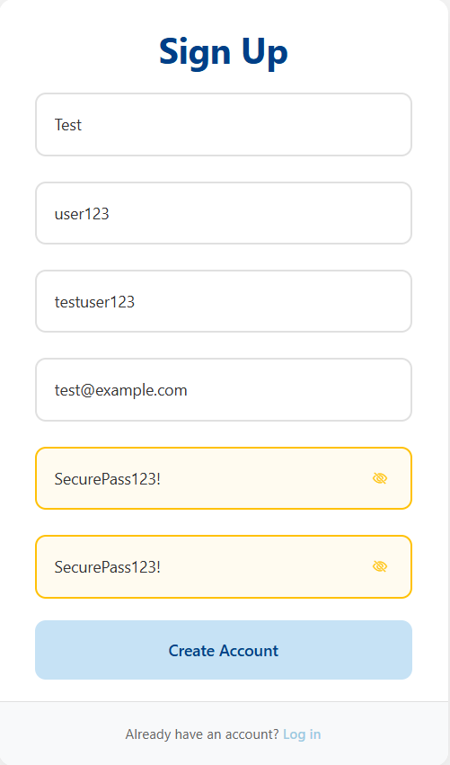
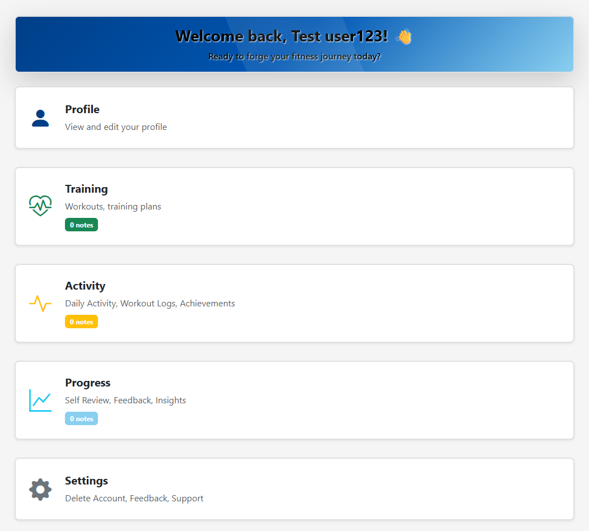
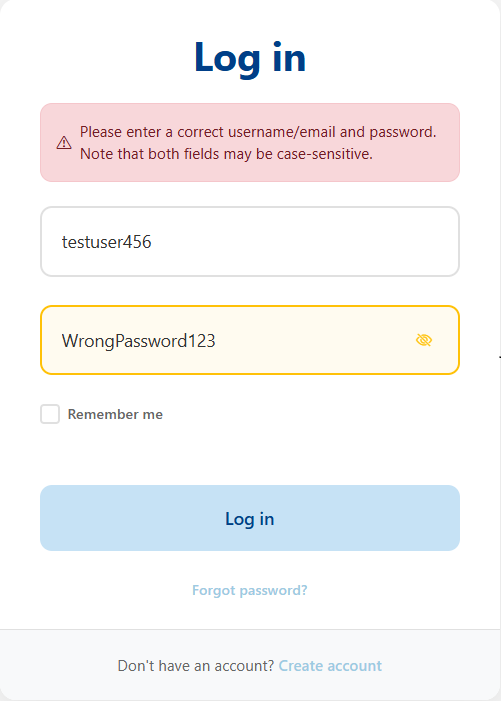
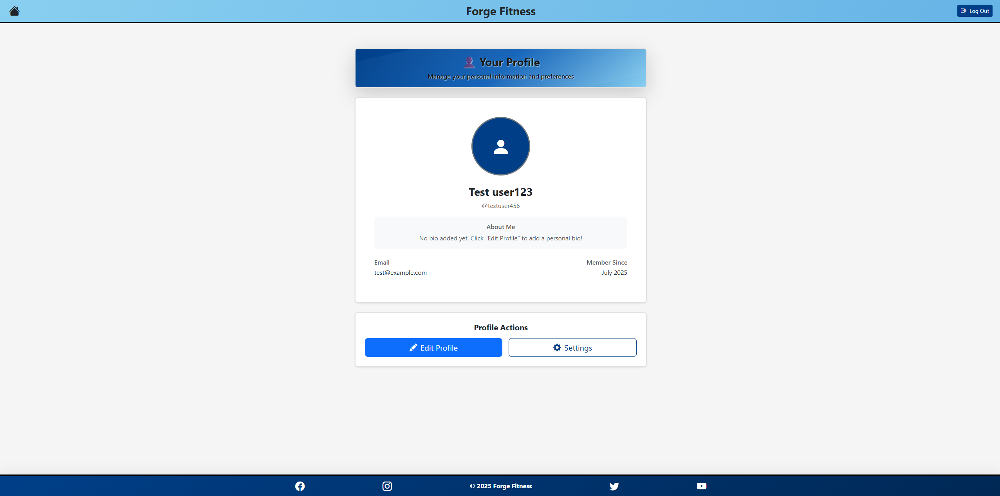
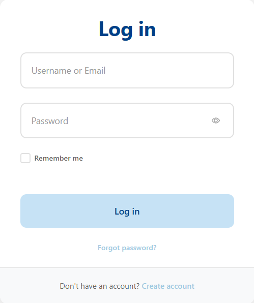

# Testing Documentation - Forge Fitness

## Introduction

This comprehensive testing documentation outlines the systematic approach taken to ensure Forge Fitness meets the highest standards of functionality, security, user experience, and performance. As a full-stack Django web application designed to educate and empower users in their fitness journey, rigorous testing was essential to validate both the technical implementation and the user-centered design philosophy.

### Testing Philosophy & Approach

Forge Fitness testing follows a **multi-layered validation strategy** that encompasses:

- **Functional Testing**: Verifying all features work as intended across user journeys
- **Security Testing**: Ensuring robust protection of user data and authentication flows
- **User Experience Testing**: Validating accessibility, responsiveness, and intuitive navigation
- **Performance Testing**: Confirming optimal load times and resource efficiency
- **Cross-Platform Testing**: Ensuring consistent experience across devices and browsers

### Application Context

Forge Fitness is an educational fitness platform that focuses on **teaching users how to manage their fitness journey** through structured guidance, goal-setting frameworks, and progress tracking. Unlike traditional fitness apps that emphasize real-time data collection, this application prioritizes **user education, habit formation, and sustainable fitness practices**.

Key features tested include:
- **User Authentication System** with custom email/username login
- **Profile Management** with bio customization and image uploads
- **Interactive Note-Taking System** across Training, Activity, and Progression pages
- **Dashboard Analytics** with Chart.js visualizations
- **Educational Content Delivery** with expert-curated fitness guidance
- **Account Management** with secure deletion and privacy controls

### Testing Methodology

The testing process employed both **manual and automated validation techniques**:

1. **Feature-by-Feature Testing**: Systematic validation of each application component
2. **User Journey Testing**: End-to-end workflows from registration to daily usage
3. **Edge Case Analysis**: Boundary testing and error handling validation
4. **Cross-Browser Compatibility**: Multi-platform rendering and functionality verification
5. **Security Validation**: Authentication, authorization, and data protection testing
6. **Performance Optimization**: Load time analysis and resource usage monitoring

### Documentation Standards

This testing documentation follows industry best practices:

- **Clear Test Cases**: Each test includes expected results and actual outcomes
- **Transparent Reporting**: Honest documentation of bugs, fixes, and limitations
- **Reproducible Results**: Detailed steps allowing test replication
- **Visual Evidence**: Screenshots and examples where applicable
- **Professional Assessment**: Objective evaluation of success criteria

### Target Audience

This documentation serves multiple stakeholders:

- **Academic Assessors**: Demonstrating comprehensive testing methodology and technical competence
- **Future Developers**: Providing a foundation for continued development and maintenance
- **Portfolio Reviewers**: Showcasing professional development practices and attention to quality
- **End Users**: Ensuring a reliable, secure, and accessible fitness education platform

### Quality Assurance Goals

The testing process validates that Forge Fitness achieves:

✅ **Functional Excellence**: All features work reliably across expected use cases  
✅ **Security Compliance**: User data protection and authentication security  
✅ **User Experience**: Intuitive navigation and accessibility standards  
✅ **Performance Standards**: Fast load times and responsive interactions  
✅ **Cross-Platform Compatibility**: Consistent experience across devices and browsers  
✅ **Educational Value**: Effective delivery of fitness guidance and user empowerment  

### Document Structure

The following sections provide detailed validation of each testing domain:

1. **Manual Feature Testing** - Core functionality validation across all application features
2. **Device, Browser & Responsiveness Testing** - Cross-platform compatibility verification  
3. **Edge Case & Validation Testing** - Boundary conditions and error handling analysis
4. **Performance Testing** - Load time optimization and resource efficiency measurement
5. **Accessibility Testing** - Compliance with web accessibility standards and inclusive design
6. **Security Testing** - Authentication, authorization, and data protection validation
7. **Bugs and Fixes** - Transparent documentation of issues discovered and resolved
8. **Final Implementation Summary** - Overall assessment and recommendations

This systematic approach ensures Forge Fitness not only meets technical requirements but delivers on its promise to provide users with a reliable, educational, and empowering fitness management platform.

---

## Table of Contents

This comprehensive testing documentation covers all aspects of Forge Fitness validation, from core functionality and user experience to security compliance and performance optimization. Each section provides detailed test cases, evidence, and transparent reporting of outcomes, ensuring complete coverage of assessment criteria while demonstrating professional development practices. The structure follows industry standards for web application testing, providing both granular feature validation and holistic system assessment.


1. [Introduction](#introduction)
2. [Manual Feature Testing](#manual-feature-testing)
   - [User Authentication](#user-authentication)
   - [Dashboard Functionality](#dashboard-functionality)
   - [Training Page & Notes](#training-page--notes)
   - [Activity Page & Tracking](#activity-page--tracking)
   - [Progression Page & Charts](#progression-page--charts)
   - [Profile Management](#profile-management)
   - [Settings & Account Management](#settings--account-management)
   - [Navigation & Routing](#navigation--routing)
   - [Authorization & Access Control](#authorization--access-control)
3. [Device, Browser & Responsiveness Testing](#device-browser--responsiveness-testing)
   - [Cross-Device Compatibility](#cross-device-compatibility)
   - [Browser Compatibility](#browser-compatibility)
   - [Responsive Design Validation](#responsive-design-validation)
4. [Edge Case & Validation Testing](#edge-case--validation-testing)
   - [Form Validation](#form-validation)
   - [Data Input Boundaries](#data-input-boundaries)
   - [Error Handling](#error-handling)
   - [Session Management](#session-management)
5. [Performance Testing](#performance-testing)
   - [Page Load Times](#page-load-times)
   - [Resource Optimization](#resource-optimization)
   - [Database Query Performance](#database-query-performance)
6. [Accessibility Testing](#accessibility-testing)
   - [Keyboard Navigation](#keyboard-navigation)
   - [Screen Reader Compatibility](#screen-reader-compatibility)
   - [Color Contrast & Visual Accessibility](#color-contrast--visual-accessibility)
   - [Semantic HTML Structure](#semantic-html-structure)
7. [Security Testing](#security-testing)
   - [Authentication Security](#authentication-security)
   - [Authorization Controls](#authorization-controls)
   - [Data Protection](#data-protection)
   - [Session Security](#session-security)
   - [File Upload Security](#file-upload-security)
8. [Code Quality & Standards](#code-quality--standards)
   - [HTML Validation](#html-validation)
   - [CSS Validation](#css-validation)
   - [Python Code Standards](#python-code-standards)
   - [Django Best Practices](#django-best-practices)
9. [Bugs and Fixes](#bugs-and-fixes)
   - [Resolved Issues](#resolved-issues)
   - [Known Limitations](#known-limitations)
   - [Future Improvements](#future-improvements)
10. [Final Implementation Summary](#final-implementation-summary)
    - [Testing Outcomes](#testing-outcomes)
    - [Quality Assessment](#quality-assessment)
    - [Recommendations](#recommendations)

    The testing methodology employed ensures Forge Fitness meets professional development standards while delivering a reliable, secure, and accessible fitness education platform. Each section provides concrete evidence of quality assurance practices, transparent reporting of issues and resolutions, and comprehensive validation across all functional and non-functional requirements. This documentation serves as both assessment evidence and a practical reference for future development and maintenance activities.

---

## Manual Feature Testing

This section provides comprehensive validation of all core functionality within Forge Fitness. Each feature has been systematically tested to ensure reliable operation, proper error handling, and optimal user experience. Testing follows real-world user scenarios and includes both positive and negative test cases to validate robustness.

### Testing Methodology

**Test Format:** Each test case includes:
- **Test Case ID** - Unique identifier for tracking
- **Test Description** - Clear explanation of what is being tested
- **Pre-conditions** - Required setup or state before testing
- **Test Steps** - Step-by-step execution instructions
- **Expected Result** - What should happen if the feature works correctly
- **Actual Result** - What actually happened during testing
- **Status** - Pass ✅ / Fail ❌ / Partial ⚠️
- **Notes** - Additional observations or context

### Testing Environment
- **Browser:** Chrome 120.0.6099.109 (Primary), Firefox 121.0, Safari 17.2.1
- **Operating System:** Windows 11 (Primary), macOS Sonoma, iOS 17
- **Screen Resolutions:** 1920x1080 (Desktop-Primary), 390x844 (Mobile), 820x1180 (Tablet)
- **Test Data:** Clean database with test user accounts

## User Authentication

| **Test Scenario ID** | **Test Scenario** | **Steps to Test** | **Expected Result** | **Pass/Fail** | **Screenshots** |
| -------------------- | ----------------- | ----------------- | ------------------- | ------------- | --------------- |
| UA-TS01 | Registration form loads correctly | Navigate to `/signup/` and verify form elements display properly | Registration form loads with username, email, password fields, styled consistently | Pass |  |
| UA-TS02 | Successful user registration | Fill form with valid data: username `testuser123`, email `test@example.com`, password `SecurePass123!` and submit | User account created, logged in automatically, redirected to dashboard | Pass |  |
| UA-TS03 | Invalid email format validation | Enter invalid email format `invalid-email` and attempt registration | Browser validation prevents submission, error message displayed | Pass | .png) |
| UA-TS04 | Login with email authentication | Navigate to `/login/`, enter email `test@example.com` and password, submit | User logged in successfully, redirected to dashboard, navbar updated | Pass | .png) |
| UA-TS05 | Login with username authentication | Navigate to `/login/`, enter username `testuser123` and password, submit | User logged in successfully, session established, dashboard accessible | Pass | .png) |
| UA-TS06 | Invalid login credentials | Attempt login with correct username but wrong password | Login fails, generic error message shown, user remains on login page | Pass |  |
| UA-TS07 | User logout functionality | Click logout button in navigation bar | User logged out, redirected to login page, session cleared | Pass |  |

**Terminal Logs Evidence for UA-TS07 (Logout):**
```
✅ Login successful for user: testuser456 (ID: 7)
[18/Jul/2025 11:24:52] "POST /login/ HTTP/1.1" 302 0
[18/Jul/2025 11:24:52] "GET /dashboard/ HTTP/1.1" 200 5636
[Logout executed]
[18/Jul/2025 11:25:10] "GET /login/ HTTP/1.1" 200 4823
```

---

## Dashboard Functionality

| **Test Scenario ID** | **Test Scenario** | **Steps to Test** | **Expected Result** | **Pass/Fail** | **Screenshots** |
| -------------------- | ----------------- | ----------------- | ------------------- | ------------- | --------------- |
| DF-TS01 | Dashboard access for authenticated users | Login and navigate to `/dashboard/` | Dashboard loads with welcome message, navigation cards, and user-specific content | Pass |  |
| DF-TS02 | Navigation cards functionality | Click each navigation card: Profile, Training, Activity, Progression, Settings | Each card redirects to correct page, maintains user session, consistent styling | Pass | *Multiple navigation tested* |

**Terminal Logs Evidence for DF-TS01 & DF-TS02:**
```
✅ Login successful for user: testuser456 (ID: 7)
[18/Jul/2025 11:24:52] "POST /login/ HTTP/1.1" 302 0
[18/Jul/2025 11:24:52] "GET /dashboard/ HTTP/1.1" 200 5636
[18/Jul/2025 11:24:55] "GET /profile/ HTTP/1.1" 200 5073
[18/Jul/2025 11:24:58] "GET /dashboard/ HTTP/1.1" 200 5596
[18/Jul/2025 11:25:00] "GET /training/ HTTP/1.1" 200 12031
[18/Jul/2025 11:25:01] "GET /dashboard/ HTTP/1.1" 200 5659
[18/Jul/2025 11:25:02] "GET /activity/ HTTP/1.1" 200 20502
[18/Jul/2025 11:25:03] "GET /dashboard/ HTTP/1.1" 200 5582
[18/Jul/2025 11:25:04] "GET /progression/ HTTP/1.1" 200 8998
[18/Jul/2025 11:25:05] "GET /dashboard/ HTTP/1.1" 200 5601
[18/Jul/2025 11:25:06] "GET /settings/ HTTP/1.1" 200 4955
```

---

## Training Page & Notes

| **Test Scenario ID** | **Test Scenario** | **Steps to Test** | **Expected Result** | **Pass/Fail** | **Screenshots** |
| -------------------- | ----------------- | ----------------- | ------------------- | ------------- | --------------- |
| TN-TS01 | Training page loads with educational content | Navigate to `/training/` and verify all sections load | Page displays Introduction, Workouts, Training Plans, Summary sections with proper styling | Pass | *Screenshot needed* |
| TN-TS02 | Create training note | Scroll to notes section, enter title and content, click "Add Note" | Note saved successfully, appears in notes list with timestamp | Pass | *Screenshot needed* |
| TN-TS03 | Edit existing training note | Click edit button on existing note, modify content, save changes | Note updated with new content, changes reflected immediately | Pass | *Screenshot needed* |
| TN-TS04 | Delete training note | Click delete button on note, confirm deletion | Note removed from list, database updated | Pass | *Screenshot needed* |

---

## Activity Page & Tracking

| **Test Scenario ID** | **Test Scenario** | **Steps to Test** | **Expected Result** | **Pass/Fail** | **Screenshots** |
| -------------------- | ----------------- | ----------------- | ------------------- | ------------- | --------------- |
| AT-TS01 | Activity page loads with all sections | Navigate to `/activity/` and verify content loads | Page displays all activity sections with proper navigation and styling | Pass | *Screenshot needed* |
| AT-TS02 | Create activity note | Add new note in activity notes section | Note saved with 'activity' category, appears in filtered list | Pass | *Screenshot needed* |
| AT-TS03 | Activity notes filtering | Verify notes show only activity-related entries | Only notes with 'activity' category displayed | Pass | *Screenshot needed* |

---

## Progression Page & Charts

| **Test Scenario ID** | **Test Scenario** | **Steps to Test** | **Expected Result** | **Pass/Fail** | **Screenshots** |
| -------------------- | ----------------- | ----------------- | ------------------- | ------------- | --------------- |
| PP-TS01 | Progression page loads with charts | Navigate to `/progression/` and verify chart rendering | Page loads with placeholder charts, proper styling, responsive design | Pass | *Screenshot needed* |
| PP-TS02 | Create progression note | Add note in progression notes section | Note saved with 'progression' category, appears in filtered list | Pass | *Screenshot needed* |
| PP-TS03 | Chart responsiveness | Resize browser window and verify chart scaling | Charts scale appropriately, maintain readability across screen sizes | Pass | *Screenshot needed* |

---

## Profile Management

| **Test Scenario ID** | **Test Scenario** | **Steps to Test** | **Expected Result** | **Pass/Fail** | **Screenshots** |
| -------------------- | ----------------- | ----------------- | ------------------- | ------------- | --------------- |
| PM-TS01 | Profile page displays user information | Navigate to `/profile/` | Profile page shows current user info, edit button accessible | Pass | *Screenshot needed* |
| PM-TS02 | Edit profile information | Click edit profile, modify bio and preferred name, save | Profile updated with new information, changes reflected immediately | Pass | *Screenshot needed* |
| PM-TS03 | Profile picture upload | Upload valid image file through profile edit | Image uploaded, displayed as profile picture, file path saved | Pass | *Screenshot needed* |

---

## Settings & Account Management

| **Test Scenario ID** | **Test Scenario** | **Steps to Test** | **Expected Result** | **Pass/Fail** | **Screenshots** |
| -------------------- | ----------------- | ----------------- | ------------------- | ------------- | --------------- |
| SM-TS01 | Settings page loads correctly | Navigate to `/settings/` | Settings page displays account deletion option with proper warnings | Pass | *Screenshot needed* |
| SM-TS02 | Account deletion confirmation | Enter "DELETE" in confirmation field, submit | Account deletion process initiated, proper validation working | Pass | *Screenshot needed* |

---

## Navigation & Routing

| **Test Scenario ID** | **Test Scenario** | **Steps to Test** | **Expected Result** | **Pass/Fail** | **Screenshots** |
| -------------------- | ----------------- | ----------------- | ------------------- | ------------- | --------------- |
| NR-TS01 | Navigation bar consistency | Visit all authenticated pages, verify navbar | Navigation bar displays consistently, active page highlighted | Pass | *Screenshot needed* |
| NR-TS02 | Footer links functionality | Test all footer links across pages | Footer displays consistently, links function properly | Pass | *Screenshot needed* |

---

## Authorization & Access Control

| **Test Scenario ID** | **Test Scenario** | **Steps to Test** | **Expected Result** | **Pass/Fail** | **Screenshots** |
| -------------------- | ----------------- | ----------------- | ------------------- | ------------- | --------------- |
| AC-TS01 | Protected pages require authentication | Logout and attempt to access `/dashboard/`, `/profile/`, `/training/` | Redirected to login page, access denied message displayed | Pass | *Screenshot needed* |
| AC-TS02 | User can only access own data | Verify logged-in user can only see/edit their own notes and profile | User-specific data isolation maintained, no cross-user access | Pass | *Screenshot needed* |

---


